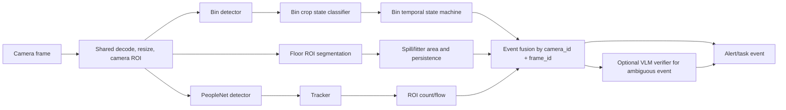

# NVIDIA “Detect Everything” assessment for LitterSpot

Date: 2026-08-17
Scope: architecture assessment only; no implementation changes
Target host observed locally: NVIDIA GeForce RTX 4050 Laptop GPU, 6,141 MiB VRAM, Windows 11, driver 551.76; Docker is not installed and WSL has no Linux distribution.

## Executive decision

There is no official NVIDIA model or product I could verify whose literal name is **“Detect Everything.”** The closest official match is **NVIDIA Grounding DINO**: NVIDIA describes it as an open-vocabulary detector and labels its use case “Detect anything.” NVIDIA also has **NanoOWL**, whose README describes nested open-vocabulary “tree detection,” but NanoOWL is explicitly optimized for Jetson Orin rather than a Windows RTX laptop.

Grounding DINO can help LitterSpot bootstrap bin/litter labels and test vocabulary, but it should **not** be the production detector for every frame. It outputs prompted object boxes; it does not reliably solve the attribute/state question “is this bin overflowing?”, nor is open-vocabulary zero-shot output a substitute for validation on the actual camera domain. NVIDIA’s hosted `nv-grounding-dino` NIM endpoint is also marked deprecated. Use the downloadable TAO model only for experimentation or assisted labeling, then train compact specialists.

The recommended production architecture is three independent perception pipelines with a deterministic fusion layer:

1. **Bin pipeline:** compact bin detector → crop each bin → compact state classifier (`normal`, `full`, `overflow`, `blocked/unknown`) → temporal confirmation.
2. **Floor-hazard pipeline:** a small semantic-segmentation model over a configured floor ROI with classes such as `floor`, `litter`, `spill`, `background` → area/persistence rules.
3. **People pipeline:** PeopleNet → multi-object tracker → ROI occupancy/flow analytics.

Use **vLLM only as an optional low-frequency verifier/explainer** for ambiguous events or as the interface to a remote VLM. vLLM is a model-serving runtime, not a localization model. Serving InternVL through vLLM may improve throughput and enforce JSON structure, but it does not improve InternVL’s visual accuracy. The existing mock-data result—19 of 20 samples with no detections—already falsifies the claim that the current 1B VLM is a dependable primary detector.

## What “NVIDIA Detect Everything” most likely means

### Candidate 1: NVIDIA Grounding DINO — most likely

NVIDIA’s TAO documentation says Grounding DINO accepts text and image inputs and returns corresponding bounding boxes. NVIDIA’s announcement says the model can detect an object described by human input, and reports COCO validation metrics for its Swin-Tiny model. The NGC model card calls it a general-purpose, open-vocabulary multimodal object detector trained on commercially licensed data.

This is useful for prompts such as:

- `waste bin . trash can . recycling bin`
- `plastic bottle . paper cup . cardboard box . garbage bag`
- `person`

It is much less dependable for prompted **states or relationships**, such as `overflowing bin`, `wet floor`, or `trash on floor`. “Overflowing” depends on the relationship between contents, rim, surrounding debris, and sometimes an open lid. A detector box alone does not establish that state robustly.

Official sources:

- [NVIDIA TAO Grounding DINO documentation](https://docs.nvidia.com/tao/tao-toolkit/latest/text/cv_finetuning/pytorch/object_detection/grounding_dino.html)
- [NVIDIA TAO 5.5 foundation-model announcement](https://developer.nvidia.com/blog/new-foundational-models-and-training-capabilities-with-nvidia-tao-5-5/)
- [NVIDIA NGC Grounding DINO model card](https://catalog.ngc.nvidia.com/orgs/nvidia/tao/models/grounding_dino)
- [NVIDIA Grounding DINO NIM page — endpoint marked deprecated](https://build.nvidia.com/nvidia/nv-grounding-dino)

### Candidate 2: NanoOWL — plausible, but wrong target platform

NanoOWL is an NVIDIA-AI-IOT project that optimizes OWL-ViT with TensorRT and introduces a nested “tree detection” pipeline. That nested design is conceptually close to “detect a bin, then classify its state.” Its official example detects a parent object and then detects/classifies content inside that parent ROI.

However, the repository explicitly targets **Jetson Orin platforms**, and its published performance table is for Jetson Orin Nano and AGX Orin. It is not the shortest supported route for this Windows RTX 4050 laptop. Its ideas are applicable, but adopting the package would introduce platform and maintenance risk.

Official source: [NVIDIA-AI-IOT NanoOWL repository](https://github.com/NVIDIA-AI-IOT/nanoowl).

### Other NVIDIA open-vocabulary options

- **Mask Grounding DINO** adds instance masks and is useful as an offline auto-labeler. NVIDIA says training it requires V100/A100-class hardware with at least 15 GB VRAM for a standard dataset, so local training on 6 GB is out of scope. [Official TAO documentation](https://docs.nvidia.com/tao/tao-toolkit/latest/text/cv_finetuning/pytorch/instance_segmentation/mask_grounding_dino.html)
- **ODISE** performs open-vocabulary panoptic segmentation, but it is a research implementation built around diffusion representations and an older environment. It is not the resource-minimal production choice here. [Official NVlabs repository](https://github.com/NVlabs/ODISE)
- **Mask2Former** is a capable semantic/instance/panoptic framework in TAO, but it is broader and heavier than needed for two floor-hazard classes. [Official TAO documentation](https://docs.nvidia.com/tao/tao-toolkit/latest/text/cv_finetuning/pytorch/instance_segmentation/mask2former.html)

## Recommended three-pipeline design



### Pipeline 1: bin detection followed by overflow-state classification

Yes—detecting a bin first and then classifying its state is both possible and preferable. NVIDIA’s DeepStream documentation explicitly supports a primary detector followed by a secondary classifier; it automatically crops detected objects and sends the crops to the classifier.

Recommended stages:

1. Detect only physical bin classes (`bin`, optionally `recycling_bin`, `wheelie_bin`).
2. Expand each detected box by roughly 10–20% so the state classifier sees the rim, lid, and nearby overflow.
3. Classify the crop into `normal`, `full`, `overflow`, and `unknown/occluded`.
4. Track each bin or associate it to a configured static bin zone.
5. Confirm an alert only after the same bin is `overflow` in `N` of the last `M` observations.
6. Preserve both model confidences and reject state output when the bin crop is too small or occluded.

Why this is better than a single VLM pass:

- The detector is responsible only for geometry.
- The classifier sees a higher-resolution crop and solves a narrower task.
- False positives can be traced to a specific stage.
- Classification need not run on the entire frame.
- A small classifier is practical on 6 GB VRAM.

Use Grounding DINO to pre-label the current mock frames with `waste bin`, manually correct those boxes, and train a compact closed-set detector. Train the state classifier from corrected bin crops. Do not treat Grounding DINO-generated labels as ground truth without human review.

Official basis: [NVIDIA DeepStream secondary-classifier workflow](https://docs.nvidia.com/tao/tao-toolkit/latest/text/ds_tao/multitask_classification_ds.html) and [Gst-nvinfer secondary inference](https://docs.nvidia.com/metropolis/deepstream/dev-guide/text/DS_plugin_gst-nvinfer.html).

### Pipeline 2: spills and trash on the floor

Use a **single specialist segmentation pipeline with separate output classes**, not a general VLM and not necessarily two separately loaded models:

- `spill`
- `floor_litter`
- `floor`
- `background/ignore`

Recommended stages:

1. Apply a per-camera floor polygon before inference or mask non-floor pixels afterward.
2. Run a small SegFormer backbone such as `mit_b0` or `mit_b1` at 512×512.
3. Convert the mask into connected components/polygons.
4. Filter by real or pixel area, location, confidence, and persistence.
5. Track component overlap through time; alert after persistence, not from a single reflective frame.
6. Record `spill` and `floor_litter` independently even though one model produces both.

Segmentation is the better output type because spills are amorphous and litter can occupy irregular areas. NVIDIA TAO supports SegFormer training, inference, export, and quantization; its supported backbone list includes `mit_b0` and `mit_b1`. TAO Deploy can build an FP16 TensorRT engine, and DeepStream accepts the resulting segmentation engine. NVIDIA notes that SegFormer INT8 is not supported, so plan around FP16.

This pipeline will require labeled masks from the deployment cameras. Reflections, glossy floors, shadows, cleaning equipment, black bags, and floor drains are mandatory negative examples. An open-vocabulary model can accelerate annotation, but camera-domain validation determines whether alerts are safe.

Official sources:

- [NVIDIA TAO SegFormer](https://docs.nvidia.com/tao/tao-toolkit/latest/text/cv_finetuning/pytorch/segformer.html)
- [SegFormer TensorRT deployment](https://docs.nvidia.com/tao/tao-toolkit/latest/text/tao_deploy/segformer.html)
- [SegFormer DeepStream integration](https://docs.nvidia.com/tao/tao-toolkit/latest/text/ds_tao/segformer_ds.html)

### Pipeline 3: human population/occupancy

Use **PeopleNet + tracker + ROI analytics**, not the VLM. The official PeopleNet model card lists `person`, `bag`, and `face` outputs, a 960×544 input, DeepStream runtime support, and support for all NVIDIA GPUs including Jetson. NVIDIA publishes a compact 8.4 MB pruned/quantized variant and approximately 85 MB ONNX/deployable variants.

DeepStream’s analytics plugin consumes detector and tracker metadata and supports:

- object count within a region of interest;
- overcrowding thresholds;
- direction detection;
- current and cumulative line-crossing counts.

Use the term **population/occupancy**, not “human popularity,” unless a different business metric is intended. For a fixed camera, report both instantaneous ROI occupancy and smoothed occupancy. Use tracking for entry/exit flow; do not sum per-frame detections, because that double-counts the same person.

Official sources:

- [NVIDIA PeopleNet model card](https://catalog.ngc.nvidia.com/orgs/nvidia/tao/models/peoplenet)
- [NVIDIA DeepStream analytics plugin](https://docs.nvidia.com/metropolis/deepstream/dev-guide/text/DS_plugin_gst-nvdsanalytics.html)

## Fusion contract

Each pipeline should emit an immutable observation envelope with the same coordinate and time basis:

```json
{
  "observation_id": "uuid",
  "camera_id": "camera-01",
  "frame_id": 123456,
  "captured_at": "RFC3339 timestamp",
  "pipeline": "bin_state | floor_hazard | occupancy",
  "model_name": "...",
  "model_version": "...",
  "inference_ms": 0,
  "detections": [],
  "metrics": {},
  "quality": {"usable": true, "reason": null}
}
```

The fusion layer should not average unlike confidences. Instead, it should:

- join observations by `camera_id` and frame/time window;
- apply pipeline-specific temporal rules;
- deduplicate event updates by stable event key;
- retain provenance for every flag;
- mark results `partial` when one pipeline times out;
- create one operational event per bin/hazard zone, not one task per frame;
- close an event only after a configurable clear window.

The cleaner-task LLM should consume fused, confirmed events. It should never infer whether a visual hazard exists from prose alone.

## What role vLLM should and should not have

vLLM provides an OpenAI-compatible model server and structured-output constraints. Its supported-model list includes InternVL 3.5 multimodal architectures. Those features are useful for serving and schema correctness, but they do not turn a VLM into a calibrated object detector.

Good uses here:

- verify low-confidence or conflicting specialist results;
- describe evidence for a human reviewer;
- normalize an ambiguous result into a strict JSON schema;
- run remotely on a larger GPU while the local GPU executes real-time CV;
- provide low-frequency semantic checks when an event first opens.

Bad uses here:

- localization on every video frame;
- people counting by natural-language generation;
- producing the only bounding boxes used by automation;
- replacing temporal tracking;
- assuming vLLM will fix model recall.

The current vLLM server default reserves up to 92% of GPU memory for its model executor. On a 6 GB device, co-locating vLLM and three continuously loaded perception models without explicitly limiting memory is likely to cause contention. If vLLM remains local, configure a much lower memory fraction, one image per prompt, short context/output lengths, and serialize VLM verification away from real-time inference. Prefer a remote vLLM service or load the local 1B verifier only on demand.

Official sources:

- [vLLM supported multimodal models](https://docs.vllm.ai/en/latest/models/supported_models/)
- [vLLM OpenAI-compatible server](https://docs.vllm.ai/en/latest/serving/online_serving/openai_compatible_server/)
- [vLLM structured outputs](https://docs.vllm.ai/en/stable/features/structured_outputs/)
- [vLLM server memory-utilization option](https://docs.vllm.ai/en/latest/cli/serve/)

## RTX 4050 Laptop 6 GB feasibility

| Component | Local inference | Local training | Recommendation |
|---|---:|---:|---|
| NVIDIA Grounding DINO Swin-Tiny | Possible only after a measured batch-1 FP16/TensorRT proof; little memory margin | No: NVIDIA documents at least 15 GB for standard training | Offline bootstrap/labeling, not always-on production |
| Mask Grounding DINO | High risk on 6 GB; must benchmark | No: at least 15 GB documented | Remote/offline annotation only |
| NanoOWL | Package targets Jetson Orin | Not the intended workflow | Do not adopt on this host |
| Compact bin detector | Yes, FP16/INT8 TensorRT | Fine-tuning may require remote GPU depending on model | Production primary detector |
| Compact bin-state classifier | Yes | Often feasible at small batch/input; remote is safer | Production secondary classifier |
| SegFormer `mit_b0`/`mit_b1` | Likely yes at batch 1, FP16, 512²; benchmark required | Likely tight/slow; use remote training if OOM | Production floor-hazard model |
| PeopleNet pruned/quantized | Yes; model card supports all NVIDIA GPUs | Published artifact is non-trainable | Production occupancy detector |
| InternVL3.5-1B via vLLM | Tight alongside other models | Not proposed | Optional verifier, preferably remote/on-demand |

“Possible” is not “proven.” Gate each candidate with measured peak VRAM, latency, recall, precision, and thermal throttling on at least 30 minutes of representative video. The current host does not meet the latest TAO agent prerequisites: NVIDIA documents Linux/Docker deployment, driver branch 580+, and 16 GB VRAM minimum for its current foundation-model workflow. The observed host has driver 551.76, no Docker, and no installed WSL distribution. Therefore, the NVIDIA TAO/DeepStream stack cannot be adopted locally without an environment upgrade; exporting engines on a compatible Linux/remote machine and deploying through a lighter local runtime may be more practical.

Official source: [current NVIDIA TAO prerequisites](https://docs.nvidia.com/tao/tao-toolkit/latest/text/getting_started.html).

## Validation gates before implementation commitment

Do not choose a model based on its demo. Use the repo’s stored mock data as an initial smoke set, then collect a larger fixed-camera evaluation set.

Minimum gates:

1. **Define truth:** label bin boxes and state, floor-hazard masks, and person boxes/ROI counts.
2. **Separate datasets:** train/validation/test splits must separate scenes or time blocks, not adjacent video frames.
3. **Bin gate:** measure detector AP/recall separately from state-classifier confusion; report the end-to-end overflow event recall.
4. **Floor gate:** report per-class IoU and event-level precision/recall after area/persistence rules.
5. **People gate:** report count MAE per frame/ROI and entry/exit counting error.
6. **Temporal gate:** measure time-to-alert and duplicate-task rate.
7. **Resource gate:** batch-1 latency, peak VRAM, sustained FPS, GPU temperature, and 30-minute stability with all three production pipelines active.
8. **Operational gate:** no task is opened from one unconfirmed frame; all model/timeouts are logged; every alert retains its evidence frame.

Suggested initial acceptance targets—business assumptions to confirm, not claims from NVIDIA:

- overflow event recall ≥ 90%, precision ≥ 90%;
- spill event recall ≥ 90%, precision ≥ 90%;
- floor-litter event recall ≥ 85%, precision ≥ 90%;
- occupancy count MAE ≤ 1 person in the configured ROI;
- duplicate task rate < 1% per confirmed event;
- sustained local operation without OOM or dropped analysis backlog.

## Final recommendation

Adopt the **three-pipeline architecture**. Use NVIDIA Grounding DINO or Mask Grounding DINO only as an assisted-labeling/experimentation tool. Implement bin detection plus secondary state classification, SegFormer-based floor-hazard segmentation, and PeopleNet/tracker/ROI analytics. Fuse deterministic events first; call a VLM through vLLM only for ambiguous, low-frequency verification or explanation.

This choice addresses the failure observed in the existing InternVL3.5-1B mock run, fits the modular business workflow, and gives each model one measurable responsibility. It also creates a clean upgrade path: any one specialist can later be replaced without rewriting the task-assignment system.
