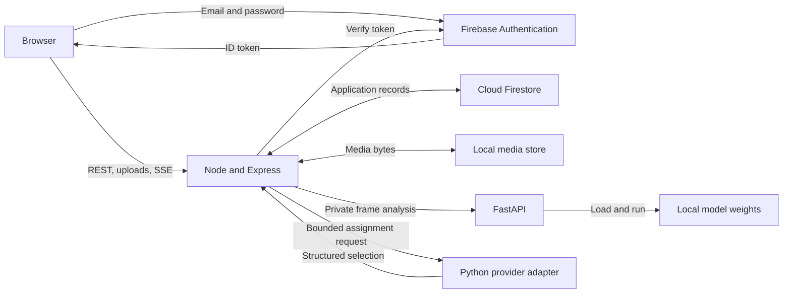

# LitterSpot architecture

## 1. Scope

This document describes the implemented component boundaries and deployment topology. Product behavior belongs in the [PRD](PRD.md) and [technical specification](spec.md). Exact persistence contracts belong in the [Firestore model](data-model/README.md).

## 2. System context

LitterSpot serves four human interfaces from one React application:

- Superadmin platform administration;
- Root Supervisor Site operations and structural administration;
- Regular Supervisor Site operations;
- Cleaner mobile operations.

The application uses Firebase Authentication for identity, Node for all business behavior, Firestore for authoritative records, a local filesystem for media, and FastAPI for stateless vision inference.

## 3. Deployment topology

The normal local production-connected command starts three processes:

1. Vite serves the React application and proxies `/api` to Node.
2. Node serves the application API, workers, media, and live events.
3. FastAPI loads local model weights and serves private inference.

Firebase Authentication and Firestore remain hosted in project `litterspot`. The Firebase web storage bucket value is part of Firebase client configuration, but LitterSpot does not use Firebase Storage for application media.

The emulator command starts the same three application processes plus local Authentication, Firestore, and Emulator UI processes. It imports and exports `.local/firebase-emulator-data` and uses `.local/emulator-media`.

## 4. Business-module architecture

### 4.1 Site and spatial administration

**Frontend owners**

- `frontend/src/features/superadmin`
- `frontend/src/pages/SiteAdministrationPage.tsx`
- `frontend/src/components/SiteMapViewer.tsx`
- Supervisor and Team pages under `frontend/src/features/operations`

**Backend owners**

- `superadminRoutes`, `supervisorAccountRoutes`, `siteMapRoutes`, and supporting services;
- Firebase Authentication identity provisioning and compensation;
- Firestore map drafts, revisions, geometry, account profiles, and Site operations.

**Key boundary**

Spatial edits occur in drafts and become active only when Node publishes an immutable Site Map Revision. The browser never writes map geometry directly to Firestore.

### 4.2 Camera monitoring and AI

**Frontend owners**

- `SiteMonitoringProvider` and shared `SiteCameraMonitoring` runtime;
- `CameraOperationsPage`, `CameraLiveView`, and `CameraCreationPage`;
- shared delayed-playback implementation.

**Backend owners**

- Camera Creation, monitoring, live event, media, and development scene routes;
- process-local Monitoring Session and episode registries;
- per-Camera inference serialization;
- lightweight Firestore runtime snapshots and analytics admission.

**FastAPI owner**

- image validation and model orchestration;
- coordinate and region transforms;
- people, bin, and floor-hazard inference;
- stateless response generation.

**Key boundary**

The browser captures sources, Node validates operational context, and FastAPI analyzes one frame. FastAPI has no Firebase client and cannot create Flags, Alerts, or Work.

### 4.3 Alert and evidence management

**Backend owners**

- temporal qualification memory in `liveMonitoringService`;
- qualification and priority rules in `alertPolicy`;
- durable creation, updates, evidence, and notifications in `alertService`;
- Alert reads and mutations in `alertRoutes`.

**Storage owners**

- Firestore stores Flags, Alerts, occurrences, events, and evidence metadata;
- local media stores the selected evidence bytes.

**Key boundary**

Detection Signals remain transient. Node creates durable state only after issue-specific qualification. One active-key document prevents duplicate active Alerts.

### 4.4 Cleaner and Work operations

**Frontend owners**

- `CleanerMobileApp`;
- Team, Alert, and Work management pages;
- Firestore notification subscriptions scoped to the signed-in user and Site.

**Backend owners**

- Cleaner identity, schedule, availability, and Station Point services;
- Work creation, transition, Verification, takeover, reassignment, and dismissal;
- notification persistence and authorized media delivery.

**Key boundary**

Availability is calculated by Node from trusted records. The provider and browser cannot mark a Cleaner eligible. Work and Cleaner reservation change in one transaction.

### 4.5 Orchestration and operational intelligence

**Backend owners**

- Firestore outbox and process-local worker;
- assignment context construction and pair validation;
- leased Runs, attempts, actions, and idempotent command commit;
- automated review application;
- dashboard, minute and daily analytics, bin-placement analysis, audit, and system status.

**Python provider owner**

- convert the bounded JSON context into an Ollama or Gemini request;
- parse one structured pair selection;
- return no business mutation.

**Key boundary**

Node calculates eligibility, priority, distance, and allowed pairs. The model selects from those pairs. Node revalidates and commits or rejects the selection.

## 5. Data ownership

| Data | Authority | Volatility |
| --- | --- | --- |
| Identity credentials | Firebase Authentication | Managed by Firebase |
| Accounts, Sites, maps, Cameras, Alerts, Work, Runs, analytics | Firestore | Durable |
| Media metadata and retention state | Firestore | Durable |
| Media bytes | Backend local filesystem | Durable on one host |
| Monitoring leases, active episodes, temporal samples, candidate evidence | Node memory | Process-local |
| Delayed video buffer and exact grid snapshots | Browser memory | Browser-local |
| Model weights | Local filesystem | Deployment artifact |
| AI Observation response | FastAPI response, then selected Node state | Stateless in FastAPI |
| Optional structured provider-bridge output | Private local diagnostics | Developer-controlled |

## 6. Trust boundaries

- The browser is untrusted for role, Site ownership, Cleaner eligibility, revision state, and model results.
- Firebase Authentication proves identity, while Node resolves the application role and active profile.
- Firestore client rules deny application business writes. Node uses Admin credentials.
- Internal Orchestrator routes require a shared token and worker ID.
- FastAPI may require `X-Internal-Token`.
- Local media is never exposed as a static directory. Node authorizes metadata, content, overlays, and byte ranges.
- Development Camera scenes and simulated Alerts remain environment-gated.

## 7. Runtime coordination

### Monitoring

One browser lease owns Site capture. Node keeps the authoritative in-process lease and episode state and writes bounded runtime snapshots. Server-sent events distribute exact analyzed snapshots and workflow refresh signals.

### Orchestrator

Firestore outbox records survive process restarts. The Node worker claims due items, starts leased Runs, calls the provider, and commits through guarded transactions. Startup recovery handles interrupted Runs and pending Camera Verification collectors.

### Analytics

Node accumulates admitted observations in minute buckets and writes completed summaries. Daily aggregation and bin-placement calculations read those bounded summaries and current operational records.

## 8. Failure behavior

- Authentication or role failure stops the request before business routes.
- Revision and lease conflicts return 409 and require refresh or retry.
- AI unavailability returns a safe upstream error and does not persist a false observation.
- Firestore quota exhaustion returns 503 and slows monitoring retry.
- Lost Monitoring Session ownership stops the affected episodes and permits later takeover.
- Delayed playback freezes and re-buffers instead of showing unanalyzed footage.
- Orchestrator failure leaves Alerts or Work in their valid current state and records a Run and system event.
- Site cleanup is paged and recoverable after process interruption.

## 9. Scaling boundary

The implementation is suitable for one backend host and one capture-owner browser per Site. Node memory, browser capture, local media, and in-process rate limits are not coordinated across multiple backend hosts. Horizontal deployment would require shared runtime coordination and shared media storage, neither of which exists in this system.
