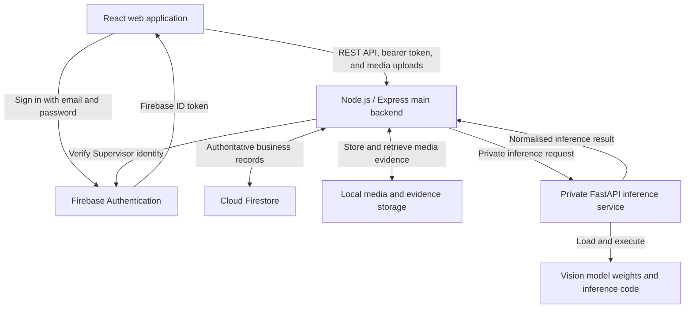

# LitterSpot prototype architecture

## 1. Status and purpose

This document records the agreed target architecture for the LitterSpot prototype. It describes the intended ownership boundaries and integration flows, even when the current repository has not yet been fully changed to match them.

The detailed functional scope is maintained in
[requirements-baseline.md](./requirements-baseline.md). The approved future
Cleaner, autonomous-orchestrator, and self-hosted deployment design is in
[autonomous-orchestrator-and-cleaner-plan.md](./autonomous-orchestrator-and-cleaner-plan.md).

The implementation sequence and database design are maintained in [backend-build-and-migration-plan.md](./backend-build-and-migration-plan.md) and [firestore-data-model.md](./firestore-data-model.md).

**Architecture status:** the Supervisor detection platform and the Phase 10-11
authenticated Cleaner/work-order backend are implemented. The Cleaner PWA and
autonomous AI Supervisor extension remain approved but not yet implemented.

## 2. Technology stack

| Layer | Technology | Responsibility |
| --- | --- | --- |
| Web frontend | React with TypeScript and Vite | Current Supervisor interface; target mobile-first Cleaner PWA |
| Main application backend | Node.js with TypeScript and Express | Public application API, authorisation, validation, business workflows, persistence coordination, alert rules, and analytics |
| Authentication | Firebase Authentication | Supervisor and provisioned Cleaner identities with Node-owned role dispatch and profile checks |
| Application database | Cloud Firestore | Authoritative application records, Cleaner presence, work orders, notifications, and histories |
| Push delivery | Firebase Cloud Messaging | Best-effort Cleaner web push backed by a durable Firestore inbox |
| AI inference service | Python with FastAPI | Private model loading and image/video-frame inference |
| AI models | Teammate-provided weights and Python inference code | Floor litter, bin overflow, people counting, and optional liquid-spill detection |
| Prototype media storage | Local filesystem | Uploaded images/videos and generated snapshot evidence |
| Prototype analytics | Node.js deterministic aggregation and scoring | Zone statistics, heatmaps, priority scores, and explainable zone ranking |
| Autonomous orchestration | Python with LangGraph and an LLM provider | Approved target for Cleaner assignment, rework, and verification decisions; not yet implemented |
| Local model runtime | Ollama | Approved Option A runtime for the orchestration LLM and optional VLM; not yet implemented |
| Agent checkpoints | PostgreSQL | Durable LangGraph threads and recovery in Option A; not yet implemented |

**Cloud Firestore is the hosted cloud database for the application.** Node.js connects to the selected Firebase project over the network, and shared development/demo data persists in that cloud project. Firestore is not being replaced by SQLite or another local database.

The Firebase Emulator Suite may optionally imitate Authentication and Firestore on a developer's machine for isolated development/tests. Emulator data is disposable and is never the shared application database.

## 3. Logical architecture



Firebase Authentication is a specialised identity provider. Apart from signing in through Firebase Authentication, the React application communicates with LitterSpot through the Node.js API.

## 4. Architectural ownership rules

### 4.1 Node.js is the main backend

Node.js/Express owns all application and business behaviour:

- request authentication and authorisation;
- Supervisor profile/session workflows and cleaner personnel-record CRUD;
- site, cleaning-zone, and camera records;
- upload validation and processing coordination;
- validation of AI-service responses;
- raw detections and people-count observations;
- grouped positive/negative cleanliness issue observations;
- provisional magnitude, confidence, temporal, and severity business rules;
- grouped cleanliness flags and per-camera confirmation state;
- zone-and-issue active-alert deduplication;
- alert status transitions and histories;
- dashboard queries;
- priority-zone aggregation, scoring, and reporting;
- references to uploaded media and snapshot evidence.

No second general-purpose application backend should be developed in Python.

### 4.2 FastAPI is a private inference service

FastAPI owns only AI-runtime concerns:

- loading trained model weights;
- model-specific preprocessing;
- running floor-litter, bin-overflow, people-counting, and optional spill inference;
- model-specific post-processing;
- returning a normalised response containing detections, counts, confidence, model version, and processing metadata.

FastAPI does not own Supervisor profiles, cleaner records, zones, flags, alerts, status history, dashboards, analytics policy, or authoritative database records. It should not be called directly from the browser.

The model-training teammates provide weights and inference code. The application-integration work packages these assets behind the private FastAPI contract.

### 4.3 Firebase responsibilities

Firebase Authentication owns Supervisor and provisioned Cleaner login
identities. Firestore owns role dispatch, application profiles, site/zone
permissions, availability, work orders, notifications, and location state.
Existing Cleaner document IDs remain the business identity and are explicitly
linked to deterministic Auth UIDs through an idempotent migration/provisioning
workflow; they are never silently reinterpreted as Auth UIDs.

The React application signs in with Firebase Authentication and receives an ID
token. It sends that token to Node.js in the API authorisation header. Node.js
verifies the token, loads `userAccounts/{uid}`, then enforces the active
Supervisor or Cleaner profile and role-specific route boundary.

React should not directly query or mutate application collections in Firestore. Keeping application data behind Node.js prevents business rules from being duplicated or bypassed.

### 4.4 Local filesystem responsibilities

During prototype development, the local filesystem stores:

- original uploaded images;
- original uploaded videos;
- selected or generated video frames;
- snapshot evidence used by detections and alerts.

Firestore stores metadata and opaque evidence references rather than image or video bytes. Media files should be served through authenticated Node.js endpoints rather than exposed as an unrestricted public directory.

Storage access must be hidden behind an application interface so local files can later be replaced with cloud object storage without changing detection and alert business rules.

## 5. Authoritative data ownership

| Data | Authority |
| --- | --- |
| Supervisor login identity and password | Firebase Authentication |
| Supervisor profile and active status | Firestore through Node.js |
| Cleaner personnel identity/contact/location assignment | Firestore through Node.js |
| Cleaner login identity | Firebase Authentication linked explicitly through Node.js |
| Role dispatch, Cleaner permissions, presence, work orders, notification inbox | Firestore through Node.js |
| Cleaner push delivery | FCM as a best-effort effect of a durable Firestore notification |
| Site, cleaning zone, and camera metadata | Firestore through Node.js |
| Uploaded media and evidence bytes | Local filesystem for the prototype |
| Media and evidence metadata | Firestore through Node.js |
| AI model weights | FastAPI service filesystem/model registry |
| Raw inference response | Transient FastAPI output validated by Node.js |
| Raw detections, grouped issue observations, and people counts | Firestore through Node.js |
| Cleanliness flags | Firestore through Node.js |
| Alerts and status histories | Firestore through Node.js |
| Analytics buckets, scores, and reports | Firestore through Node.js |

Any SQLite database or Python-owned alert/analytics state currently present in the repository is not part of the agreed target architecture. It may be useful as existing prototype code or migration input, but Firestore through Node.js is the intended authority.

## 6. Main request and event flows

### 6.1 Login

1. React submits email and password to Firebase Authentication.
2. Firebase returns an ID token after successful authentication.
3. React includes the ID token as a bearer token in Node.js API requests.
4. Node.js verifies the token, loads role dispatch, and checks the corresponding
   Firestore Supervisor or Cleaner profile is active.
5. Node.js returns only role-authorised application data.

### 6.2 Supervisor profile and cleaner administration

Supervisor authentication and cleaner management are separate flows:

1. The initial Supervisor identity is provisioned with a controlled, one-time bootstrap process in Firebase Authentication, with a matching Firestore Supervisor profile.
2. The signed-in Supervisor may update their allowed profile fields through Node.js; credential changes use Firebase Authentication.
3. The Supervisor submits Cleaner create, view, edit, permission, provisioning,
   reconciliation, or deactivation requests to Node.js.
4. Node.js preserves the Firestore Cleaner business ID, reserves the normalised
   email, creates/links the deterministic Firebase Auth UID, and writes the
   `userAccounts` role record safely across service retries.
5. Cleaner deactivation is blocked while active work remains, then marks the
   personnel/role records inactive and disables Firebase Auth while preserving
   historical references.

Supervisor bootstrap and Cleaner provisioning/disablement span Firebase Auth
and Firestore, so they use deterministic identities, intermediate states, and
explicit reconciliation because the services do not share one transaction.

### 6.3 Image or video inference

1. React uploads an image or video to Node.js with site, zone, capture-time, and optional camera metadata.
2. Node.js authenticates the Supervisor and validates file type, size, location, and timestamps.
3. Node.js stores the original media locally and creates a processing record.
4. Node.js sends the accepted media or selected frames to FastAPI over a private HTTP connection.
5. FastAPI runs the relevant models and returns a normalised inference result.
6. Node.js validates the response against the shared contract.
7. Node.js stores raw detections, people-count observations, evidence references, processing status, and model metadata in Firestore.
8. Node.js groups the raw detections into one positive or negative issue observation per analysis run and cleanliness issue.
9. Positive groups continue into the flag-and-alert workflow; negative groups remain available for confirmation history and analytics coverage.

Image requests may finish synchronously when processing is short. Video processing should expose a processing state such as `queued`, `processing`, `completed`, or `failed` so the browser does not need to hold one request open for the whole video.

### 6.4 Flag and alert workflow

1. Node.js evaluates all raw detections for one run as grouped floor-litter, bin-overflow, and optional floor-spill observations. Each run produces a positive or negative observation for each supported issue.
2. A positive group creates at most one deterministic cleanliness flag, regardless of how many raw detections contributed to it. Test groups are scored but excluded before flag creation.
3. Node.js updates a temporal confirmation buffer scoped to the same camera, zone, and issue type.
4. The provisional rules are floor litter 3-of-5 within 30 minutes, bin overflow 2-of-3 within 15 minutes, and floor spill two consecutive within 10 minutes.
5. Once a camera-specific sequence confirms, Node.js transactionally creates or updates the single active alert for the relevant `zoneId + issueType`.
6. Positive grouped flags become alert occurrences; negative observations never attach to an alert and never resolve a human work item automatically.
7. Supervisor status updates append immutable history entries.
8. Resolving an alert releases its zone/issue active key and advances a reset generation, so a later incident requires a fresh confirmation sequence.

The grouping weights, confidence floors, severity thresholds, and temporal
windows are versioned prototype policy rather than model-training parameters.
They remain configurable and subject to calibration.

### 6.5 Dashboard flow

React requests dashboard views from Node.js. Node.js reads or calculates:

- active-alert summaries;
- recent detections;
- latest processed media and overlays;
- processing failures;
- zone and issue statistics;
- alert status history.

For the first prototype, the latest processed upload or video frame represents the detection view. True live camera updates are deferred.

### 6.6 Priority-zone analytics flow

1. Node.js aggregates validated observations and deduplicated incidents by time bucket and cleaning zone.
2. It calculates litter burden, visitor pressure, overflow burden, issue persistence, and data coverage.
3. It applies configurable deterministic weights.
4. It ranks zones as high, medium, or low priority, or marks them as having insufficient data.
5. React displays the ranking, factor breakdown, heatmap, and plain-language reasons.

This analysis does not require a separately trained model.

### 6.7 Approved autonomous work flow

After Phase 4 creates an alert, Node.js creates or resumes one durable
orchestrator run. The LangGraph/LLM service retrieves typed context through
Node.js, chooses a Cleaner and instructions, and submits a typed command back to
Node.js. Node.js validates role, site/zone permission, status, and idempotency
before persisting the work order and notification.

The Cleaner accepts and performs the work through the mobile web app, then
marks it ready for review. The orchestrator obtains fresh evidence, combines
vision results with its operational reasoning, and decides clean, rework, more
evidence, or visible exception. Only a clean review resolves the alert; Cleaner
submission alone cannot do so.

## 7. Security and trust boundaries

- The browser must never receive Firebase service-account credentials, model filesystem paths, or FastAPI administrative access.
- Node.js must verify every Firebase ID token. Implemented routes enforce
  explicit Supervisor/Cleaner permissions and active profiles.
- Private orchestrator tools require service authentication and per-tool
  authorisation. The LLM has no Firebase credentials and no direct Firestore
  write path.
- FastAPI should bind to a private/local interface in development and a private network in deployment.
- Node.js must validate upload MIME type, extension, decoded media type, size, and generated filenames.
- Local evidence paths must not be accepted directly from client input.
- Firestore writes that enforce flags, alerts, histories, or analytics rules must occur through Node.js.
- Secrets and local paths belong in environment configuration and must not be committed.
- FastAPI responses are untrusted service input until Node.js validates their schema and value ranges.

## 8. Approved Option A deployment shape

The selected deployment for the next prototype is **Option A: one self-hosted
workstation or local server for application and AI compute, with managed
Firebase services remaining in the cloud**.

```text
Caddy HTTPS reverse proxy
React production build / Cleaner PWA
Node.js/Express application backend
Private Python/LangGraph orchestrator
PostgreSQL LangGraph checkpoint store
Private FastAPI vision inference service
Ollama local LLM and optional VLM
Local media/evidence directory
Cloud Firebase Authentication, Cloud Firestore, and FCM
```

Docker Compose should manage the application services and persistent volumes.
On macOS, Ollama should normally run on the host when that provides better Apple
hardware acceleration. Only Caddy is public; FastAPI, LangGraph, PostgreSQL, and
Ollama remain private.

A trusted HTTPS origin is required for phone access, geolocation, service
workers, and web push. A secure tunnel is acceptable for demonstrations. A
longer-running installation should use a stable hostname, TLS, controlled
firewall rules, startup recovery, and coordinated backups of Firestore,
PostgreSQL, and local media.

This is not a fully offline deployment because Authentication, Firestore, and
FCM remain Firebase cloud services.

## 9. Planned evolution

### Current prototype

- uploaded images and video files;
- local media/evidence storage;
- one all-powerful Supervisor role;
- provisioned Cleaner login role with restricted mobile APIs;
- Cleaner permissions, presence/location, work orders, notification inbox, and
  best-effort FCM delivery;
- Firestore as application database;
- grouped issue observations and per-camera temporal cleanliness confirmation;
- one active Supervisor alert per zone and cleanliness issue;
- deterministic priority-zone analytics;
- latest processed media instead of a true live stream.

### Approved next extension

- mobile-first Cleaner PWA using the implemented backend;
- review attempts separated from the implemented work orders and alerts;
- autonomous LLM assignment, reassignment, and verification through LangGraph;
- Node-validated typed tools, durable checkpoints, and full decision audit;
- FCM web notification with a persisted Firestore fallback;
- Option A self-hosted packaging with Caddy, Compose, PostgreSQL, and Ollama.

The orchestrator is trusted to make operational choices without routine human
approval, while Node.js remains the business execution authority and enforces
hard invariants. See
[autonomous-orchestrator-and-cleaner-plan.md](./autonomous-orchestrator-and-cleaner-plan.md).

### Other later phases

- CCTV/IP-camera streams and connection monitoring;
- resilient background job processing for continuous or long-running inference;
- cloud object storage replacing local media files;
- true near-real-time dashboard delivery;
- more detailed site maps and heatmap presentation;
- separately deployable and scalable Node.js and FastAPI services.

These later changes should extend the same ownership boundaries rather than move business workflows into FastAPI or the React client.

## 10. Decisions intentionally not made yet

- Exact Option A host hardware, hostname, TLS/tunnel, and backup destination.
- Cloud object-storage provider.
- Background job/queue technology for videos and camera streams.
- Later calibration of the current video sampling and temporal confirmation
  policy.
- Dashboard real-time transport, such as polling, server-sent events, or another mechanism.
- Final analytics weights and data-sufficiency thresholds.
- Live-camera protocol and credential-management design.
- Field calibration of the implemented five-minute Cleaner freshness and
  seven-day location retention.
- Work-order timeout/automatic reassignment policy and whether a later version
  needs assisting Cleaners beyond the implemented one-primary-Cleaner rule.
- Initial Ollama model, optional VLM, prompt policy, and evaluation dataset.

## 11. Change log

### 2026-08-18 - Cleaner backend boundary implemented

- Implemented Firebase Auth/Firestore role dispatch for Supervisor and Cleaner
  without changing Cleaner business IDs.
- Implemented Cleaner permissions, presence/location, work orders, durable
  notifications, and best-effort FCM behind Node-only application APIs.
- Kept the Cleaner PWA, LangGraph/LLM decisions, PostgreSQL checkpoints, and
  automated evidence review in their later owned phases.

### 2026-08-17 - Autonomous Cleaner workflow and Option A deployment

- Approved Cleaner as a Firebase-authenticated mobile-web user with constrained
  work-order capabilities, site/zone assignments, availability, and location.
- Approved an autonomous LangGraph/LLM Supervisor that chooses assignments and
  reviews work without routine human approval.
- Kept Node.js as the typed-tool, validation, persistence, and invariant
  authority; the orchestrator does not write Firestore directly.
- Separated alerts, work orders, and verification reviews.
- Selected Option A: Caddy and Docker Compose on one self-hosted machine,
  PostgreSQL checkpoints, local Ollama/FastAPI/media, and cloud Firebase Auth,
  Firestore, and FCM.

### 2026-08-13 - Grouped temporal alert ownership

- Recorded raw detection retention and one positive or negative grouped issue
  observation per analysis run and issue type.
- Added provisional per-camera temporal confirmation for litter, overflow, and
  spill, with one active Supervisor alert per zone and issue type.
- Recorded test-data exclusion, negative-observation behaviour, and the fresh
  confirmation sequence required after resolution.

### 2026-08-12 - Firebase foundation connected

- Connected the Node backend to Firebase project/database `litterspot` in Singapore.
- Implemented Supervisor token/profile verification and Firebase-authenticated React sessions.
- Migrated cleaner CRUD to Firestore while keeping cleaners outside Firebase Authentication.

### 2026-08-11 - Location hierarchy simplified

- Confirmed `site -> cleaning zone -> camera` and removed the area layer from the prototype architecture.

### 2026-08-11 - Supervisor authentication and cleaner-record boundary

- Limited Firebase Authentication identities to Supervisors.
- Defined cleaners as Firestore personnel records with no login credentials.
- Split Supervisor bootstrap/profile handling from cleaner-directory CRUD.

### 2026-08-11 - Initial architecture record

- Recorded React, Node.js/Express, Firebase Authentication, Firestore, and private FastAPI as the target stack.
- Established Node.js as the main business backend and Firestore as the application-state authority.
- Limited FastAPI to private AI inference responsibilities.
- Recorded local filesystem media storage for the prototype and cloud storage as a later replacement.
- Recorded uploaded images/videos before live camera streams.
- Recorded deterministic Node.js priority-zone analytics without an additional trained model.
