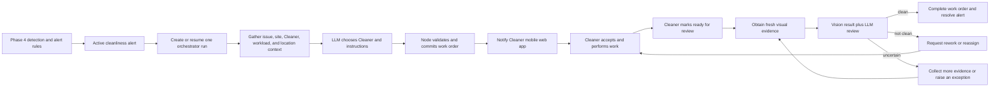
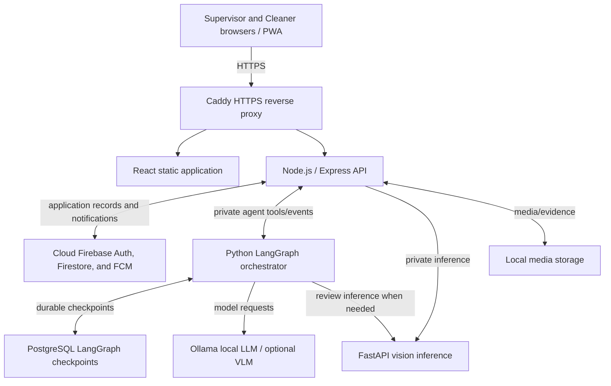

# Autonomous AI Supervisor and Cleaner workflow plan

> **V2 scope notice:** This plan records the earlier autonomous-workflow direction but does not define the clarified V2 contract. Phase 9 now gives the LLM up to 10 waiting Alerts and all backend-validated available Cleaners so it can select one Alert and Cleaner pair. Station Point remains the default location, with a fresh resolved Work target supplied only as uncertain returning-to-station context. See [`current-clarified-requirements-continuation.md`](current-clarified-requirements-continuation.md), [`data-model-v2/`](data-model-v2/), and [`adr/0003-orchestrator-selects-assignment-pair.md`](adr/0003-orchestrator-selects-assignment-pair.md).

## 1. Decision status

**Approved target architecture as of 2026-08-18. Phase 10-11 backend, the
Node-owned Phase 12 orchestrator foundation, and the backend-owned Phase 14
review/rework foundation are implemented; the Cleaner PWA and autonomous model
runtime are not yet implemented.**

This document defines the next product direction for LitterSpot: authenticated
Cleaner users carry out physical work while an autonomous LLM-based
orchestrator performs the routine operational work of a human Supervisor.

The existing detection/alert APIs plus Cleaner identity, role isolation,
presence, work-order, notification, orchestrator-run, and review backend are
the implemented baseline. The future model runtime does not replace the
deterministic detection, flag, alert, or Node state-transition rules; it begins
work after those rules produce an alert.

## 2. Product objective

The normal operational path should require no human Supervisor approval:

1. LitterSpot confirms a cleanliness problem and creates an alert.
2. The orchestrator gathers live operational context.
3. An LLM reasons over that context and chooses a Cleaner, timing, and
   instructions.
4. The selected Cleaner receives a mobile-web notification, performs the work,
   and reports that it is ready for review.
5. The orchestrator obtains fresh visual evidence, evaluates the result, and
   either completes the work, requests rework, or gathers more evidence.

The human Supervisor becomes an oversight and exception-management role. They
retain dashboards, reports, audit history, manual override, reassignment, and an
emergency stop, but they are not an approval gate in the normal workflow.

## 3. Actors and permissions

### 3.1 Supervisor

The existing Supervisor capabilities remain available. In the target system a
Supervisor may also:

- create or invite Cleaner accounts;
- activate or deactivate Cleaner access;
- assign each Cleaner to permitted sites and zones;
- monitor orchestrator decisions and Cleaner work;
- manually assign, reassign, cancel, or resolve work when intervention is
  necessary;
- pause autonomous assignment globally or for a site;
- inspect decision, tool-call, notification, and review audit trails.

### 3.2 Cleaner

A Cleaner becomes an authenticated Firebase user and uses a focused React
mobile web application or progressive web app. A Cleaner may:

- sign in and sign out;
- set availability to online, busy, on break, or offline;
- grant location permission and publish current or last-known location while
  online;
- receive assignments and notifications;
- accept or reject an assignment with an optional reason;
- mark work in progress;
- mark work ready for review, with notes and optional completion evidence;
- view their own active and recent work orders.

A Cleaner may not browse all cameras, all alerts, analytics, configuration, or
other Cleaners. A Cleaner cannot directly mark an alert resolved.

### 3.3 Autonomous orchestrator

The orchestrator is a trusted operational actor. It may decide which Cleaner to
assign, when to assign or reassign, what instructions to provide, whether more
evidence is needed, and whether completed work passes review.

The LLM owns the assignment decision. Application code supplies facts such as
distance, availability, workload, permissions, and location freshness; it does
not secretly replace the LLM with a hard-coded ranking formula.

Node.js remains the execution authority. The orchestrator calls typed Node.js
tools, and Node.js validates non-negotiable invariants before committing a
decision. For example, Node.js must reject assignment to an inactive Cleaner,
an unauthorised site, an invalid workflow state, or a duplicate concurrent work
order. The orchestrator never writes Firestore directly.

## 4. Domain workflow and states

Alert, work order, and review are separate concepts:

- an **alert** says a zone has a confirmed cleanliness issue;
- a **work order** says a particular Cleaner has been asked to act;
- a **review** records the evidence and decision about whether the work solved
  the issue.



### 4.1 Alert lifecycle

The Node-owned backend lifecycle is:

```text
new -> acknowledged -> in_progress -> awaiting_verification -> resolved
                                      -> in_progress (rework)
```

Cleaner submission enters `awaiting_verification` but never resolves the alert.
The future orchestrator runtime supplies the reasoning; Node validates and
persists the typed review decision. Existing manual Supervisor transitions
remain as override paths.

### 4.2 Work-order lifecycle

```text
    unassigned -> assigned -> accepted -> in_progress -> ready_for_review -> completed
                  |           |              |               |
                  |           +-> rejected   |               +-> rework_required
                  +-> cancelled              +-> cancelled
```

Rejection, timeout, deactivation, or stale location may cause reassignment.
Cleaner submission creates a durable review request; only a clean review
completes the work order and resolves the alert. All transitions must be
idempotent and append immutable history records.

## 5. Orchestrator design

### 5.1 Runtime boundary

Use a separate private Python orchestration service built with LangGraph. This
is not a second public application backend:

- Node.js remains the public API and Firestore/business authority;
- LangGraph owns agent state, checkpoints, retries, and LLM tool sequencing;
- Ollama or another configured provider serves the LLM/VLM;
- FastAPI continues to serve the project's trained detection models.

Create one durable LangGraph thread per alert. Use PostgreSQL checkpoints in the
selected deployment so an orchestrator run can resume after a process restart.
Trigger runs through a durable outbox/run record rather than an in-memory,
fire-and-forget HTTP call.

### 5.2 Minimum context supplied to the LLM

- alert type, severity, zone, camera, timestamps, evidence, and history;
- active Phase 4 occurrences and confidence/magnitude summaries;
- permitted and active Cleaners for the alert's site/zone;
- each Cleaner's availability, current workload, capabilities, and recent
  assignments;
- last-known location, timestamp, accuracy, and calculated travel distance;
- site hours, access constraints, and any current incidents;
- previous assignment attempts, rejection reasons, and review results.

### 5.3 Typed tools

The initial tool set should include:

- `get_alert_context` and `get_evidence`;
- `list_eligible_cleaners` and `get_cleaner_workload`;
- `get_location_freshness` and `calculate_travel_distances`;
- `create_work_order`, `assign_cleaner`, and `reassign_cleaner`;
- `send_notification`;
- `request_fresh_evidence` and `analyze_review_evidence`;
- `mark_rework_required` and `resolve_alert`;
- `raise_supervisor_exception` and `pause_site_automation`.

Tool schemas, permissions, idempotency keys, timeouts, and retry behaviour are
part of the API contract. Free-form model text is never executed as a database
command.

### 5.4 Model abstraction

The orchestration layer must use a provider interface rather than bind business
code to one model. Planned provider modes are `ollama`, `vllm`, and
`online_api`. The approved local deployment starts with Ollama. The project may
later use an external VLM, but the current trained litter and overflow models
remain the first review signal.

## 6. Cleaner mobile web behaviour

The Cleaner interface should be mobile-first and installable as a PWA, but it
does not require a native iOS or Android wrapper.

Location collection requires explicit consent and HTTPS. An online session uses
browser geolocation plus periodic heartbeats. Every location record includes a
capture time and accuracy, and assignment context must label old data as stale.
Mobile browsers cannot guarantee continuous background location tracking, so
the system must tolerate paused updates and fall back to the last known zone,
manual check-in, or availability status.

Use Firebase Cloud Messaging for web push where supported and also persist every
notification in Firestore. The in-app inbox is the reliable record when push is
blocked, delayed, or unsupported. Notification payloads should contain only the
minimum operational information and should open the authenticated work-order
view.

## 7. Application data boundary

The Node-owned application schemas below are implemented in Firestore. The
model teammate still owns provider-specific prompts, checkpoints, and model
runtime state:

- authenticated role/profile records for Supervisors and Cleaners;
- Cleaner site/zone assignments and capabilities;
- availability sessions and bounded location history;
- work orders, assignment attempts, and immutable work-order histories;
- persisted notifications and delivery attempts;
- orchestrator runs, leases, tool calls, decisions, and policy/model versions;
- review requests and immutable review attempts with before/after evidence
  references;
- model checkpoints and provider state (future PostgreSQL/LangGraph runtime);
- automation settings, pause state, and human overrides.

The current `cleaners/{cleanerId}` personnel documents require an explicit,
idempotent migration to Firebase Authentication-linked Cleaner profiles. Do not
silently reinterpret an existing opaque Cleaner document ID as an Auth UID.

## 8. Approved Option A deployment

Option A is a single self-hosted LitterSpot workstation or server for the
application and AI compute, while Firebase remains managed in the cloud.



### 8.1 Services

| Component | Option A choice |
| --- | --- |
| Public entry point | Caddy with HTTPS and reverse proxy rules |
| Web application | React production build served as static files |
| Main backend | Node.js/Express container |
| Orchestration | Private Python/LangGraph container |
| Agent checkpoints | PostgreSQL container with a persistent volume |
| Vision inference | Private FastAPI container or host process |
| Local language/vision model runtime | Ollama, preferably native on macOS for Apple acceleration |
| Application identity/data/messages | Cloud Firebase Authentication, Cloud Firestore, and FCM |
| Evidence bytes | Local filesystem mounted as a persistent volume |
| Process composition | Docker Compose, except host-native Ollama when that gives better hardware acceleration |

The current developer Mac can run the demo, but a dedicated machine is
recommended for unattended operation. Phones must reach a trusted HTTPS origin
for sign-in, geolocation, service workers, and web push. A secure HTTPS tunnel is
acceptable for demonstrations; a longer-running site installation should use a
stable hostname, TLS certificate, and controlled local-network/firewall setup.

The application is therefore self-hosted, not fully offline: Firebase Auth,
Firestore, and FCM still require internet access. A future offline-only product
would be a separate architecture decision.

### 8.2 Capacity constraints

The litter, bin, people, LLM, and optional VLM workloads share the host's CPU,
GPU, and memory. Before choosing hardware, benchmark the actual models together.
Use quantised models, bounded concurrency, and on-demand VLM loading where
necessary. If the workload no longer fits one machine, the same private service
boundaries allow inference or Ollama to move to a second machine later.

### 8.3 Minimum operational controls

- health and readiness checks for Node, orchestrator, FastAPI, Ollama, and
  PostgreSQL;
- automatic service restart and startup recovery;
- persistent volumes and documented backup/restore for PostgreSQL and local
  media, coordinated with Firestore exports;
- no public exposure of FastAPI, Ollama, PostgreSQL, or Firebase credentials;
- request IDs and end-to-end correlation across alert, run, work order, and
  review;
- resource limits and queue backpressure;
- an emergency automation pause that does not disable manual Supervisor access.

## 9. Reliability, safety, and audit requirements

Trusting the LLM means accepting its operational choice without routine human
approval. It does not mean accepting malformed or impossible commands.

- Every agent action uses a typed, authorised, idempotent Node.js tool.
- Concurrent alert events must not create duplicate active assignments.
- Agent runs resume from durable checkpoints after restart.
- Retries must not duplicate work orders, notifications, or status changes.
- Unavailable, inactive, off-site, or stale-location Cleaners must be visible to
  the LLM and rejected by Node when they violate an invariant.
- Evidence and database text are untrusted inputs and must not be allowed to
  override system instructions or tool permissions.
- Record model/provider/version, prompt/policy version, context snapshot,
  selected Cleaner, concise decision rationale, tool calls, timestamps,
  retries, result, and any human override.
- Keep location retention short and access-controlled; define a privacy notice
  and explicit consent before field testing.
- Low-confidence review should gather more evidence or create a visible
  exception rather than silently resolve an alert.

## 10. Implementation sequence

1. **Cleaner identity and access (backend implemented):** migrate personnel
   records safely, add the Cleaner role, Firebase Auth provisioning, role-based
   middleware, and mobile session/profile APIs.
2. **Cleaner operations (backend implemented; PWA deferred):** availability,
   location heartbeat, mobile work queue APIs, persisted notification inbox,
   and FCM delivery.
3. **Work-order domain (implemented):** state machine, assignment history,
   rejection/reassignment/rework, semantic-idempotent commands, and Supervisor
   override APIs.
4. **Orchestrator foundation:** durable alert outbox, LangGraph service,
   PostgreSQL checkpoints, typed tools, provider abstraction, and audit records.
5. **Autonomous assignment:** LLM context retrieval, distance calculations,
   assignment/reassignment decisions, timeouts, and notification workflow.
6. **Autonomous verification:** fresh evidence capture, current-model review,
   optional VLM adapter, rework loop, and final alert resolution.
7. **Option A packaging:** Compose services, Caddy HTTPS, host-native Ollama
   integration, backups, recovery, monitoring, and phone-based acceptance tests.

Each stage requires automated state-machine/idempotency tests and a full path
test from an alert through Cleaner completion and autonomous verification.

## 11. Decisions still to finalise

- whether a later version needs assisting Cleaners beyond the implemented one
  primary Cleaner;
- assignment acceptance timeout and automatic reassignment policy;
- field calibration/privacy wording for the implemented five-minute freshness
  and seven-day location retention;
- whether the implemented site/zone arrays and four capabilities need expansion;
- what fresh footage source is available before live camera streaming exists;
- evidence threshold for clean, rework, more evidence, and Supervisor exception;
- first Ollama LLM and optional VLM, prompt design, and evaluation dataset;
- FCM browser support and fallback expectations for the Cleaners' actual phones;
- dedicated host hardware, hostname, tunnel/domain, and backup destination.

These settings must be configurable and versioned. They should not be buried in
prompts or source-code constants.

## 12. Reference notes

- [LangGraph checkpoint interfaces](https://langchain-ai.github.io/langgraph/reference/checkpoints/)
- [Ollama tool calling](https://docs.ollama.com/capabilities/tool-calling)
- [Ollama vision](https://docs.ollama.com/capabilities/vision)
- [MDN Geolocation API security requirements](https://developer.mozilla.org/en-US/docs/Web/API/Geolocation_API)
- [Firebase Cloud Messaging for web](https://firebase.google.com/docs/cloud-messaging/web/get-started)
- [Firebase web foreground/background message handling](https://firebase.google.com/docs/cloud-messaging/web/receive-messages)
