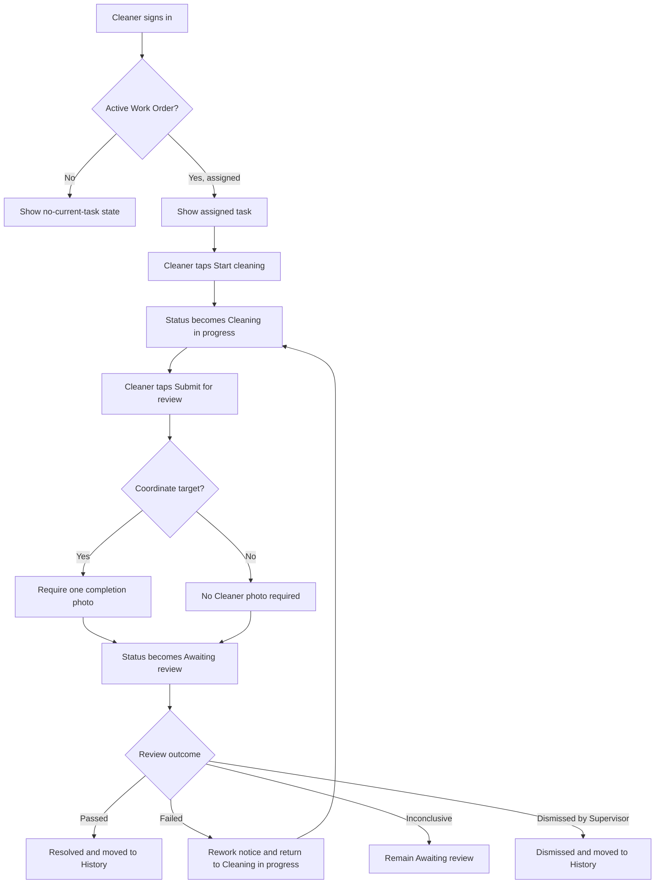

# Cleaner mobile web UI behavior brief

## Purpose

This brief explains the expected Cleaner-facing mobile web behavior for LitterSpot. It gives the frontend team enough product context to plan screens and interactions. It does not prescribe colors, typography, layout style, or a component library.

The Cleaner product is intentionally narrow. A Cleaner signs in, sees one assigned cleaning task, performs it, submits it for review, and reacts to a rework notice if cleaning must continue.

The backend domain term is **Work Order**. The interface may use the friendlier label **Cleaning task**.

## Cleaner rules that affect the interface

- A Cleaner receives credentials created by a Supervisor.
- A Cleaner can have at most one active Work Order.
- Assignment counts as acceptance. There is no Accept button.
- The Cleaner cannot reject, decline, cancel, report a problem, or mark themselves available or unavailable.
- The Cleaner cannot choose another task or Cleaner.
- The Cleaner cannot resolve a Work Order. They submit it for review.
- A Supervisor controls schedules and availability.
- The Cleaner does not provide GPS or live location.
- The Cleaner may view their own Station Point and schedule, but cannot edit them.
- The Cleaner cannot browse Alerts, all Cameras, other Cleaners, analytics, or Supervisor controls.
- The Cleaner may see only their active Work and latest five resolved or dismissed Work Orders.

## Suggested mobile navigation

A four-item bottom navigation is enough:

1. **Current task**
2. **Notifications**
3. **History**
4. **Profile**

After sign-in, open **Current task**. If a notification links to a Work Order, tapping it opens that Work Order directly.

## Main workflow

## Screen behavior

### 1. Sign-in

Show:

- LitterSpot identity;
- email field;
- password field;
- sign-in action;
- validation and authentication errors.

Possible results:

- successful Cleaner login opens Current task;
- invalid credentials show a plain error;
- inactive Cleaner or inactive Site shows that access is unavailable;
- a Supervisor or Superadmin account should not enter the Cleaner product area.

Password recovery and self-registration are not required for the first prototype.

### 2. Current task

This is the Cleaner home screen.

When no active Work exists, show:

- a clear "No cleaning task assigned" state;
- current derived status such as Available, Off shift, Unavailable, or Account inactive;
- the next scheduled working time when useful;
- a small read-only Station Point summary.

Do not show an assignment queue. The Orchestrator or Supervisor chooses the Work.

When active Work exists, show a compact task summary:

- task title;
- issue type;
- severity;
- current status;
- Zone name;
- target type, either Camera or map coordinate;
- assignment time;
- instruction summary;
- one primary action for the current status.

Tapping the summary opens Work Order Details.

### 3. Work Order Details

The details screen should show:

- title and instructions;
- issue type and severity;
- status and relevant timestamps;
- Zone name;
- Site Map section with the Work target marked;
- Camera name when the Work came from a Camera;
- annotated Alert Evidence for Camera-linked Work;
- latest Verification result when one exists;
- rework message and rework count when cleaning must continue;
- the action allowed for the current status.

The Site Map is a read-only task-location view. It does not allow the Cleaner to edit Zones, Camera placement, or Station Points.

#### Assigned

Show **Start cleaning** as the primary action.

Do not show Accept, Reject, Cannot find, or Report problem.

After a successful request, the status becomes **Cleaning in progress**. Disable duplicate submissions while the request is running.

#### Cleaning in progress

Show **Submit for review** as the primary action.

For Camera-linked Alert Work:

- no Cleaner photo is required;
- submission starts fresh Camera Verification;
- explain that LitterSpot will review the Camera after submission.

For coordinate-targeted manual Work:

- require exactly one completion photo before submission;
- allow capture from the phone camera or selection from the device;
- show upload progress and a replace-photo action before final submission;
- explain that a Supervisor will review the result.

If the Cleaner cannot see the issue or believes it is already gone, they still use **Submit for review**. There is no separate problem-report flow.

#### Awaiting review

Show a waiting state with no workflow action.

Suggested message:

> Cleaning submitted. Waiting for review.

The screen should refresh when the Work is resolved, dismissed, or returned for rework.

#### Rework

Rework is not a separate stored Work status. Failed Verification returns the same Work Order to **Cleaning in progress**.

Make the rework condition obvious:

- show "More cleaning required";
- show a short safe reason when the backend provides one;
- retain the same target, evidence, and Cleaner;
- show **Submit for review** after the Cleaner finishes again.

The Cleaner does not accept the rework and cannot transfer it to someone else.

#### Resolved

Show that review passed and the task is complete. Remove it from Current task and place it in History.

#### Dismissed

Show that the task was closed by a Supervisor or the system. Remove it from Current task and place it in History. The Cleaner does not need to act.

## Status labels for the interface

| Backend status | Suggested Cleaner label | Cleaner action |
| --- | --- | --- |
| `assigned` | New task | Start cleaning |
| `in_progress` | Cleaning in progress | Submit for review |
| `awaiting_review` | Awaiting review | None |
| `resolved` | Completed | None |
| `dismissed` | Dismissed | None |

Failed Verification returns the Work to `in_progress`. The interface should add a visible rework message instead of inventing a new Work status.

## Notifications

The Cleaner receives these notification types:

- new Work assigned;
- rework required;
- Work resolved;
- Work dismissed.

Expected behavior:

- when the mobile web page is open, a new notification appears immediately;
- show a small in-app banner or toast;
- also add it to the Notifications list;
- tapping it opens the related Work Order;
- when the browser was closed, the stored notification appears after the next sign-in;
- browser push, operating-system notifications, SMS, and email are not required.

Notifications are read-only events. There is no unread count, mark-as-read action, acknowledgement, or delivery receipt.

The Notifications screen can show:

- notification title;
- short message;
- timestamp;
- severity treatment when relevant;
- link to the related Work Order.

If the Work no longer exists in the active view, open its historical detail instead.

## History

Show only the five most recent Work Orders with status `resolved` or `dismissed`.

Each row may show:

- task title;
- Zone;
- issue type;
- final status;
- resolved or dismissed time;
- a small evidence thumbnail when available.

Historical details are read-only. The Cleaner cannot reopen, repeat, or comment on completed Work.

## Profile and schedule

Show read-only information:

- Cleaner name;
- staff code;
- account status;
- derived availability status;
- weekly schedule in the Site timezone;
- Station Point on a small Site Map;
- Station Zone;
- current active-task status when busy.

Do not provide controls for:

- editing the Cleaner profile;
- changing the schedule;
- moving the Station Point;
- setting availability;
- submitting leave;
- enabling GPS.

The Supervisor owns all of those changes.

## Real-time and refresh behavior

The frontend may listen directly to Firebase only for notifications addressed to the signed-in Cleaner. All Work Order, profile, schedule, map, evidence, and history data comes through the Node API.

When a notification arrives, the frontend should refetch the related Work Order or Current task. It should also refetch when the page regains focus and after every Cleaner action.

If an action fails because the Work changed on another device or through a Supervisor action, refetch the Work and show its current state instead of leaving the old action button active.

## Important empty and error states

The UI should account for:

- no active Work;
- off shift;
- Supervisor-set unavailable state;
- Site or Cleaner account inactive;
- task dismissed while open;
- task resolved while open;
- rework received while awaiting review;
- completion-photo upload failure;
- expired sign-in session;
- temporary API or network failure;
- target map revision retained for historical Work even after the active Site Map changes.

For temporary failures, keep the current screen content and provide Retry. Do not convert network failure into a Work status.

## What the Cleaner UI must not include

- task acceptance or rejection;
- Report problem or Cannot find issue;
- manual online, offline, available, or busy controls;
- GPS permission or location tracking;
- Cleaner selection or reassignment;
- Alert dismissal or Work resolution;
- Verification override;
- all-Camera monitoring;
- Alert management;
- other Cleaner profiles;
- Site, Zone, Camera, schedule, or Station Point editing;
- Orchestrator controls, logs, or raw reasoning;
- Dashboard or bin-placement analytics.

## Suggested prototype walkthrough

The frontend team can demonstrate the behavior using hardcoded states:

1. Sign in as a Cleaner with no active Work.
2. Receive an in-app "New cleaning task" event.
3. Open Camera-linked Work with annotated evidence and a map target.
4. Start cleaning.
5. Submit without a photo and enter Awaiting review.
6. Receive a rework notice and return to Cleaning in progress.
7. Submit again and show the resolved state.
8. Open History and see the completed Work.
9. Open a coordinate-targeted manual Work and demonstrate the required completion-photo step.
10. Open Profile to view the read-only schedule and Station Point.

## Items still open for visual design

The frontend team may decide:

- exact navigation style;
- how the Site Map target and annotated evidence share the screen;
- whether Current task uses a card or opens details immediately;
- toast, banner, and notification-list presentation;
- how severity and rework are emphasized;
- mobile breakpoints and desktop fallback layout.

These choices must preserve the workflow and permission limits above.
