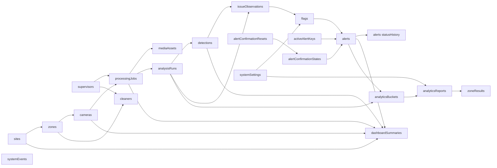

# LitterSpot Firestore data model and Firebase services plan

## 1. Purpose and status

This document defines the proposed Firebase services, Firestore collections, document shapes, query indexes, consistency rules, and local-media relationship for the LitterSpot prototype.

Related documents:

- [requirements-baseline.md](./requirements-baseline.md)
- [architecture.md](./architecture.md)
- [backend-build-and-migration-plan.md](./backend-build-and-migration-plan.md)
- [autonomous-orchestrator-and-cleaner-plan.md](./autonomous-orchestrator-and-cleaner-plan.md)

**Status:** active database design. Authentication, location, cleaner, media,
image-analysis, grouped-observation, flag, alert, dashboard, server-owned
video/frame, system-event, and priority-zone analytics collections are
implemented. The analytics policy remains explicitly provisional and may be
calibrated without changing which service owns the records. Phase 8 retired
the former Python/SQLite business path; FastAPI's operational frame contract is
now stateless inference only. Phase 9 hardening, system events, cursor indexes,
and dry-run-first media retention are implemented.

Authenticated Cleaner role dispatch, presence/location, work orders,
assignment attempts, and notifications are implemented. The orchestrator,
review, and checkpoint collections later in this document remain approved
targets rather than implemented claims.

## 2. Firebase services

### 2.1 Services used now

| Service | Use |
| --- | --- |
| Firebase Authentication | Current Supervisor email/password login identities; approved target adds Cleaner identities |
| Cloud Firestore | Authoritative application database |
| Firebase Admin SDK in Node.js | Verify Supervisor ID tokens, administer Supervisor identities, and read/write Firestore |
| Firebase client SDK in React | Authentication only |
| Firebase Emulator Suite | Recommended local Auth/Firestore development and integration tests |

The approved target also uses Firebase Cloud Messaging for Cleaner web push.
Every notification must still have a Firestore inbox record because web push is
not a guaranteed delivery channel.

**Cloud Firestore means Firebase's managed, cloud-hosted database.** The real prototype and shared team/demo environment connect to a Firebase cloud project. The Emulator Suite is only a disposable local testing substitute and is not the deployed or shared database.

### 2.2 Services not used now

| Service | Decision |
| --- | --- |
| Cloud Storage for Firebase | Not used; media/evidence stays on the local filesystem for the prototype |
| Cloud Functions for Firebase | Not used; Node.js owns workflows and analytics |
| Firebase Hosting | Not used; Option A serves the React build through self-hosted Caddy |
| Realtime Database | Not needed; Firestore is the single application database |
| Direct Firestore access from React | Not used; React accesses application data through Node.js |

This keeps the prototype within the selected architecture and avoids relying on Firebase services that are not currently part of the project plan.

### 2.3 Environment separation

Recommended environments:

1. Firebase Emulator Suite for optional isolated local development and automated integration tests.
2. One shared cloud Firebase development project for team integration/demo testing and the working prototype database.
3. A separate production project only if the prototype is later deployed for real use.

Never point automated tests at the shared project. Never commit service-account JSON or client secrets that are not intended for browser use.

The current shared prototype project is `litterspot`. Its Firestore Native
database ID is `litterspot` in `asia-southeast1` (Singapore). Node must select
this named database explicitly; it must not assume `(default)`.

### 2.4 First Supervisor bootstrap

The first Supervisor cannot be created through the normal protected API because no authenticated Supervisor exists yet. Provide a one-time Node CLI/bootstrap command that:

1. creates or locates the Firebase Authentication identity;
2. creates the matching Firestore `supervisors/{uid}` document;
3. records role `supervisor` and status `active`;
4. is safe to rerun;
5. refuses to overwrite an incompatible existing identity.

In the implemented baseline, the authenticated Supervisor uses the application
for cleaner personnel-record CRUD and Cleaner creation never calls Firebase
Authentication. The approved target adds a controlled Cleaner
provisioning/invitation flow and an explicit migration from those existing
personnel records.

## 3. Data-design principles

- Node.js is the only application writer and reader of Firestore.
- Firebase Authentication stores credentials; Firestore never stores passwords.
- In the implemented baseline, Cleaner records have no Firebase Authentication
  identity. The target migration links a personnel record to a separate Auth UID
  without silently changing its document ID.
- Use Firestore `Timestamp` values and server timestamps, not locale strings.
- Use opaque IDs; do not expose sequential database IDs.
- Use soft deactivation for records referenced by history.
- Store string IDs instead of Firestore `DocumentReference` fields to keep DTOs and migrations simple.
- Denormalise parent IDs and display-name snapshots where needed for efficient queries and historical readability.
- Store media bytes on the local filesystem; Firestore stores metadata and safe relative storage keys.
- Store bounding boxes and polygons as normalised 0-1 coordinates; also retain source image width and height.
- Do not store base64 images, videos, model weights, or absolute filesystem paths in Firestore.
- Avoid large opaque raw-response blobs. Persist typed fields needed for traceability, display, and analytics.
- Every retryable write path must have an idempotency strategy.
- Demo/test data may retain raw detections and grouped metrics, but must be
  explicitly excluded from flags, temporal confirmation, alerts, and analytics.
- Business statuses and issue types use controlled enum values.

## 4. Relationship overview



All application relationships use ID fields. The arrows describe logical relationships rather than mandatory Firestore nesting.

## 5. Common conventions

### 5.1 Audit fields

Mutable top-level documents should use the relevant subset of:

```ts
{
  createdAt: Timestamp,
  createdByUid: string,
  updatedAt: Timestamp,
  updatedByUid: string,
  deactivatedAt: Timestamp | null,
  deactivatedByUid: string | null
}
```

System-created documents use `createdByUid: "system"` or a dedicated `actorType` field where clearer.

### 5.2 Status enums

```text
Supervisor/cleaner/location status: active | inactive
Camera availability: unknown | available | unavailable
Job status: uploading | queued | processing | completed | failed | cancelled
Alert status: new | acknowledged | in_progress | resolved
Analytics report status: pending | completed | insufficient_data | failed
```

### 5.3 Issue types

```text
floor_litter
bin_overflow
floor_spill       optional
```

People count is an observation, not a cleanliness issue type.

### 5.4 Source types

```text
image_upload
video_upload
camera_stream     reserved for later
```

### 5.5 Coordinates

Persist a normalised box as:

```ts
{
  x1: number, // 0..1
  y1: number, // 0..1
  x2: number, // 0..1
  y2: number  // 0..1
}
```

The invariant is `0 <= x1 < x2 <= 1` and `0 <= y1 < y2 <= 1`. Polygons use arrays of `{x, y}` points in the same normalised coordinate space.

## 6. Identity and location collections

### 6.1 `supervisors/{uid}`

The document ID is the Firebase Authentication UID.

```ts
{
  uid: string,
  email: string,
  emailNormalized: string,
  displayName: string,
  role: "supervisor",
  status: "active" | "inactive",
  authDisabled: boolean,
  reconciliationStatus: "consistent" | "auth_pending" | "firestore_pending" | "error",
  createdAt: Timestamp,
  createdByUid: string,
  updatedAt: Timestamp,
  updatedByUid: string,
  deactivatedAt: Timestamp | null,
  deactivatedByUid: string | null
}
```

Rules:

- never store a password or password hash;
- email uniqueness is enforced by Firebase Authentication;
- Node checks both Firebase identity and Firestore `status` on protected requests;
- the current application UI does not administer additional Supervisor identities;
- historical records retain actor snapshots even if a Supervisor is later disabled.

### 6.2 `cleaners/{cleanerId}` - implemented baseline

Cleaners are personnel records managed by a Supervisor. They are not users of the web application and the document ID is an opaque Firestore ID, not a Firebase Authentication UID.

```ts
{
  staffCode: string,             // e.g. CLN-001, unique after normalisation
  staffCodeNormalized: string,
  fullName: string,
  fullNameNormalized: string,
  phone: string,
  assignedSiteId: string,
  assignedZoneId: string,
  assignedZoneNameSnapshot: string,
  status: "active" | "inactive",
  notes: string | null,
  createdAt: Timestamp,
  createdByUid: string,          // Supervisor UID
  updatedAt: Timestamp,
  updatedByUid: string,
  deactivatedAt: Timestamp | null,
  deactivatedByUid: string | null
}
```

Current rules:

- never create a Firebase Authentication identity for a cleaner;
- never store a cleaner password, auth token, role, or `authDisabled` field;
- validate `assignedZoneId` against an active zone and derive the site/name snapshot in Node.js;
- use a transactionally reserved staff code or the cleaner document ID as the true uniqueness key; do not rely on a query followed by a write;
- deactivation is the normal delete behavior and removes the cleaner from active assignment choices without erasing history;
- changing a cleaner's current zone must not rewrite historical assignment snapshots;
- the current UI fields are staff code, full name, phone, one assigned zone, and
  status. The approved target adds authenticated access, multiple permitted
  locations where needed, availability, location, and assignment history using
  the planned collections in section 19.

### 6.3 `sites/{siteId}`

```ts
{
  name: string,
  slug: string,
  description: string | null,
  timezone: string,             // e.g. Asia/Kuala_Lumpur
  status: "active" | "inactive",
  operatingHours: object | null,
  mapAssetId: string | null,
  createdAt: Timestamp,
  createdByUid: string,
  updatedAt: Timestamp,
  updatedByUid: string
}
```

A site represents one attraction/property, such as Batu Caves or Sunway Lagoon.

### 6.4 `zones/{zoneId}`

```ts
{
  siteId: string,
  name: string,
  code: string | null,
  description: string | null,
  status: "active" | "inactive",
  analyticsEnabled: boolean,
  mapCentroid: { x: number, y: number } | null,
  mapPolygon: Array<{ x: number, y: number }>,
  createdAt: Timestamp,
  createdByUid: string,
  updatedAt: Timestamp,
  updatedByUid: string
}
```

A cleaning zone is the smallest operational unit used for alert ownership and priority ranking.

### 6.5 `cameras/{cameraId}`

For the upload-first prototype, a camera may be a logical source rather than a connected stream.

```ts
{
  siteId: string,
  zoneId: string,
  name: string,
  code: string | null,
  sourceMode: "upload" | "stream",
  streamProtocol: string | null,
  streamUri: string | null,
  status: "active" | "inactive",
  availability: "unknown" | "available" | "unavailable",
  focusRegionNormalized: Array<{ x: number, y: number }>,
  latestAnalysisRunId: string | null,
  latestAnalysisAt: Timestamp | null,
  lastHealthCheckAt: Timestamp | null,
  unavailableReason: string | null,
  createdAt: Timestamp,
  createdByUid: string,
  updatedAt: Timestamp,
  updatedByUid: string
}
```

Do not store future camera passwords in plaintext. The final stream credential mechanism is deferred.

## 7. Media and processing collections

### 7.1 Local storage layout

Use generated relative keys, for example:

```text
media/{mediaId}/original.jpg
media/{mediaId}/original.mp4
media/{frameMediaId}/frame.jpg
evidence/{analysisRunId}/{detectionId}.jpg
```

The configured storage root is an environment value outside Firestore. Node resolves and validates every key beneath that root.

### 7.2 `mediaAssets/{mediaId}`

```ts
{
  kind: "original_upload" | "extracted_frame" | "evidence" | "site_map" | "report_export",
  sourceType: "image_upload" | "video_upload" | "camera_stream",
  originalFileName: string,
  storageKey: string,
  storageStatus: "pending" | "available" | "missing" | "deleted",
  mimeType: string,
  byteSize: number,
  sha256: string,
  width: number | null,
  height: number | null,
  durationSeconds: number | null,
  codecName?: string | null,
  formatName?: string,
  parentMediaId: string | null,
  frameIndex: number | null,
  videoOffsetSeconds: number | null,
  siteId: string,
  zoneId: string,
  cameraId: string | null,
  capturedAt: Timestamp,
  isTest: boolean,
  createdAt: Timestamp,
  createdByUid: string,
  deletedAt?: Timestamp,
  deletionReason?: "retention_policy",
  retentionPolicyVersion?: "local-media-retention-v1",
  retentionCutoffAt?: Timestamp
}
```

The `storageKey` is never supplied by the browser. It is generated by Node.
Original videos retain probed dimensions, duration, codec, and container name.
Phase 9 retention removes only eligible owned local files and preserves this
document with `storageStatus: "deleted"`; it deletes `storageKey` and records
the versioned reason/timestamps above. Active-alert evidence and in-flight job
sources are never eligible. Execution is an offline maintenance action after a
coordinated Firestore/local-media backup; dry run is the default.
Each successful sampled frame is an `extracted_frame` whose `parentMediaId`
points to the original video and whose `frameIndex` and `videoOffsetSeconds`
identify its deterministic sample.

### 7.3 `processingJobs/{jobId}`

```ts
{
  type: "image" | "video",
  status: "uploading" | "queued" | "processing" | "completed" | "failed" | "cancelled",
  sourceMediaId: string,
  sourceType: "image_upload" | "video_upload",
  siteId: string,
  zoneId: string,
  cameraId: string | null,
  requestedByUid: string,
  requestedAt: Timestamp,
  captureStartedAt: Timestamp,
  startedAt: Timestamp | null,
  completedAt: Timestamp | null,
  analyticsEligible: boolean,
  isTest: boolean,
  clientRequestId: string,
  sourceSha256?: string,
  video?: {
    durationSeconds: number,
    width: number,
    height: number,
    codecName: string | null,
    formatName: string
  },
  options: {
    frameIntervalSeconds: number | null,
    floorConfidence: number | null,
    binLocalizerConfidence: number | null,
    focusRegionNormalized: Array<{ x: number, y: number }>
  },
  progress: {
    plannedFrames: number | null,
    processedFrames: number,
    successfulFrames: number,
    failedFrames: number,
    lastFrameIndex: number | null
  },
  summary: {
    analysisRunCount: number,
    detectionCount: number,
    flagCount: number,
    alertIds: string[]
  },
  error: {
    code: string,
    message: string,
    occurredAt: Timestamp
  } | null,
  attemptCount: number,
  claimToken: string | null,
  leaseExpiresAt: Timestamp | null,
  analysisRunId: string | null,
  videoTrackingState?: object,
  createdAt: Timestamp,
  updatedAt: Timestamp
}
```

Use a unique `clientRequestId` per Supervisor/request and derive the job ID from `requestedByUid + clientRequestId`, or protect a separate idempotency-key document transactionally. A normal query followed by a write does not guarantee uniqueness. Video progress must be updated at bounded intervals rather than for every small internal step.

For video, `uploading` is a short-lived staging state while the validated
temporary file is moved under its generated storage key. The job becomes
`queued` only after the media is available. Startup recovery reconciles an
interrupted staging move, requeues queued/expired-processing jobs, and relies on
the claim token plus lease to prevent two live workers from owning one attempt.
The current queue runs sequentially inside one Node process.

`sourceSha256` makes video idempotency stricter: the same Supervisor and
`clientRequestId` may return the original job only when the Camera and source
file match. Video `progress` advances once per sampled frame, and the persisted
tracking checkpoint supports stable per-video bin entity IDs across resumed
processing.

### 7.4 `processingJobs/{jobId}/frameFailures/{frameIndex}`

Non-fatal frame failures are stored by deterministic frame index:

```ts
{
  frameIndex: number,
  videoOffsetSeconds: number,
  error: { code: string, message: string },
  createdAt: Timestamp
}
```

Creating the same failure document twice is a no-op, so a retry cannot increment
`failedFrames` twice for one sample. A video may complete with both successful
and failed frames; it fails when no sampled frame succeeds or when private
inference is unavailable.

## 8. Inference and detection collections

### 8.1 `analysisRuns/{runId}`

One document represents one processed image or one sampled video frame. For video, use a deterministic ID based on job and frame index so retries overwrite/confirm the same logical run rather than creating duplicates.

```ts
{
  jobId: string,
  sourceMediaId: string,
  frameMediaId: string | null,
  evidenceMediaId: string | null,
  sourceType: "image_upload" | "video_upload" | "camera_stream",
  siteId: string,
  siteName: string,
  zoneId: string,
  zoneName: string,
  cameraId: string | null,
  cameraCode: string,
  cameraName: string,
  capturedAt: Timestamp,
  frameIndex: number | null,
  videoOffsetSeconds: number | null,
  image: { width: number, height: number },
  focusRegionNormalized: Array<{ x: number, y: number }>,
  peopleCount: number,
  people: Array<{ confidence: number, bbox: object }>,
  bins: Array<{
    entityId: string | null,
    state: "normal" | "full" | "overflow" | "unknown",
    confidence: number,
    bbox: object,
    confirmed: boolean,
    stale: boolean
  }>,
  issueKinds: string[],
  issueCounts: {
    floorLitter: number,
    binOverflow: number,
    floorSpill: number
  },
  modelVersions: {
    floorHazard: string | null,
    people: string | null,
    binLocalizer: string | null,
    binState: string | null
  },
  processingTimeMs: number,
  alertWorkflowVersion: "grouped-temporal-v2",
  alertEvaluationStatus: "pending" | "completed",
  alertEvaluationPolicyVersion: "cleanliness-v2" | null,
  alertEvaluationWorkflowVersion?: "grouped-temporal-v2",
  alertEvaluationAt: Timestamp | null,
  observationIds?: string[],
  flagIds?: string[],
  alertIds?: string[],
  videoTrackingStateAfter?: object,
  videoJobAppliedAt?: Timestamp | null,
  analyticsEligible: boolean,
  analyticsAppliedAt: Timestamp | null,
  analyticsApplicationStatus?: "applied" | "excluded",
  analyticsGenerationId?: string,
  analyticsBucketId?: string,
  analyticsPersistenceOutOfOrderIssueTypes?: string[],
  isTest: boolean,
  createdAt: Timestamp
}
```

Keep embedded arrays compact. If a scene can exceed safe document size, store detailed boxes in a non-indexed result file or split them into subdocuments while preserving the summary fields above.

For video, both the frame-media ID and analysis-run ID are deterministic from
`jobId + frameIndex`. `videoTrackingStateAfter` is the resumable checkpoint
after that frame, while `videoJobAppliedAt` is the idempotency marker proving
that the run's counts and tracking state have been applied to its parent job.
The frame `capturedAt` is the source video's capture-start timestamp plus
`videoOffsetSeconds`.

Analytics application occurs only after grouped alert evaluation. The
generation-scoped document in `analyticsSampleApplications`, rather than the
convenience fields embedded here, is the authoritative exactly-once marker.

### 8.2 `detections/{detectionId}`

Create one top-level detection document for every cleanliness issue result that must be reviewed, queried, flagged, or included in analytics. People boxes do not need individual detection documents.

```ts
{
  analysisRunId: string,
  jobId: string,
  sourceMediaId: string,
  evidenceMediaId: string | null,
  sourceType: "image_upload" | "video_upload" | "camera_stream",
  siteId: string,
  siteName: string,
  zoneId: string,
  zoneName: string,
  cameraId: string | null,
  cameraCode: string,
  cameraName: string,
  issueType: "floor_litter" | "bin_overflow" | "floor_spill",
  confidence: number,
  bboxNormalized: object,
  polygonNormalized: Array<{ x: number, y: number }>, // maximum 128 points
  entityId: string | null,
  modelKey: string,
  modelVersion: string,
  capturedAt: Timestamp,
  thresholdApplied: number,
  qualificationStatus: "pending_evaluation" | "excluded" | "qualified" | "rejected",
  qualifiedForFlag: boolean | null,
  qualificationReason: string,
  qualificationEvaluatedAt: Timestamp | null,
  observationId: string | null,
  flagId: string | null,
  analyticsEligible: boolean,
  isTest: boolean,
  createdAt: Timestamp
}
```

Before policy evaluation, detections use `qualificationStatus: "pending_evaluation"`
and `qualifiedForFlag: null`. Evaluated below-threshold detections use
`qualificationStatus: "rejected"` and `qualifiedForFlag: false` and remain
available for review. Qualifying detections use `qualificationStatus: "qualified"`
and `qualifiedForFlag: true`. Normal/full/unknown bin observations
may remain in `analysisRuns.bins` unless a later use case needs them as separate
searchable documents.

Test detections use `qualificationStatus: "excluded"`,
`qualifiedForFlag: false`, and reason `test_data`. Their grouped metrics are
still calculated for inspection, but they never create flags or alerts or
enter temporal confirmation and analytics.

Node reduces dense segmentation contours to at most 128 evenly distributed
normalized points before persistence. Public list APIs omit the polygon, while
the detection detail API may return it. The private, stateless FastAPI
`/analyze/frame` response contains only image/ROI metadata, people, bins, floor
hazards, model versions, and processing time. Node validates and normalizes
that model-detailed response before it becomes application data; see the
[private contract](./api-reference.md#private-fastapi-post-analyzeframe).

## 9. Grouped observation, flag, and alert collections

The current Node workflow version is `grouped-temporal-v2`. Raw model
detections remain separate documents, but alert policy evaluates them as one
group per analysis run and issue type.

### 9.1 `issueObservations/{observationId}`

Create exactly one issue observation for every `analysisRunId + issueType`
combination, including a negative observation when the run contains no eligible
detection for that issue. The deterministic ID is derived from the run ID and
issue type.

```ts
{
  workflowVersion: "grouped-temporal-v2",
  policyVersion: "cleanliness-v2",
  analysisRunId: string,
  jobId: string,
  sourceType: "image_upload" | "video_upload" | "camera_stream",
  siteId: string,
  zoneId: string,
  cameraId: string,
  issueType: "floor_litter" | "bin_overflow" | "floor_spill",
  evidenceMediaId: string | null,
  capturedAt: Timestamp,
  frameIndex: number | null,
  videoOffsetSeconds: number | null,
  detectionIds: string[],
  eligibleDetectionIds: string[],
  rejectedDetectionIds: string[],
  detectionCount: number,
  positive: boolean,
  excluded: boolean,
  evaluationReason: string,
  severity: "warning" | "critical" | null,
  metrics: {
    detectionCount: number,
    maximumConfidence: number,
    meanConfidence: number,
    mergedRegionCount: number,
    coverageRatio: number,
    occupiedGridCells: number,
    spatialDistribution: number,
    magnitudeScore: number | null
  },
  flagId: string | null,
  alertId: string | null,
  temporalStatus: "excluded" | "negative" | "awaiting_confirmation" | "attached" | "out_of_order" | "pre_reset_replay",
  confirmation: object | null,
  confirmationGeneration: number | null,
  temporalAppliedAt: Timestamp | null,
  temporalResult: object | null,
  createdAt: Timestamp,
  updatedAt: Timestamp
}
```

Test observations retain calculated metrics but use `excluded: true`; they do
not enter a confirmation buffer and cannot create a flag or alert. Negative
operational observations enter the camera-specific buffer but never attach to
an alert.

### 9.2 `flags/{flagId}`

A positive grouped observation creates at most one flag even when several raw
detections contributed to the group. Use a deterministic flag ID derived from
the observation ID.

```ts
{
  workflowVersion: "grouped-temporal-v2",
  policyVersion: "cleanliness-v2",
  observationId: string,
  analysisRunId: string,
  detectionId: string | null,
  detectionIds: string[],
  siteId: string,
  zoneId: string,
  cameraId: string,
  issueType: "floor_litter" | "bin_overflow" | "floor_spill",
  severity: "warning" | "critical",
  confidence: number,
  metrics: object,
  thresholdApplied: number,
  evidenceMediaId: string | null,
  capturedAt: Timestamp,
  status: "pending_confirmation" | "attached" | "ignored_out_of_order",
  alertId: string | null,
  confirmation: object | null,
  attachedAt: Timestamp | null,
  failureReason: string | null,
  createdAt: Timestamp,
  updatedAt: Timestamp
}
```

### 9.3 `alerts/{alertId}`

```ts
{
  workflowVersion: "grouped-temporal-v2",
  policyVersion: "cleanliness-v2",
  activeKey: string,
  activeKeyId: string,
  siteId: string,
  zoneId: string,
  triggerCameraId: string,
  cameraId: string, // compatibility alias of the trigger camera
  latestCameraId: string,
  cameraIds: string[],
  siteNameSnapshot: string,
  zoneNameSnapshot: string,
  issueType: "floor_litter" | "bin_overflow" | "floor_spill",
  severity: "warning" | "critical",
  status: "new" | "acknowledged" | "in_progress" | "resolved",
  firstObservationId: string,
  latestObservationId: string,
  firstDetectionId: string | null,
  latestDetectionId: string | null,
  latestFlagId: string,
  firstEvidenceMediaId: string | null,
  latestEvidenceMediaId: string | null,
  occurrenceCount: number,
  firstDetectedAt: Timestamp,
  lastDetectedAt: Timestamp,
  latestConfidence: number,
  maximumConfidence: number,
  latestMagnitudeScore: number | null,
  maximumMagnitudeScore: number,
  statusUpdatedAt: Timestamp,
  statusUpdatedByUid: string,
  resolvedAt: Timestamp | null,
  resolvedByUid: string | null,
  analyticsIncidentAppliedAt?: Timestamp,
  analyticsIncidentGenerationId?: string,
  analyticsIncidentBucketId?: string,
  createdAt: Timestamp,
  updatedAt: Timestamp
}
```

Repeated positive grouped flags update the latest evidence, camera, timestamp,
confidence/magnitude summaries, and occurrence count while retaining the first
evidence and first-detected time.

### 9.4 `alerts/{alertId}/occurrences/{flagId}`

```ts
{
  flagId: string,
  observationId: string,
  detectionId: string | null,
  detectionIds: string[],
  analysisRunId: string,
  cameraId: string,
  evidenceMediaId: string | null,
  confidence: number,
  magnitudeScore: number | null,
  metrics: object,
  severity: "warning" | "critical",
  capturedAt: Timestamp,
  createdAt: Timestamp
}
```

The deterministic grouped flag ID is also the occurrence ID, so workflow replay
cannot attach the same positive observation twice.

### 9.5 `activeAlertKeys/{activeKeyId}`

Firestore does not provide a unique compound constraint. Use a deterministic
lock/index document to guarantee one active alert per zone and issue type.

The logical key is:

```text
zoneId + ":" + issueType
```

```ts
{
  workflowVersion: "grouped-temporal-v2",
  alertId: string,
  siteId: string,
  zoneId: string,
  issueType: string,
  createdAt: Timestamp,
  updatedAt: Timestamp
}
```

Confirmation remains camera-specific. Two cameras do not combine observations
to satisfy a temporal rule, but once either camera confirms, its positive flag
creates or attaches to the shared zone/issue alert.

### 9.6 Confirmation state and resolution reset

`alertConfirmationStates/{stateId}` stores a bounded buffer for one
`zoneId + cameraId + issueType`. The policy-versioned buffer keeps at most five
compact observation snapshots and applies the provisional rules:

- floor litter: at least three positive observations among the latest five, all within 30 minutes;
- bin overflow: at least two positive observations among the latest three, all within 15 minutes;
- floor spill: two consecutive positive observations within 10 minutes.

`alertConfirmationResets/{activeKeyId}` stores a generation number for the
zone/issue. Resolving an alert deletes the matching active key and increments
this generation in the same transaction. A camera state from an earlier
generation is cleared before accepting a new observation, which requires a
fresh post-resolution sequence without relying on camera clock alignment.

Creation/update transaction:

1. read the issue observation, camera confirmation state, zone active key, reset generation, referenced alert, and supporting flags/occurrences;
2. add the distinct positive or negative observation to the bounded camera buffer;
3. create an alert only when the rule confirms and no zone/issue alert is active;
4. attach positive grouped flags as idempotent alert occurrences;
5. update the state, observation, flag, alert, and active key together.

### 9.7 `alerts/{alertId}/statusHistory/{eventId}`

```ts
{
  previousStatus: "new" | "acknowledged" | "in_progress" | "resolved" | null,
  newStatus: "new" | "acknowledged" | "in_progress" | "resolved",
  actorType: "system" | "supervisor" | "migration",
  actorUid: string | null,
  actorNameSnapshot: string,
  actorEmailSnapshot: string | null,
  note: string | null,
  changedAt: Timestamp
}
```

The first history entry records system creation with `previousStatus: null` and `newStatus: new`.

Status-history documents are append-only. Editing or deleting them is not supported by application services.

## 10. Dashboard and system collections

### 10.1 `dashboardSummaries/{siteId}`

This is the implemented compact, site-scoped reconciliation snapshot. Its
document ID is the site ID.

```ts
{
  version: "site-dashboard-summary-v1",
  workflowVersion: "grouped-temporal-v2",
  siteId: string,
  activeAlertCounts: {
    new: number,
    acknowledged: number,
    inProgress: number,
    total: number
  },
  resolvedAlertCount: number,
  configuredCameraCount: number,
  activeCameraCount: number,
  availableCameraCount: number,
  unavailableCameraCount: number,
  unknownCameraCount: number,
  latestDetectionAt: Timestamp | null,
  latestJobFailureAt: Timestamp | null,
  reconciledAt: Timestamp,
  reconciledByUid: string,
  updatedAt: Timestamp
}
```

Treat this as a rebuildable read model, not authority. Authenticated
`POST /api/dashboard/reconcile` validates the site, reads all site cameras and
alerts, counts only `grouped-temporal-v2` alerts, finds the latest site
detection and failed job, and overwrites this document with the Supervisor UID
and server timestamps. `GET /api/dashboard/summary?siteId=...` returns `404`
until the first reconciliation.

Active-camera availability counts consider only cameras with `status: active`;
`configuredCameraCount` includes active and inactive cameras. The latest failure
uses `error.occurredAt` when present and otherwise `completedAt`.

The summary is currently reconciled on demand and may become stale between
reconciliations. The full `GET /api/dashboard` DTO is built directly from
authoritative collections and does not currently read this summary document.

### 10.2 `systemEvents/{eventId}`

```ts
{
  type: "ai_service_unavailable" | "camera_unavailable" | "processing_failure" | "reconciliation_failure",
  severity: "info" | "warning" | "critical",
  siteId: string | null,
  cameraId: string | null,
  jobId: string | null,
  message: string,
  details: object,
  status: "open" | "closed",
  occurredAt: Timestamp,
  closedAt: Timestamp | null
}
```

This supports the requirement to notify the Supervisor when the detection service or a future camera becomes unavailable.

### 10.3 `systemSettings/{settingId}`

Initial documents:

- `alert-policy`
- `analytics-policy`
- `media-policy`

Example alert-policy shape:

```ts
{
  workflowVersion: "grouped-temporal-v2",
  version: "cleanliness-v2",
  activeAlertScope: "zone_issue",
  issuePolicies: {
    floor_litter: {
      enabled: true,
      minimumDetectionConfidence: 0.50,
      magnitudeThreshold: 0.40,
      criticalMagnitudeThreshold: 0.75,
      confirmation: { mode: "at_least", requiredPositive: 3, windowSize: 5, maximumWindowSeconds: 1800 }
    },
    bin_overflow: {
      enabled: true,
      minimumDetectionConfidence: 0.50,
      criticalConfidence: 0.75,
      confirmation: { mode: "at_least", requiredPositive: 2, windowSize: 3, maximumWindowSeconds: 900 }
    },
    floor_spill: {
      enabled: true,
      minimumDetectionConfidence: 0.50,
      criticalConfidence: 0.75,
      confirmation: { mode: "consecutive", requiredPositive: 2, windowSize: 2, maximumWindowSeconds: 600 }
    }
  },
  updatedAt: Timestamp,
  updatedByUid: string
}
```

The shown values match the current centralized Node policy, but remain
provisional calibration values. The current API exposes them read-only through
`GET /api/alerts/policy`; loading an editable Firestore policy is a planned
configuration step and must validate and version changes so old pending samples
are not silently mixed with a new policy.

## 11. Analytics collections

### 11.1 `analyticsBuckets/{bucketId}`

The implemented first version uses one UTC-hour bucket per active analytics
generation, site, and cleaning zone. The document ID is a SHA-256 hash of the
versioned identity tuple `generationId + siteId + zoneId + bucketStart`.

```ts
{
  aggregationVersion: "hourly-zone-v1",
  granularity: "hour",
  generationId: string,
  bucketStart: Timestamp,
  bucketEnd: Timestamp,
  siteId: string,
  zoneId: string,
  analyticsEligible: true,
  isTest: false,
  sampleCount: number,
  successfulSampleCount: number,
  failedSampleCount: number,
  cameraIds: string[],
  peopleCountSum: number,
  peopleCountMax: number,
  peoplePresentSamples: number,
  litterPositiveSamples: number,
  litterDetectionCount: number,
  litterIncidentCount: number,
  overflowPositiveSamples: number,
  overflowDetectionCount: number,
  overflowIncidentCount: number,
  spillPositiveSamples: number,
  spillDetectionCount: number,
  optionalSpillIncidentCount: number,
  issuePersistenceSeconds: number,
  issuePersistenceSecondsByType: {
    floor_litter: number,
    floor_spill: number,
    bin_overflow: number
  },
  persistenceMethod: "positive_to_positive_gap_same_camera_capped_by_confirmation_horizon_v1",
  modelVersions: string[],
  modelVersionSampleCounts: Array<{ version: string, sampleCount: number }>,
  createdAt: Timestamp,
  updatedAt: Timestamp
}
```

Definitions:

- a positive sample is a non-test `issueObservation` whose grouped metrics pass the current per-sample policy;
- a detection count counts qualifying detection entities;
- an incident count increments only for one alert's first positive observation;
- repeated occurrences attached to the same active alert do not create new incidents;
- people counts never create incidents;
- only non-test `analyticsEligible: true` runs update buckets;
- failed inference attempts currently have no `analysisRun`, so they do not yet
  increment `failedSampleCount` and are a known coverage limitation;
- persistence is the same-camera positive-to-positive gap, capped by that
  issue's confirmation horizon; out-of-order incremental samples add zero and
  require chronological reconciliation to repair the historical sequence.

### 11.2 Generation and reconciliation records

`analyticsSites/{analyticsSiteKey}` is the small publication pointer for one
site. The key is deterministic but opaque.

```ts
{
  siteId: string,
  currentGenerationId: string,
  previousGenerationId?: string | null,
  aggregationVersion: "hourly-zone-v1",
  lastReconciledAt?: Timestamp,
  lastReconciledByUid?: string,
  createdAt: Timestamp,
  updatedAt: Timestamp
}
```

Each rebuild writes metadata beneath
`analyticsSites/{analyticsSiteKey}/generations/{generationId}`. It starts as
`ready`, becomes `active` only when its pointer is published in a Firestore
transaction, and the former active generation becomes `superseded`. Buckets
and markers from old generations are retained; automatic generation garbage
collection is not implemented.

`analyticsReconciliationLocks/{analyticsSiteKey}` prevents live sample or
incident application while a site is being rebuilt. It records a random token,
the staging generation, requesting Supervisor, acquisition time, and a
30-minute lease expiry. Reconciliation constructs the complete new generation
before atomically switching the site pointer. If any bounded source would be
partial, it returns `409` and does not publish the generation.

### 11.3 Exactly-once application markers and persistence state

`analyticsSampleApplications/{markerId}` is deterministic for
`generationId + analysisRunId`. It records `applied` with the target bucket, or
`excluded` with `test_data`/`not_analytics_eligible`. The marker and bucket
mutation are created in one transaction. `analysisRuns.analyticsAppliedAt`
remains an audit field, while the generation-scoped marker is the actual
idempotency authority across reconciliation generations.

`analyticsIncidentApplications/{markerId}` is separately deterministic for
`generationId + alertId + firstObservationId`. This separation is necessary
because a newly confirmed alert may attach previously buffered observations.
The marker increments the incident in the hour containing that first
observation, exactly once, independently of which later run caused
confirmation.

`analyticsPersistenceStates/{stateId}` stores the latest chronological sample
per generation, site, zone, camera, and issue type:

```ts
{
  aggregationVersion: "hourly-zone-v1",
  persistenceMethod: string,
  generationId: string,
  siteId: string,
  zoneId: string,
  cameraId: string,
  issueType: "floor_litter" | "floor_spill" | "bin_overflow",
  lastAnalysisRunId: string,
  lastCapturedAt: Timestamp,
  lastPositive: boolean,
  createdAt: Timestamp,
  updatedAt: Timestamp
}
```

### 11.4 `analyticsReports/{reportId}`

```ts
{
  siteId: string,
  siteNameSnapshot: string,
  siteTimeZoneSnapshot: string,
  zoneIds: string[],
  periodStart: Timestamp,
  periodEnd: Timestamp,
  status: "pending" | "completed" | "insufficient_data" | "failed",
  policyVersion: "priority-zone-v1-provisional",
  aggregationVersion: "hourly-zone-v1",
  generationId: string,
  policy: object,
  selection: object,
  sufficientZoneCount: number,
  insufficientZoneCount: number,
  generatedByUid: string,
  generatedAt: Timestamp,
  completedAt: Timestamp | null,
  highPriorityZoneCount: number,
  mediumPriorityZoneCount: number,
  lowPriorityZoneCount: number,
  bucketQueryMode: "indexed" | "fallback_bounded_scan",
  error: object | null
}
```

Reports are immutable snapshots of the active generation, policy, site name,
time zone, selected period, and optional zone selection used at generation
time. A failed synchronous generation retains a `failed` report record and its
safe error message.

### 11.5 `analyticsReports/{reportId}/zoneResults/{zoneId}`

```ts
{
  reportId: string,
  siteId: string,
  zoneId: string,
  zoneName: string,
  zoneNameSnapshot: string,
  rank: number | null,
  priorityBand: "high" | "medium" | "low" | "insufficient_data",
  totalScore: number | null,
  factors: {
    litterBurden: { raw: number, normalized: number | null, weight: number, weightedContribution: number | null },
    visitorPressure: { raw: number, normalized: number | null, weight: number, weightedContribution: number | null },
    overflowBurden: { raw: number, normalized: number | null, weight: number, weightedContribution: number | null },
    issuePersistence: { raw: number, normalized: number | null, weight: number, weightedContribution: number | null }
  },
  evidence: {
    litterIncidents: number,
    overflowIncidents: number,
    averagePeoplePerSuccessfulSample: number,
    peakPeople: number,
    issuePersistenceSeconds: number
  },
  coverage: {
    eligibleHourlyBucketCount: number,
    successfulHourlyBucketCount: number,
    localCalendarDayCount: number,
    successfulSampleCount: number,
    failedSampleCount: number,
    sampleSuccessRatio: number,
    sufficient: boolean,
    insufficiencyReasons: string[]
  },
  reasons: string[],
  createdAt: Timestamp
}
```

Keeping zone results as subdocuments avoids the Firestore document-size limit
when a site has many zones. The provisional score is 35% litter incidents, 30%
average people per successful sample, 25% overflow incidents, and 10% issue
persistence. It normalises factors within the sufficient zones in that
site/report. Sufficiency requires 8 successful hourly buckets, 2 local calendar
days in the site's IANA time zone, and an 80% sample-success ratio. High begins
at 70, medium at 40, and insufficient zones receive no score or rank. This is a
zone recommendation, not an exact physical point and not a trained model.

## 12. Transactions, idempotency, and integrity

### 12.1 Supervisor bootstrap/profile operations across two Firebase services

Firebase Authentication and Firestore do not share one transaction.

Supervisor-bootstrap strategy:

1. create Auth identity;
2. create Firestore `supervisors/{uid}` profile;
3. if profile creation fails, attempt to disable/delete the newly created identity;
4. record reconciliation failure if compensation fails;
5. make retry safe by locating the identity by UID/email.

Supervisor-disable strategy, if required administratively:

1. mark reconciliation operation pending;
2. disable Auth identity;
3. mark Firestore Supervisor inactive;
4. Node checks Firestore active status on every request, so stale tokens cannot continue using the application;
5. retry/reconcile if either write fails.

Cleaner CRUD does not use this cross-service strategy. It writes only Firestore. Cleaner creation plus staff-code uniqueness should use a Firestore transaction and a deterministic reservation document such as `cleanerStaffCodes/{staffCodeNormalized}`. Deactivation updates the cleaner status/audit fields and preserves the record.

### 12.2 Processing idempotency

- `processingJobs.clientRequestId` prevents duplicate browser submissions.
- processing job IDs or dedicated idempotency-key documents enforce that client request uniqueness transactionally.
- video `analysisRuns` use deterministic job/frame IDs.
- `detections` may use a deterministic run/issue/entity ID.
- `issueObservations` use deterministic run/issue IDs.
- `flags` use deterministic observation-based IDs.
- analytics bucket IDs are deterministic within an immutable generation;
- a generation-scoped deterministic sample marker and its bucket mutation are
  written transactionally; `analysisRuns.analyticsAppliedAt` is audit metadata,
  not the sole retry guard;
- incident application is deliberately separate from alert creation and uses a
  deterministic generation/alert/first-observation marker, allowing an alert
  created by a later confirmation run to count the earlier first observation
  exactly once;
- reconciliation stages a bounded replacement generation under a site lock and
  changes the active pointer only after the staging metadata is `ready`.

### 12.3 Alert integrity

Use a Firestore transaction around confirmation state/reset, active-alert key,
alert, grouped flag, issue observation, and occurrence updates. Never implement
uniqueness as a query followed by an unprotected write.

### 12.4 Alert status integrity

Use one transaction to:

- read current alert status;
- validate the requested forward transition;
- update alert status and actor fields;
- append status history;
- delete active-alert key when resolved;
- increment the zone/issue confirmation-reset generation when resolved;

Do not treat a dashboard summary as part of this authoritative status
transaction. The implemented reconciliation endpoint rebuilds derived counts
from alert and camera records.

### 12.5 Soft deletion

Do not hard-delete Supervisors, cleaners, sites, zones, cameras, alerts, detections, or history through normal APIs. Mark mutable personnel/configuration records inactive. Media retention/cleanup is a separate administrative policy that must not remove database history silently.

### 12.6 `systemEvents/{eventKey}`

Operational dependency visibility is Node-owned and read-only to public API
clients. `eventKey` is a deterministic SHA-256 of dependency, stable event
code, and scope. It deduplicates a current failure generation while preserving
lifetime counters and immutable idempotency markers in `occurrences` and
`recoveries` subcollections.

```ts
{
  eventKey: string,
  dependency: "ai_service" | "video_processing" | "analytics_rebuild",
  eventCode: string,
  scopeType: "global" | "site" | "job",
  scopeId: string | null,
  status: "open" | "resolved",
  severity: "warning" | "critical",
  maximumSeverity: "warning" | "critical",
  generation: number,
  occurrenceCount: number,
  lifetimeOccurrenceCount: number,
  resolutionCount: number,
  reopenCount: number,
  firstSeenAt: Timestamp,
  lastSeenAt: Timestamp,
  firstEverSeenAt: Timestamp,
  resolvedAt: Timestamp | null,
  lastResolvedAt: Timestamp | null,
  reopenedAt: Timestamp | null,
  latestSafeDetails: object,
  latestRecoverySafeDetails: object | null,
  createdAt: Timestamp,
  updatedAt: Timestamp
}
```

`latestSafeDetails` is a strict allowlist of identifiers, stable reason codes,
counts, timing, and retryability. Raw errors, stacks, URLs, request headers,
tokens, and arbitrary prompts are invalid. Business work never fails merely
because best-effort system-event persistence fails.

## 13. Query and index plan

Firestore automatically creates many single-field indexes. The following composite queries are expected.

| Collection | Query | Composite index fields |
| --- | --- | --- |
| `cleaners` | Active cleaners in a site | `assignedSiteId ASC, status ASC, fullNameNormalized ASC` |
| `cleaners` | Active cleaners in a zone | `assignedZoneId ASC, status ASC, fullNameNormalized ASC` |
| `zones` | Active zones in a site | `siteId ASC, status ASC, name ASC` |
| `cameras` | Cameras in a zone | `siteId ASC, zoneId ASC, status ASC, name ASC` |
| `processingJobs` | User job history | `requestedByUid ASC, requestedAt DESC` |
| `processingJobs` | Queue/failed jobs | `status ASC, createdAt ASC` |
| `processingJobs` | Recent failed jobs for site dashboard | `siteId ASC, status ASC, completedAt DESC` |
| `analysisRuns` | Latest camera results | `cameraId ASC, capturedAt DESC` |
| `analysisRuns` | Cursor-paged runs for a camera | `cameraId ASC, createdAt DESC` |
| `analysisRuns` | Cursor-paged runs for a job | `jobId ASC, createdAt DESC` |
| `analysisRuns` | Zone history | `zoneId ASC, capturedAt DESC` |
| `analysisRuns` | Frames for a job | `jobId ASC, frameIndex ASC` |
| `detections` | Zone issue history | `zoneId ASC, issueType ASC, capturedAt DESC` |
| `detections` | Camera issue history | `cameraId ASC, issueType ASC, capturedAt DESC` |
| `detections` | Qualification review | `qualificationStatus ASC, createdAt DESC` |
| `detections` | Recent site dashboard detections | `siteId ASC, capturedAt DESC` |
| `issueObservations` | Camera issue timeline | `cameraId ASC, issueType ASC, capturedAt DESC` |
| `issueObservations` | Positive zone samples | `zoneId ASC, issueType ASC, positive ASC, capturedAt DESC` |
| `flags` | Flags attached to an alert | `alertId ASC, createdAt ASC` |
| `alerts` | Current site dashboard alerts | `siteId ASC, workflowVersion ASC, status ASC, lastDetectedAt DESC` |
| `alerts` | Active alert list | `status ASC, severity ASC, updatedAt DESC` |
| `alerts` | Site alert list | `siteId ASC, status ASC, updatedAt DESC` |
| `alerts` | Zone alert list | `zoneId ASC, status ASC, updatedAt DESC` |
| `alerts` | Resolved history | `status ASC, resolvedAt DESC` |
| `analyticsBuckets` | Active-generation site report window | `siteId ASC, generationId ASC, bucketStart ASC` |
| `analyticsReports` | Site report history | `siteId ASC, generatedAt DESC` |
| `analyticsReports` | Filtered site report history | `siteId ASC, status ASC, generatedAt DESC` |
| `systemEvents` | Open events | `status ASC, occurredAt DESC` |
| `workOrders` | Cleaner active queue | `assignedCleanerId ASC, status ASC, createdAt DESC` |
| `workOrders` | Cleaner history | `assignedCleanerId ASC, createdAt DESC` |
| `workOrders` | Alert work history | `alertId ASC, createdAt DESC` |
| `workOrders` | Status queue | `status ASC, createdAt DESC` |
| `notifications` | Cleaner unread/read inbox | `recipientCleanerId ASC, status ASC, createdAt DESC` |
| `notifications` | Cleaner complete inbox | `recipientCleanerId ASC, createdAt DESC` |
| `cleanerPushTokens` | Active Cleaner devices | `cleanerId ASC, status ASC` |

Only add an index when a real API query requires it. Commit generated `firestore.indexes.json` so team environments remain consistent.

### 13.1 Disable unnecessary indexing

Disable or exempt indexing for fields that are never filtered or sorted and can be large:

- people arrays;
- bin arrays;
- polygons and focus-region arrays;
- system-event details;
- job error details;
- report reasons/weights maps where not queried;
- name snapshots not used for filtering.

This reduces index storage and write amplification.

### 13.2 Search limitation

Firestore does not provide general full-text search. For the small Supervisor/cleaner/camera lists in the prototype:

- use exact/prefix-friendly normalized fields where needed;
- load bounded lists and filter client-side only when the list is small;
- do not promise arbitrary substring search at large scale;
- add a dedicated search service only if later requirements justify it.

## 14. Security rules and API access

Because Node.js is the only application data API, Firestore client rules should deny direct application collection access:

```text
match /{document=**} {
  allow read, write: if false;
}
```

Firebase Admin SDK bypasses these rules. Node.js must therefore enforce authentication, active-account status, validation, and business permissions for every operation.

React may use Firebase client APIs for authentication but should not import Firestore application repositories.

## 15. Dashboard read-cost control

To stay practical on a limited prototype quota:

- use `GET /api/dashboard/summary` when a previously reconciled headline-only
  snapshot is sufficient;
- use `GET /api/dashboard` for the live DTO; it reads at most 200 configured
  cameras, follows only their latest-analysis references, reads the requested
  active-alert page plus one look-ahead record, and obtains exact per-status
  active-alert counts with Firestore aggregation queries;
- keep recent detection and failed-job limits at their default 10 unless a
  larger bounded page is genuinely needed;
- deploy the three tracked composite indexes for current site alerts, recent
  `siteId + capturedAt` detections, and recent
  `siteId + status + completedAt` jobs. The alert list requires its index.
  Until either recent-feed index is deployed, that feed scans at most 500 site
  candidates, reports `sourceQueryMode: fallback_bounded_scan`, and marks the
  source as bounded rather than implying complete history;
- reconcile `dashboardSummaries/{siteId}` deliberately after relevant changes
  or before headline-only reads; do not assume it updates itself;
- paginate detection and alert history;
- avoid 30-second polling on hidden tabs;
- refresh immediately after known mutations and use a slower background interval;
- do not attach a broad realtime listener to raw analysis runs or detections;
- aggregate analytics into hourly buckets rather than rereading every frame for every dashboard request.

The exact Firebase quotas and plan restrictions should be rechecked before public deployment.

## 16. Local media consistency

Firestore and the local filesystem do not share a transaction. Use a staged pattern:

1. generate media ID and temporary local path;
2. validate and write the file safely;
3. create the Firestore media/job record with `storageStatus: pending`;
4. atomically rename the temporary file to its final generated key;
5. update the media record to `storageStatus: available` and mark the job ready;
6. clean orphan temporary files with a maintenance command;
7. detect missing files and display evidence unavailable without hiding database records.

When migrating to cloud object storage, preserve `mediaAssets` IDs and replace storage implementation/keys rather than rewriting alerts and detections.

## 17. Retired SQLite data

Phase 8 removed SQLite from FastAPI startup and deleted Python business-state
ownership. The old repository database contains demo-only rows and is no longer
a runtime dependency, so the settled policy is:

- do not import current rows;
- create explicit Firebase development seed fixtures;
- do not restore SQLite or its Python endpoints as a compatibility path;
- safely ignore, move, or delete the local demo file without affecting
  inference or the Node application.

If meaningful legacy data appears later, use the optional importer described in [backend-build-and-migration-plan.md](./backend-build-and-migration-plan.md). Store the legacy table/ID on imported documents for traceability and idempotency.

## 18. Recommended implementation order

1. Firebase project/emulator configuration and Admin SDK.
2. `supervisors` and first-Supervisor bootstrap.
3. `sites`, `zones`, `cameras`, and `cleaners`. (Implemented.)
4. local storage adapter, `mediaAssets`, and `processingJobs`. (Implemented.)
5. `analysisRuns` and `detections` for one image flow. (Implemented.)
6. grouped `issueObservations`, temporal confirmation state/reset, deterministic `flags`, zone-scoped `activeAlertKeys`, `alerts`, occurrences, and history. (Implemented as `grouped-temporal-v2`; cloud-editable settings remain optional.)
7. site dashboard DTO plus versioned dashboard-summary reconciliation. (Implemented; React cutover intentionally deferred.)
8. video job idempotency, server-owned extraction, frame runs, progress, and
   resume checkpoints. (Implemented; React cutover intentionally deferred.)
9. `systemEvents`. (Implemented.)
10. analytics generations, buckets, application markers, persistence state,
    reports, and zone results. (Implemented; React cutover deferred.)
11. further index tuning, backups/exports, and retention. (Implemented within
    the Phase 9/Spark-plan constraints.)
12. Cleaner Auth-link migration and role-aware account index. (Implemented.)
13. Cleaner presence/location, work orders, histories, and notification inbox.
    (Backend implemented; PWA deferred.)
14. durable orchestrator runs/decisions, PostgreSQL checkpoints, assignment,
    and review integration. (Approved target.)

## 19. Cleaner operations implementation and orchestrator target

Sections 19.1-19.4 describe the implemented Phase 10-11 backend. Sections
19.5-19.6 remain the Phase 12-14 target.

### 19.1 Identity migration

Preserve `cleaners/{cleanerId}` as the personnel/business identity. Add an
explicit link to a Firebase Authentication UID instead of changing the document
ID:

```ts
cleaners/{cleanerId} {
  // existing fields retained
  authUid: string | null,
  email: string | null,
  accountStatus: "not_provisioned" | "provisioning" | "invited" |
                 "active" | "disable_pending" | "disabled",
  permittedSiteIds: string[],
  permittedZoneIds: string[],
  capabilities: string[],
  authLinkedAt: Timestamp | null
}

userAccounts/{uid} {
  role: "supervisor" | "cleaner",
  profileId: string,             // Supervisor UID or Cleaner document ID
  status: "active" | "inactive",
  createdAt: Timestamp,
  updatedAt: Timestamp
}
```

Migration requirements:

- provisioning is Supervisor-only, idempotent, and safe across Firebase Auth
  and Firestore partial failure;
- reserve each Auth UID and normalised email uniquely;
- do not store credentials or refresh tokens in Firestore;
- disabling a Cleaner disables the Firebase identity and prevents new
  assignments while preserving historical references;
- use `userAccounts/{uid}` for role dispatch, then load the role profile and
  verify active status in Node.js;
- existing Cleaner APIs continue to work during migration, but only linked and
  active records may use Cleaner endpoints.

### 19.2 Availability and location

```ts
cleanerPresence/{cleanerId} {
  availability: "online" | "busy" | "break" | "offline",
  activeWorkOrderId: string | null,
  lastHeartbeatAt: Timestamp | null,
  locationConsent: boolean,
  lastLocation: {
    latitude: number,
    longitude: number,
    accuracyMeters: number,
    capturedAt: Timestamp,
    source: "browser_geolocation" | "manual_check_in"
  } | null,
  updatedAt: Timestamp
}

cleaners/{cleanerId}/locationHistory/{locationId} {
  latitude: number,
  longitude: number,
  accuracyMeters: number,
  capturedAt: Timestamp,
  receivedAt: Timestamp,
  source: "browser_geolocation" | "manual_check_in",
  clientHeartbeatId: string,
  requestFingerprint: string,
  retentionExpiresAt: Timestamp
}
```

The presence document is the assignment read model. `locationStatus` is
derived at read time from consent, availability, `lastHeartbeatAt`, and the
last capture; it is not trusted as stored state. Freshness is five minutes.
Detailed history stores `retentionExpiresAt` and has a seven-day,
dry-run-first administrative cleanup. The browser supplies measurements; Node
never presents stale data as live.

### 19.3 Work orders

```ts
workOrders/{workOrderId} {
  alertId: string,
  siteId: string,
  zoneId: string,
  issueType: "floor_litter" | "bin_overflow" | "floor_spill",
  status: "unassigned" | "assigned" | "accepted" | "in_progress" |
          "ready_for_review" | "rework_required" | "completed" |
          "rejected" | "cancelled",
  assignedCleanerId: string | null,
  assignedCleanerUid: string | null,
  assignedCleanerNameSnapshot: string | null,
  assignedCleanerStaffCodeSnapshot: string | null,
  assignmentAttempt: number,
  instructions: string,
  assignmentDecisionId: string,
  idempotencyKey: string,
  requestFingerprint: string,
  availabilityOverride: boolean,
  assignedAt: Timestamp | null,
  acceptedAt: Timestamp | null,
  startedAt: Timestamp | null,
  readyForReviewAt: Timestamp | null,
  completedAt: Timestamp | null,
  rejectedAt: Timestamp | null,
  cancelledAt: Timestamp | null,
  createdAt: Timestamp,
  updatedAt: Timestamp
}

workOrders/{workOrderId}/statusHistory/{historyId} {
  fromStatus: string | null,
  toStatus: string,
  actorType: "cleaner" | "supervisor" | "orchestrator" | "system",
  actorId: string,
  note: string | null,
  idempotencyKey: string,
  requestFingerprint: string,
  createdAt: Timestamp
}
```

Use a transactional active-work key per alert so concurrent agent retries cannot
create two active work orders for the same alert. Preserve assignment attempts
and Cleaner snapshots for audit even after reassignment or deactivation.
`activeWorkOrderKeys/{hash(alertId)}` points to the one non-terminal work order;
`workOrderDecisions/{hash(decisionId)}` prevents decision replay across work
orders; `assignmentAttempts` preserves each Cleaner/instruction snapshot.

### 19.4 Notifications

```ts
notifications/{notificationId} {
  recipientUid: string,
  recipientCleanerId: string,
  type: "work_assigned" | "work_reassigned" | "rework_required" |
        "work_cancelled" | "system_message",
  workOrderId: string | null,
  title: string,
  body: string,
  status: "pending" | "sent" | "failed" | "read",
  deliveryAttempts: number,
  deliveryReasonCode: string | null,
  createdAt: Timestamp,
  sentAt: Timestamp | null,
  readAt: Timestamp | null
}
```

FCM delivery is an effect of this durable record. Retries use deterministic
idempotency keys and must not create duplicate inbox messages. No token or push
failure updates the durable record to `failed`; it remains visible until the
Cleaner marks it `read`.

### 19.5 Orchestrator runs and decisions

```ts
orchestratorRuns/{runId} {
  alertId: string,
  threadId: string,              // durable LangGraph thread/checkpoint key
  status: "queued" | "running" | "waiting_for_cleaner" |
          "waiting_for_evidence" | "completed" | "failed" | "paused",
  currentWorkOrderId: string | null,
  modelProvider: "ollama" | "vllm" | "online_api",
  modelName: string,
  promptPolicyVersion: string,
  attemptCount: number,
  lastErrorCode: string | null,
  createdAt: Timestamp,
  updatedAt: Timestamp
}

orchestratorRuns/{runId}/decisions/{decisionId} {
  decisionType: "assign" | "reassign" | "request_evidence" |
                "rework" | "resolve" | "raise_exception",
  contextSnapshot: object,       // bounded, redacted, typed facts
  selectedCleanerId: string | null,
  rationaleSummary: string,
  modelProvider: string,
  modelName: string,
  promptPolicyVersion: string,
  idempotencyKey: string,
  createdAt: Timestamp
}
```

LangGraph checkpoint payloads belong in Option A PostgreSQL, not Firestore.
Firestore stores business-visible run state and bounded audit summaries. Typed
Node.js tool invocations should also have an immutable, correlated audit record.

### 19.6 Review attempts and target alert states

```ts
workOrders/{workOrderId}/reviews/{reviewId} {
  beforeEvidenceMediaIds: string[],
  afterEvidenceMediaIds: string[],
  visionResults: object,
  decision: "clean" | "rework" | "more_evidence" |
            "supervisor_exception",
  rationaleSummary: string,
  modelVersions: object,
  promptPolicyVersion: string,
  createdAt: Timestamp
}
```

The target alert lifecycle adds `awaiting_verification`. Cleaner completion
moves work to review; it does not resolve the alert. A clean review resolves the
alert. Rework returns the alert/work to `in_progress` using a new immutable
history entry.

### 19.7 Implemented and future indexes

Phase 10-11 indexes are deployed for:

- active work orders by `assignedCleanerId + status + createdAt`;
- Cleaner history by `assignedCleanerId + createdAt`;
- work orders by `alertId + createdAt` and `status + createdAt`;
- notification inbox by `recipientCleanerId + status + createdAt` and complete
  history by `recipientCleanerId + createdAt`;
- active push devices by `cleanerId + status`.

Future orchestrator work must validate indexes for:

- eligible Cleaners by permitted site/zone and account status;
- orchestrator runs by `status + updatedAt` for recovery;
- location-history retention by `capturedAt`.

Array membership, geospatial distance, and compound availability/workload
queries must be tested against real Firestore constraints before freezing this
shape. Distance calculation may use the bounded eligible set returned by
Firestore; the LLM still makes the final assignment choice.

## 20. Open data decisions

- Whether camera assignment is mandatory for every analytics-eligible upload. The current recommendation is yes.
- Final calibration of the provisional alert magnitude, confidence, temporal,
  and severity rules.
- Video sampling defaults are 2 seconds, at most 300 frames, 600 seconds, and
  250 MiB; later field testing may tune these configurable limits.
- Whether detailed person boxes must be retained long-term or only counts/evidence.
- Retention period for original video, sampled frames, and evidence.
- Field calibration of the implemented provisional sufficiency gate (8
  successful hours, 2 local days, and 80% success) and the current inability to
  count inference failures that produce no analysis run.
- Field calibration of the provisional 35/30/25/10 priority weights and 70/40
  priority-band thresholds.
- Whether reports require generated PDF files or only in-app/CSV output in the first version.
- Field calibration of the implemented five-minute Cleaner heartbeat freshness
  and seven-day location-history retention.
- Whether `permittedZoneIds` arrays are sufficient or need assignment
  subcollections for larger sites.
- Whether a later version needs assisting Cleaners in addition to the
  implemented one-primary-Cleaner rule.
- Assignment/review timeout and escalation fields.
- Audit context size, redaction rules, and retention.

## 21. Change log

### 2026-08-18 - Cleaner identity and operations collections implemented

- Added `userAccounts`, email reservations, Auth-link lifecycle fields,
  role-aware migration, and account reconciliation/disable states.
- Added Cleaner presence, consented idempotent location history, derived
  freshness, and seven-day privacy retention.
- Added work orders, active keys, decision reservations, assignment attempts,
  semantic-idempotency history, durable notifications, push devices, and the
  deployed query indexes.
- Applied the migration to two existing Cleaner records and one Supervisor
  role dispatch in cloud Firestore, then verified an idempotent zero-change dry
  run.

### 2026-08-17 - Cleaner, work-order, and orchestrator target model

- Preserved existing Cleaner personnel IDs and planned an explicit Auth-link
  migration plus role index.
- Added planned presence/location, work-order/history, notification,
  orchestrator-run/decision, and review collections.
- Kept LangGraph checkpoints in Option A PostgreSQL while Firestore remains the
  business/audit authority.
- Added idempotency, stale-location, privacy, notification fallback, and
  target-index requirements.

### 2026-08-13 - Python business-state retirement completed

- Removed FastAPI SQLite persistence, evidence, operations/history, placement,
  demo seeding, business flags, and video-session state after Node/Firestore
  parity.
- Kept FastAPI as a stateless private inference dependency with no authority
  over Firestore IDs, site/zone/camera context, workflows, or analytics.
- Retained the old SQLite mapping only as an optional legacy-import reference;
  current demo rows remain intentionally excluded.

### 2026-08-13 - Priority-zone analytics implemented

- Added active-generation hourly zone buckets, site publication pointers,
  rebuild generations, reconciliation locks, and same-camera persistence state.
- Added generation-scoped exactly-once sample markers and separate
  alert/first-observation incident markers so buffered confirmation is assigned
  to the correct first-observation hour.
- Added persisted reports and zone-result subcollections using the versioned
  provisional four-factor score and explicit sufficiency gate.
- Added bounded reconciliation/report reads, indexed and labelled fallback
  modes, list/detail/CSV APIs, and test/ineligible exclusion.
- Retained known prototype limitations: failed inference without a run is not
  yet a failed analytics sample, persistence is approximate, and superseded
  generations require a later retention/cleanup policy.

### 2026-08-13 - Server-owned video processing implemented

- Added streamed MP4/WebM intake with genuine-file/container validation,
  ffprobe metadata, staged local storage, and strict file-aware idempotency.
- Added video job metadata, frame plans, leases, frame progress/failures,
  deterministic extracted-frame media and analysis runs, and a resumable
  per-video bin-tracking checkpoint.
- Added the sequential in-process Node worker, explicit `202` enqueue/retry
  contract, polling state, and startup recovery for queued, expired, and
  interrupted-upload jobs.
- Reused Node's grouped temporal policy for every successful frame. Test videos
  retain inspectable outputs while remaining excluded from confirmation,
  flags, alerts, and analytics.
- Kept the React video/dashboard cutover deferred; these are backend and data
  contracts for the later coordinated integration pass.

### 2026-08-13 - Site dashboard backend implemented

- Added authenticated full-dashboard, summary-read, and summary-reconciliation
  contracts scoped by site.
- Added stable `site-dashboard-v1` presentation with cameras/latest runs,
  current active alerts, recent detections, recent failed jobs, evidence links,
  completeness markers, and query-mode diagnostics.
- Added versioned `site-dashboard-summary-v1` reconciliation from authoritative
  cameras, alerts, detections, and failed jobs using the authenticated actor UID.
- Added the required current-alert, recent-detection, and recent-failure index
  definitions plus an explicit `fallback_bounded_scan` compatibility mode for
  the two recent feeds until each environment deploys them.
- Kept the React dashboard cutover deferred; these changes are backend and data
  contracts only.

### 2026-08-13 - Grouped temporal flag and alert workflow implemented

- Replaced the initial per-detection policy with the `grouped-temporal-v2`
  workflow and provisional `cleanliness-v2` policy.
- Added one positive or negative issue observation per run and issue type, with
  floor-litter dirty-magnitude metrics and at most one grouped flag.
- Excluded scored test observations and retained below-threshold operational
  observations without flags.
- Added camera-specific 3-of-5 floor-litter, 2-of-3 overflow, and two-consecutive
  spill confirmation within bounded time windows.
- Added deterministic grouped flags, transaction-safe zone/issue active-alert
  uniqueness, idempotent occurrences, evidence/metric aggregation, and severity escalation.
- Added forward-only Supervisor status transitions, append-only history, and
  active-key release plus confirmation-generation reset on resolution.

### 2026-08-12 - Image analysis collections implemented

- Used the deterministic processing-job ID as the image `analysisRuns` ID.
- Persisted people counts/boxes and all bin observations on the analysis run.
- Persisted only litter, spill, and overflow issues as top-level `detections`
  with deterministic retry-safe IDs and normalized geometry.
- Stored the original upload as the initial evidence reference; derived
  annotated evidence remains a later enhancement.
- Left detection qualification disabled until the Node flag/alert policy is
  implemented.
- Capped stored segmentation polygons at 128 points, omitted geometry from list
  responses, and represented unevaluated qualification as an explicit pending
  state instead of a false rejection.

### 2026-08-12 - Media and processing-job collections implemented

- Implemented Node-owned local storage with generated `media/{mediaId}` keys.
- Implemented `mediaAssets` metadata and deterministic `processingJobs`
  idempotency using Supervisor UID plus `clientRequestId`.
- Defaulted uploads to `isTest: true` and `analyticsEligible: false`.
- Added authenticated metadata, job-status, and media-content endpoints.

### 2026-08-12 - Location collections implemented

- Implemented cloud Firestore CRUD for `sites`, `zones`, and `cameras` through
  authenticated Node routes.
- Reserved camera codes transactionally in `cameraCodes/{codeNormalized}`.
- Enforced active parents on creation, reassignment, and reactivation.
- Enforced child-first soft deactivation for the location hierarchy and cleaner
  assignments.
- Connected the React location setup and cleaner zone selector to these records.

### 2026-08-12 - Cloud Firebase foundation implemented

- Recorded Firebase project/database `litterspot` and verified the Singapore Firestore location.
- Implemented Application Default Credentials without copying the service-account key into the repository.
- Implemented the `supervisors`, `cleaners`, and `cleanerStaffCodes` access paths plus authenticated zone lookup.
- Added deny-all client Firestore rules because React accesses application data through Node.

### 2026-08-11 - Location hierarchy simplified

- Confirmed `sites -> zones -> cameras` as the Firestore hierarchy.
- Removed the `areas` collection and every `areaId`/area snapshot from operational and analytics records.
- Updated cleaner assignment and query planning to reference zones directly within a site.

### 2026-08-11 - Supervisor and cleaner collection split

- Replaced the generic `users` collection with Firebase-linked `supervisors` profiles.
- Added Firestore-only `cleaners` personnel records using the fields present in the latest frontend work.
- Removed Firebase Authentication creation/deactivation from cleaner CRUD.
- Added soft deactivation, staff-code uniqueness, zone validation, queries, and indexes for cleaners.

### 2026-08-11 - Initial design

- Selected Firebase Authentication and Cloud Firestore services.
- Defined top-level identity, location, media, processing, inference, detection, flag, alert, dashboard, system, and analytics records.
- Added transaction-safe active-alert uniqueness.
- Added append-only status history and soft-deactivation support.
- Added local-storage references without storing media bytes in Firestore.
- Added zone-level analytics buckets and report result documents.
- Recorded current SQLite data as demo-only and excluded from the default migration.
