# Phase 1 to Phase 4 follow-up defects

Status: diagnosed and repaired on 2026-09-09. Browser, unit, build, and focused emulator checks passed.

Related implementation plan: `docs/work-detail-dashboard-and-list-scaling-plan-2026-09-09.md`

## Repair results

- BUG-01, BUG-02, BUG-04, and BUG-09 shared one request-lifecycle flaw. A cached page request used the first component caller's `AbortSignal` for the shared transport. React remount cleanup could therefore cancel the request reused by the next caller. Shared transports now continue independently, while each caller still receives its own cancellation result. The initial Alert browser check now reports 193 matching Alerts, 25 rendered cards, and `Load more · 25 of 193`. Twelve repeated Work navigations, six Team refreshes, and Create Camera initialization completed without an aborted-signal error.
- BUG-03 came from calculating the metric strip from the 25 loaded rows. The Work list endpoint now returns grouped status counts for the complete filtered query. The browser check reports 207 Work Orders in both the metric strip and queue heading while the table remains at 25 rows.
- BUG-05 came from the Camera viewer binding its animation loop to a canvas node that React later replaced during ownership and view changes. Camera Detail now uses one route-independent compressed delayed playback controller and binds rendering to the actual mounted canvas node. Grid cards remain exact analyzed snapshots.
- BUG-06 is repaired by replacing the decoded 480 px frame ring with a compressed MediaRecorder and MediaSource buffer used only by capture-owner Camera Detail. A 1920 × 1080 source is presented at the agreed 1280 × 720 cap. The buffer retains a bounded playback window instead of full decoded frames.
- BUG-07 now keeps `Live monitoring` stable while analyzed coverage is healthy. Coverage loss freezes the last valid frame and shows `Rebuffering analysis`; recovery either resumes the short frozen position or skips to the newest safe delayed position. A thirty-second startup or recovery failure shows `Camera analysis unavailable` with Retry.
- BUG-08 had two causes. First, the configured Site background PNG existed on disk while Firestore marked it `missing`, so the media endpoint returned 410. The media read path now recovers stale `missing` metadata when the file exists. Second, every map instance used a different media-cache key, which forced another 3 MB download when Dashboard, Create Work, Create Cleaner, Create Camera, or Cleaner Profile mounted. Shared Site Map views now key the cache by the background asset and reuse the completed object URL. The viewer also shows a retryable error instead of an indefinite loading label when a real media failure remains.
- UI-01 now follows the light Field Station system. The Work modal and pagination control use the existing Field typefaces, white ruled surfaces, square controls, operational colors, and a lighter scrim on desktop and mobile.

Verification completed:

- frontend unit suite: 154 tests passed;
- backend unit suite: 267 tests passed, with emulator-only suites skipped in the ordinary run;
- focused Work Order emulator suite: 8 tests passed, including pagination and grouped status counts;
- focused media emulator suite: 2 tests passed, including stale-status recovery;
- frontend and backend production builds passed;
- Real-model CPU benchmark at 1280 × 720: one cold run at 743 ms, then four warm full-pipeline runs from 216 to 270 ms. This supports a two-frame-per-second Detail target only when the remaining Site capacity is shared adaptively.
- Final 1080p browser acceptance: six Cameras processed; selected Detail produced 56 observations while the busiest background Camera produced 29; startup completed in 6.0 seconds; 1280 × 720 output, exact grid snapshots, bounded compressed buffer, forced rebuffer and skip-forward recovery, stable status, Original-video toggle, secondary-viewer delivery, and ownership failover passed.
- Thirty-second unavailable and Retry browser path passed.
- Focused monitoring emulator integration passed all five workflows. One earlier run returned a transient Auth-emulator 401 after several successful requests with the same token; the immediate isolated rerun passed unchanged.

## Scope rule for the follow-up

The Phase 1 to Phase 4 UI additions were built with the wrong dark visual treatment. Any later correction must preserve the existing light Field Station design, typography, colors, spacing, controls, error presentation, and interaction patterns. The functional behavior agreed in the implementation plan should remain intact unless a defect below requires a behavioral correction.

This visual correction applies to every UI change introduced during these phases, not only the Work detail modal. The existing light application is the visual reference.

## Defect categories and priority ranking

Priority levels:

- P0, emergency: the primary monitoring function is unavailable or presents misleading evidence during normal use.
- P1, critical: a main workflow is blocked, records become inaccessible, or recovery requires navigation or a browser refresh.
- P2, high: the workflow continues, but its information, media quality, status, or visual presentation is wrong.

Rank determines repair order inside a priority level. A lower rank should be addressed first. The ranking reflects the reported user impact and reproduction details. It does not claim a root cause.

| Rank | ID | Category | Priority | Reason for placement |
| ---: | --- | --- | --- | --- |
| 1 | BUG-05 | Camera playback and evidence integrity | P0 | Enabled Camera footage disappears during normal monitoring while the Camera remains Online, and overlays can remain over an empty frame. |
| 2 | BUG-02 | Navigation, request lifecycle, and error recovery | P1 | An intermittent aborted request opens Work detail without user intent, blocks the full Work page, and cannot be dismissed. |
| 3 | BUG-04 | Route startup and request lifecycle | P1 | Refreshing the Team route consistently replaces the page with an aborted-signal error. |
| 4 | BUG-09 | Camera creation and map initialization | P1 | The active Site Map fails to initialize and blocks the Create Camera wizard. |
| 5 | BUG-01 | Alert pagination and query metadata | P1 | The initial page hides the real Alert total and does not expose access to the remaining matching Alerts. |
| 6 | BUG-08 | Shared map media loading | P1 | The Site background is missing across several operational and creation views, while some views remain stuck in a loading state. |
| 7 | BUG-06 | Camera media quality and performance policy | P1 | The shared playback path silently reduces source footage to 480 px and about 15 FPS, including the view labelled Original video. |
| 8 | BUG-03 | Work aggregation and metrics | P2 | Work totals and status metrics describe only the loaded page instead of all matching Work Orders. |
| 9 | UI-01 | Visual system consistency | P2 | Phase 1 to Phase 4 additions use a visual system that conflicts with the rest of the application. |
| 10 | BUG-07 | Camera status model and UI stability | P2 | The Camera remains usable, but normal analysis timing causes misleading status flicker. |

Category groups:

- Request lifecycle and recovery: BUG-02, BUG-04, BUG-09.
- Camera playback, evidence, and status: BUG-05, BUG-06, BUG-07.
- List data, pagination, and aggregation: BUG-01, BUG-03.
- Shared Site Map media: BUG-08.
- Visual system consistency: UI-01.

The no-artificial-wait requirement below is a product constraint, not a separate ranked defect. It applies to any repair of BUG-05, BUG-06, or BUG-07.

## BUG-01: Alert list pagination is incorrect on initial entry

Category: Alert pagination and query metadata.

Priority: P1, critical. Rank: 5 of 10.

Observed behavior:

- On first navigation to the Alert list, the counter in the upper-right reports only 25 Alerts.
- No `Load more` control appears below the first page.
- The real matching total is approximately 192 Alerts.
- Clicking through the Alert filters causes the reported count to increase over several interactions until it reaches 192.
- The `Load more` control appears only after those filter interactions.

Expected behavior:

- The first response should show the backend total for the current filter immediately.
- The counter should report approximately 192 Alerts when the default filter matches all 192.
- `Load more` should appear immediately whenever the backend returns `hasMore: true` and a next cursor.
- Changing filters should replace the total and cursor with the values for the new query. It should not accumulate totals from earlier filter states.

Reproduction:

1. Navigate to another page.
2. Open the Alert list from the main navigation.
3. Observe the top-right count and the bottom of the first page.
4. Click through multiple Alert filters.
5. Observe the count increasing toward 192 and the delayed appearance of `Load more`.

Notes for later diagnosis:

- Check the initial page metadata path separately from the item array.
- Check whether cached first-page data omits `totalCount`, `hasMore`, or `nextCursor`.
- Check whether filter requests merge pagination metadata from different query keys.

## BUG-02: Work detail can fail with an aborted-signal error and trap the page

Category: Navigation, request lifecycle, and error recovery.

Priority: P1, critical. Rank: 2 of 10.

Observed behavior:

- Navigating to the Work list from another page sometimes opens an error dialog without the user selecting a Work Order.
- The dialog says `Work detail unavailable` and `signal is aborted without reason`.
- The failure is intermittent.
- While the dialog is present, the Work list cannot be used.
- The dialog's `Close` button does not respond.
- Refreshing the browser on the Work list clears the failure and the page then loads normally.

Expected behavior:

- Entering the Work list without a valid `workId` should never request or open Work detail.
- Cancelling a stale request during navigation should be treated as an expected lifecycle event, not a user-facing error.
- A Work detail failure must not block the underlying Work queue.
- The close action must always remove the modal state and return focus to the page unless a mutation is pending.
- Browser refresh should not be required for recovery.

Reproduction:

1. Start on another main navigation page.
2. Navigate to Work.
3. Repeat the cross-page navigation until the intermittent failure appears.
4. Try the Work rows and the `Close` button.
5. Refresh the browser and confirm that the Work page then loads.

Evidence:

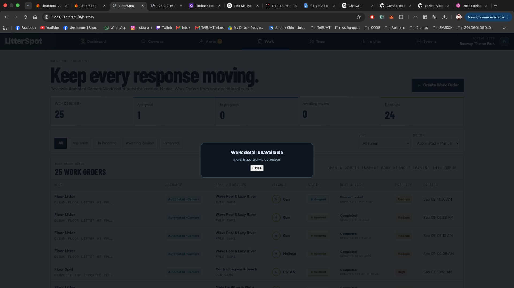

The Work list is blocked by a `Work detail unavailable` dialog that reports `signal is aborted without reason`.

Notes for later diagnosis:

- Check hash synchronization and whether a stale `workId` survives navigation.
- Check effects that abort and restart list or detail requests when the Work array changes.
- Check rejection handling for browser `AbortError`, Firebase cancellation errors, and plain `signal is aborted without reason` errors.
- Check whether the error layer and valid Work modal can render at the same time.

## BUG-03: Work metrics count loaded rows instead of all matching Work Orders

Category: Work aggregation and metrics.

Priority: P2, high. Rank: 8 of 10.

Observed behavior:

- The `WORK ORDERS` metric reports 25.
- The Work Order Queue heading reports the correct total of 206.
- The table correctly contains only the first 25 loaded rows.
- Status metrics are also calculated from the loaded page rather than the complete backend counts.

Expected behavior:

- `WORK ORDERS` should report 206 for the default query.
- The table should continue to render only the loaded page until the user selects `Load more`.
- Assigned, In progress, Awaiting review, Resolved, and other status metrics must come from backend aggregate counts, not the current 25 rows.
- Loading another page must not change aggregate metrics unless the underlying records changed.

Evidence:

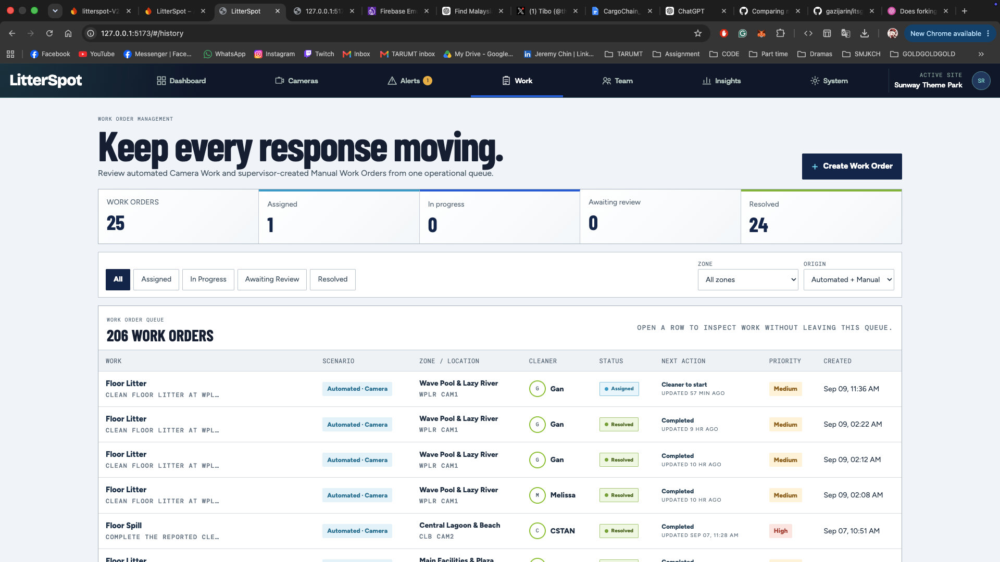

The metric strip reports 25 Work Orders while the queue heading reports 206.

Notes for later diagnosis:

- The list response currently exposes one `totalCount`, but the metric strip needs counts grouped by Work status.
- Do not fetch every page to calculate these metrics.

## BUG-04: Team page fails after a browser refresh

Category: Route startup and request lifecycle.

Priority: P1, critical. Rank: 3 of 10.

Observed behavior:

- Navigating to Team through the application navigation works.
- Refreshing the browser while `#/admin` is active consistently replaces the Team page with `signal is aborted without reason`.
- The page presents a `Try again` action, but the expected Team content is absent.

Expected behavior:

- A direct load or browser refresh on `#/admin` should produce the same Team page as in-app navigation.
- Request cancellation during startup or React remounting should not become a visible application error.
- If a real request fails, the message should identify the failed resource and offer a working retry.

Reproduction:

1. Navigate to Team through the main navigation and confirm it loads.
2. Refresh the browser while the URL ends in `#/admin`.
3. Observe the full-page aborted-signal error.

Evidence:

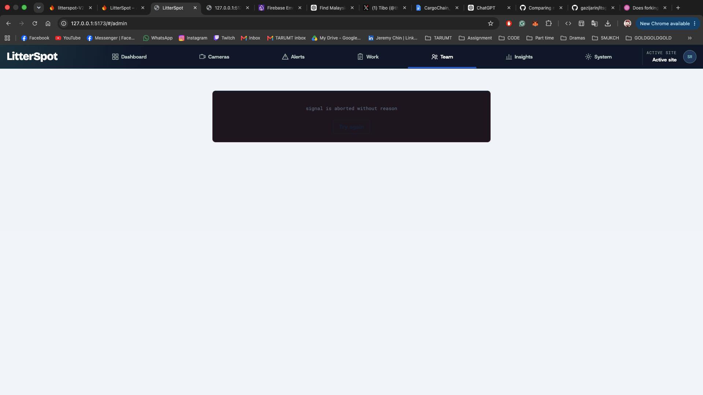

The Team route is replaced by a full-page `signal is aborted without reason` error after browser refresh.

Notes for later diagnosis:

- Check initial resource loading under React Strict Mode, where effects may mount, abort, and mount again.
- Check whether shared pending requests are tied to the first caller's `AbortSignal`.
- Check whether an aborted cached promise is returned to the second caller during startup.

## BUG-05: Enabled Camera footage disappears after several seconds

Category: Camera playback and evidence integrity.

Priority: P0, emergency. Rank: 1 of 10.

Observed behavior:

- Enabling a Camera initially displays its footage.
- After approximately three to five seconds, the footage disappears and the stage becomes a solid dark panel.
- The Camera remains labelled `Online`.
- Detection overlays may remain visible over the empty stage even though the underlying frame is gone.
- The failure occurs when enabling from either the Camera list or Camera detail.
- If the failure starts in the Camera list, opening Camera detail restores the footage in both the list and detail views.
- If the failure starts in Camera detail, returning to the Camera list restores the footage in both views.
- The reciprocal navigation recovery suggests that remounting or rebinding the presentation view changes the result, but this has not been diagnosed.

Expected behavior:

- Camera footage must remain visible for the full monitoring session.
- List and detail views must display the same continuous Camera timeline.
- Mounting, unmounting, or navigating between those views must not be required to restore playback.
- Overlays must never render without the matching visible frame beneath them.
- An `Online` label must not accompany an empty playback stage.

Reproduction from the Camera list:

1. Open the Camera list.
2. Enable a Camera from its card.
3. Confirm that footage initially appears.
4. Wait approximately three to five seconds.
5. Observe the footage disappear while the Camera remains Online.
6. Open that Camera's detail page.
7. Observe the footage return in Camera detail and remain restored when returning to the list.

Reproduction from Camera detail:

1. Open a disabled Camera's detail page.
2. Enable the Camera.
3. Confirm that footage initially appears.
4. Wait approximately three to five seconds.
5. Observe the footage disappear.
6. Return to the Camera list.
7. Observe the footage return in both list and detail after navigating again.

Evidence:

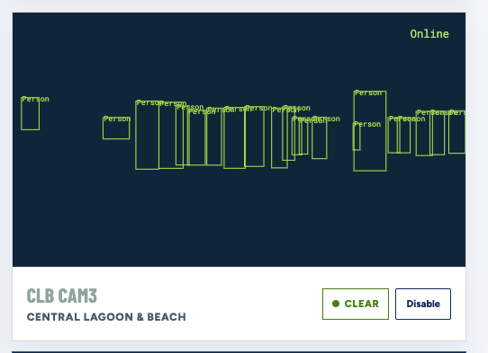

The Camera list card remains Online and draws detection boxes, but the footage is gone.

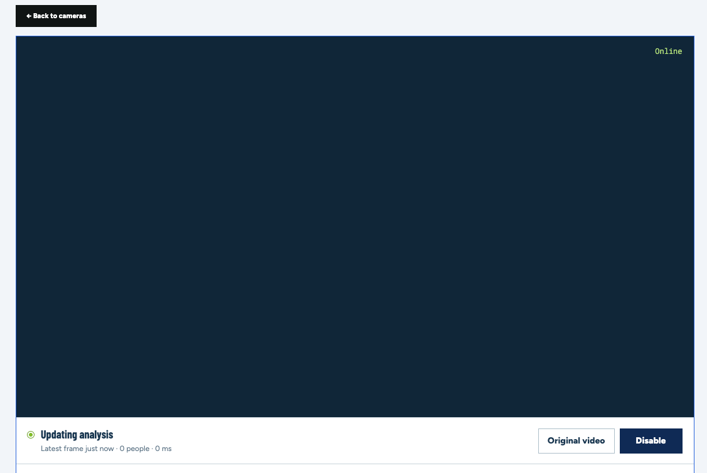

Camera detail reports `Updating analysis` while the playback stage is empty.

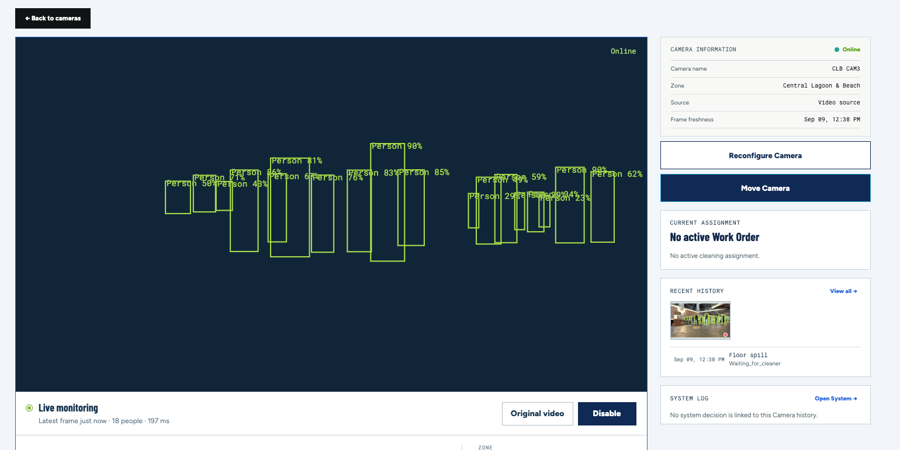

Camera detail reports `Live monitoring` and draws detection overlays without the matching visible frame.

Notes for later diagnosis:

- Build a browser test that enables a Camera, samples the rendered canvas for at least ten seconds, and fails if the frame becomes uniformly dark.
- Run the same test from both list and detail entry points.
- Check ownership of the playback canvas, animation-frame loops, canvas resizing or clearing, buffer eviction, and view remount subscriptions.
- Check whether two views copy from or mutate the same canvas element.
- Check why navigation rebinds playback successfully.

## BUG-06: Camera footage was downgraded to a 480 px buffered canvas

Category: Camera media quality and performance policy.

Priority: P1, critical. Rank: 7 of 10.

Observed behavior:

- The new playback path downsizes source footage to a maximum width of 480 px.
- The configured capture interval is approximately 67 milliseconds, or about 15 frames per second.
- A 1080p, 60 FPS Camera therefore loses substantial resolution and motion quality before display.
- `Original video` currently uses the same reduced buffered canvas and only hides overlays. It is not original-quality video.

Product correction:

- The 480 px downgrade is not accepted.
- Camera detail should preserve the source footage's useful resolution and smooth motion.
- Camera cards may use an intentionally smaller presentation size, but their playback should still be clear and should not redefine the shared source timeline at 480 px.
- `Original video` must mean the same synchronized footage without overlays, not a lower-quality substitute.
- Performance controls should not silently reduce every Camera to 480 px.

Notes for later diagnosis and design:

- Measure the actual memory and CPU cost before choosing a playback resolution or frame rate.
- Separate source capture quality, analysis sampling quality, Camera-card rendering quality, and Camera-detail playback quality.
- Preserve time synchronization without forcing every consumer to share one low-resolution canvas.

## BUG-07: Camera status flickers between Live monitoring and Updating analysis

Category: Camera status model and UI stability.

Priority: P2, high. Rank: 10 of 10.

Observed behavior:

- During otherwise continuous monitoring, the status repeatedly switches between `Live monitoring` and `Updating analysis`.
- The switch can happen as individual analyzed samples enter and leave the narrow overlay-matching window.
- The status flickers even when the Camera connection and footage timeline have not changed.
- This makes a healthy Camera look unstable.

Expected behavior:

- `Live monitoring` should remain stable while the source is connected and footage is moving.
- Analysis latency should not repeatedly replace the primary connection status.
- `Updating analysis` should appear only for a sustained or meaningful analysis delay, not between ordinary samples.
- Connection state, playback state, and analysis freshness should be treated as separate facts.

Notes for later diagnosis:

- Reproduce with timestamped status transitions for at least thirty seconds.
- Check whether a missing exact-frame overlay is incorrectly treated as an analysis problem.
- Add hysteresis or a sustained-lateness threshold only after defining the intended status model.

## BUG-08: Site background image is missing across shared map views

Category: Shared map media loading.

Priority: P1, critical. Rank: 6 of 10.

Status: reported; not diagnosed or fixed.

Observed behavior:

- The configured Site background image no longer appears on the Dashboard map.
- The same missing-background behavior is visible in the Manual Work Order creation map, Cleaner creation Station Point map, and Cleaner mobile Profile Station Point map.
- Zone polygons, labels, Camera markers, coordinates, and other map geometry still render over a plain background.
- Several views remain stuck on `Loading Site background` even though the coordinate layers are already available.

Expected behavior:

- The configured Site background image must render consistently in every view that uses the shared Site Map.
- Zone polygons, markers, and selectable points must remain correctly aligned with the background.
- The background must remain available after navigation, browser refresh, and opening a map inside a modal.
- If the background cannot load, the UI must show a recoverable, actionable error rather than remaining indefinitely in a loading state.

Evidence supplied:

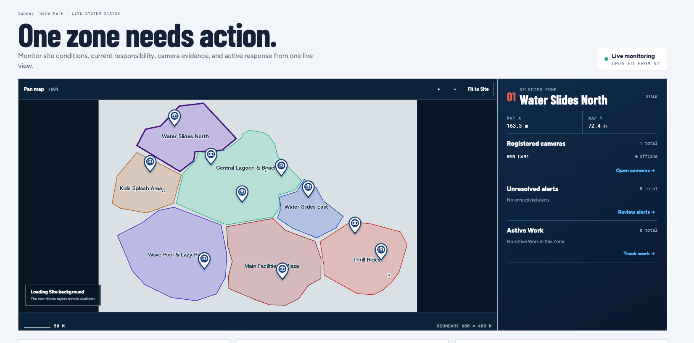

The Dashboard renders map geometry and Camera markers, but the Site background is absent and the map says `Loading Site background`.

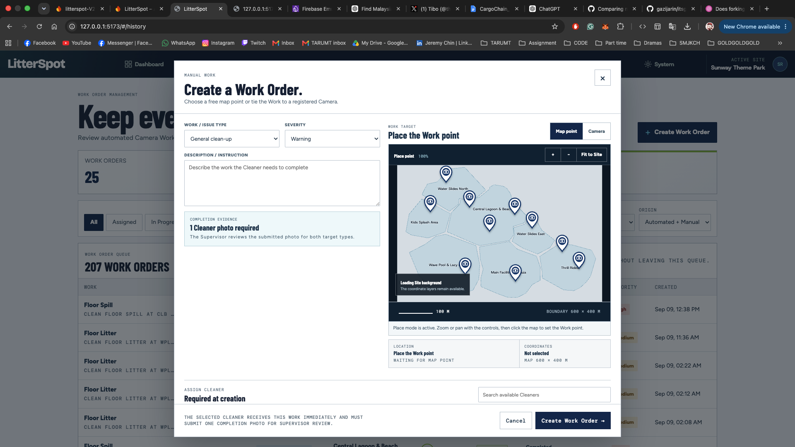

The Create Work Order placement map has the same missing background and loading notice.

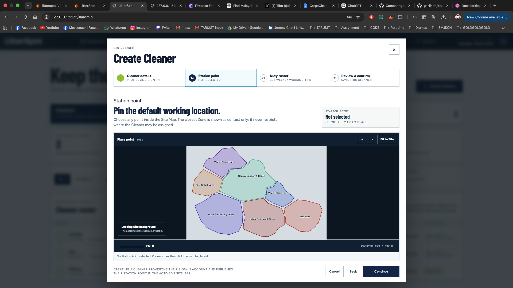

The Create Cleaner Station Point map has the same missing background and loading notice.

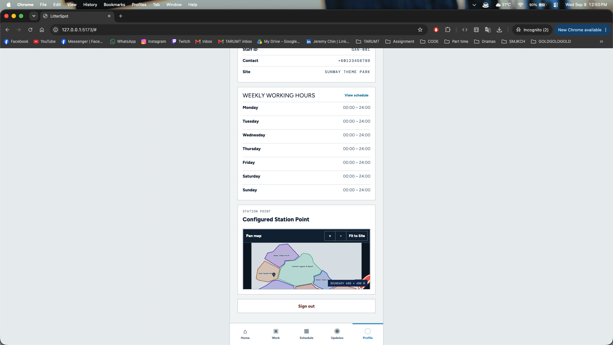

The Cleaner mobile Profile renders the configured Station Point map without the Site background.

Notes for later diagnosis:

- Inspect shared Site Map background-media loading and caching.
- Check authentication and storage access for the Site background asset.
- Check the background content URL lifecycle and invalidation.
- Check AbortSignal ownership or reuse across map consumers.
- Compare modal, Dashboard, and mobile map initialization.

No root cause has been confirmed.

## BUG-09: Create Camera exposes an aborted-signal error and cannot load the active Site Map

Category: Camera creation and map initialization.

Priority: P1, critical. Rank: 4 of 10.

Status: reported; not diagnosed or fixed.

Observed behavior:

- Opening Create Camera can leave the placement map stuck on `Loading the active Site Map...`.
- The wizard displays `signal is aborted without reason` in its error area.
- Camera details and continuation controls remain unavailable because the active Site Map did not initialize.

Expected behavior:

- Create Camera must load the active Site Map reliably when the wizard opens.
- Internal request cancellation must not surface as a user-facing failure.
- The wizard must recover cleanly from a cancelled or superseded request and allow Camera creation to continue.

Evidence:

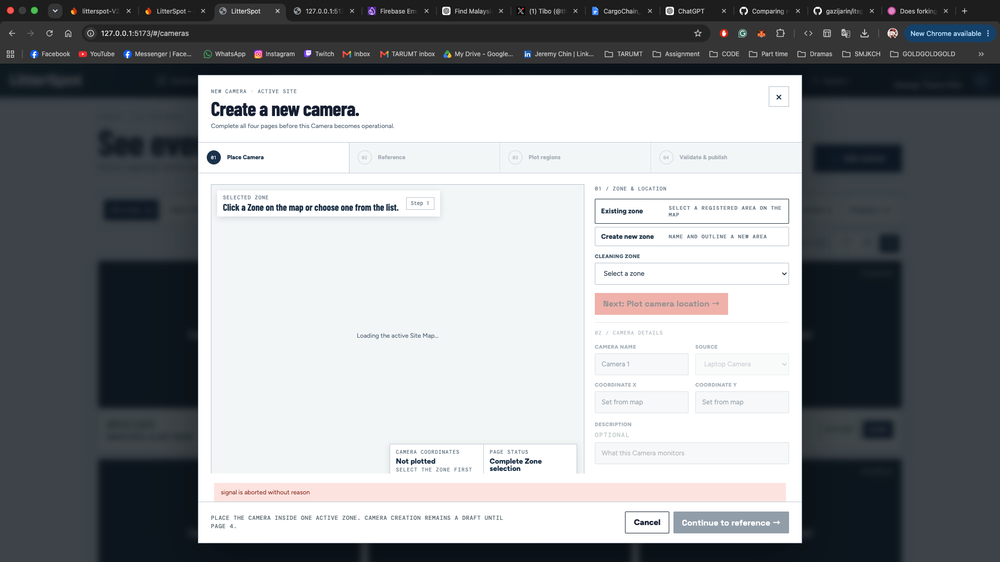

The Create Camera wizard remains on `Loading the active Site Map...`, reports `signal is aborted without reason`, and cannot continue.

Notes for later diagnosis:

- Inspect Create Camera map-loading effects and cleanup during modal mounting.
- Check AbortSignal lifecycle, including any signal shared with cached or deduplicated requests.
- Check development-mode remount behavior and request-cancellation handling.
- Determine whether this belongs to the same abort regression family as BUG-02 and BUG-04.

No root cause has been confirmed.

## Requirement clarification: real delayed analyzed playback

The earlier no-wait correction misunderstood the requested product behavior and is superseded.

- Camera Detail in the capture-owner browser deliberately presents delayed footage so analysis can be ready before the matching moment is shown.
- Connecting is controlled by real compressed footage and successful analysis coverage, not a timer alone. Five seconds is the initial minimum measurement target; slower conditions may require ten seconds or longer.
- Camera grid cards and secondary browsers show exact analyzed snapshots instead of continuous delayed playback.
- Camera Detail presentation is capped at 1280 × 720, preserves aspect ratio, and never uses a rolling buffer of decoded full-frame images.
- If analysis coverage runs out, freeze the last valid frame, remove expired overlays, and show `Rebuffering analysis`. Do not continue silently as unanalysed footage.
- Resume the frozen position after a short interruption. If the player falls more than two seconds behind its intended delayed position, skip the missed presentation segment behind the loading state and resume at the newest safely analyzed delayed position.
- If safe playback cannot start or recover within thirty seconds, show `Camera analysis unavailable` with Retry.
- Sampling is adaptive across the Site. Camera Detail receives reserved capacity; visible cards receive lower snapshot cadence; enabled offscreen Cameras retain minimal operational sampling; positive detections and active Verification may burst temporarily.
- Higher presentation sampling must not accelerate Alert qualification or Verification policy.

## UI-01: Phase 1 to Phase 4 additions use the wrong visual system

Category: Visual system consistency.

Priority: P2, high. Rank: 9 of 10.

Observed behavior:

- The new Work detail and error UI use dark navy panels, teal accents, and typography from an older operations-console style.
- The surrounding application uses the light Field Station visual system.
- The mismatch makes the new UI appear to belong to another product.

Expected behavior:

- All Phase 1 to Phase 4 UI must use the existing light Field Station system.
- Modal structure, protected confirmations, progressive loading, and playback controls should remain, but their visual treatment must match nearby pages and components.
- Error dialogs must also use the light system and remain readable without dimming the underlying page so heavily that context disappears.

Follow-up boundary:

- Fix this visual mismatch after the functional defects have a reproducible test loop.
- Do not introduce another visual direction.
- Review every Phase 1 to Phase 4 component, not only `work-detail-modal.css`.

## Acceptance checks for the later repair

1. A fresh Alert page load immediately shows the correct total and `Load more` state.
2. Repeated filter changes never accumulate totals or cursors from another query.
3. Repeated cross-page navigation to Work never opens an aborted-signal error.
4. Browser Back and modal close always restore an interactive Work list.
5. Work metrics use backend aggregates while the table remains paginated.
6. Repeated browser refreshes on `#/admin` load Team without exposing request cancellation.
7. Every Phase 1 to Phase 4 UI addition matches the light Field Station system on desktop and mobile.
8. Tests cover rapid navigation, React Strict Mode remounting, stale requests, empty pages, last pages, and cached page reuse.
9. Camera footage remains visible for at least ten minutes after enablement without requiring navigation.
10. List and detail views can mount in either order without clearing or stealing each other's footage.
11. Overlays never appear over an empty or mismatched frame.
12. Camera detail is not capped at 480 px and `Original video` preserves useful source quality.
13. `Live monitoring` remains stable during normal inference intervals.
14. Playable footage appears immediately without an artificial fixed buffer wait.
15. The configured Site background renders on every shared map consumer, including Dashboard, Work creation, Cleaner creation, and Cleaner mobile Profile.
16. The Site background remains visible after navigation, browser refresh, and opening a map inside a modal.
17. Create Camera loads the active Site Map and never exposes an internal aborted-signal message to the user.
18. A Site background or map-media failure is recoverable and does not leave the interface in an indefinite loading state.
