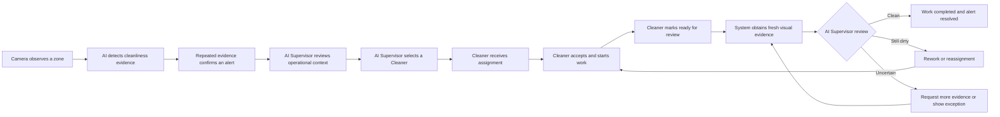

# LitterSpot product and frontend experience context

## 1. Purpose of this brief

This document gives a zero-context reader a complete understanding of the
LitterSpot product: what kind of system it is, who it serves, who uses it, how
the operational workflow behaves, which capabilities it includes, and which
technical or environmental constraints affect the frontend experience.

It intentionally does not define what an external team must deliver, the format
or fidelity of that deliverable, the design process, project schedule, screen
count, source-code requirements, or presentation requirements. Those engagement
details will be provided separately by the client.

The product requirements leave visual and interaction decisions open, including:

- visual direction and brand expression;
- information architecture and navigation;
- page composition and dashboard layout;
- component appearance and interaction patterns;
- typography, colour, iconography, spacing, and motion;
- how complex monitoring information is simplified for each user.

No existing LitterSpot interface should be treated as the required visual
reference. This document describes the intended product rather than an existing
frontend that must be reproduced.

## 2. Product overview

LitterSpot is an AI-assisted cleanliness monitoring and operations system for
tourist attractions. It observes public areas through registered cameras,
detects possible cleanliness problems, decides when a location has become dirty
enough to require action, assigns cleaning work, verifies the result, and helps
management understand which zones require the most attention.

The system focuses on three primary detection capabilities:

1. floor litter;
2. overflowing bins;
3. people counting.

Liquid-spill detection may also be shown as an additional capability, but it is
not as important as floor litter and overflowing bins.

The product is intended to help tourist attractions respond to cleanliness
problems based on evidence and operational priority instead of relying entirely
on continuous manual observation.

## 3. Target market and operating context

The primary market is operators of medium-to-large tourist attractions and
public visitor destinations, especially locations with:

- many visitors moving between different zones;
- multiple cleaning teams or Cleaner assignments;
- CCTV or IP-camera coverage;
- areas that become dirty at different rates;
- a need to maintain a positive visitor experience;
- management interest in response time and long-term cleanliness patterns.

Representative examples are:

- **Batu Caves:** an open public attraction with stairs, entrances, walkways,
  gathering points, food activity, and zones with very different visitor
  density;
- **Sunway Lagoon:** a managed attraction with multiple themed zones, queues,
  food areas, rest areas, bins, and operational staff.

The experience should feel appropriate for real operational use at a tourist
site, not like a model-training dashboard or a generic corporate admin panel.

## 4. Location structure

LitterSpot uses this location hierarchy:

```text
Site -> Zone -> Camera
```

Example:

```text
Site: Batu Caves
  Zone: Main Entrance
    Camera: Entrance Camera 1
  Zone: Stairway Lower Section
    Camera: Stairway Camera 1
```

- A **site** is the complete attraction or managed property.
- A **zone** is an operational cleaning area within a site.
- A **camera** observes part of a zone and supplies visual evidence.

Alerts and cleaning work are organised primarily around zones. Priority-zone
analytics identify which zones deserve more attention; they do not recommend
an exact physical point at which to place a bin.

## 5. Users

### 5.1 Human Supervisor

The Supervisor is a management and oversight user. The Supervisor normally uses
LitterSpot from a desktop or tablet.

The Supervisor needs to:

- understand the current cleanliness condition of a site;
- monitor active alerts and cleaning progress;
- inspect camera evidence and detection details;
- see which Cleaner has been assigned and why;
- intervene, reassign, cancel, or override when necessary;
- create and manage Cleaner accounts;
- assign Cleaners to permitted sites and zones;
- manage sites, zones, and registered cameras;
- review system performance, histories, analytics, and reports;
- monitor the autonomous AI Supervisor's decisions;
- pause automated operations in an exceptional situation.

The human Supervisor is not expected to approve every routine assignment. The
normal workflow should continue automatically while the human Supervisor watches
the operation, investigates exceptions, and reviews performance.

### 5.2 Cleaner

The Cleaner is a field worker using LitterSpot mainly from a phone browser or
installable mobile web application.

The Cleaner needs to:

- sign in;
- indicate whether they are online, busy, on break, or offline;
- grant or refuse device-location permission;
- receive a cleaning assignment and notification;
- understand where to go and what problem to address;
- accept or reject the assignment;
- indicate that work has started;
- mark work ready for review after completing it;
- add a short note and optional completion photo;
- receive a rework request if the area is still not clean;
- see their own active and recent work.

The Cleaner should have a focused, low-friction experience. They do not need to
browse every camera, view organisation-wide analytics, configure the system, or
see other Cleaners' private information.

### 5.3 Autonomous AI Supervisor

LitterSpot includes an autonomous orchestrator powered by an LLM. It acts as the
routine operational Supervisor and should be represented clearly in the product
experience.

When an alert is triggered, the AI Supervisor considers information such as:

- issue type and severity;
- site, zone, camera, time, and visual evidence;
- available Cleaners and their permitted locations;
- Cleaner availability and current workload;
- current or last-known Cleaner location and how fresh it is;
- distance to the affected zone;
- previous assignment attempts or rejection reasons.

It then decides:

- which Cleaner to assign;
- what instructions to provide;
- whether and when to reassign;
- whether completed work is clean;
- whether rework or more evidence is needed.

The human Supervisor may inspect and override these decisions, but routine
decisions do not wait for human approval.

## 6. Important system concepts

The interface may simplify or hide internal terminology where appropriate, but
these concepts explain the product's underlying meaning.

### Detection

A model output identifying something visible in one image or video frame, such
as one piece of floor litter or an overflowing bin.

### Cleanliness observation

The system groups detections from the same analysis into one observation of an
issue type. For example, ten pieces of litter in one frame are treated as one
floor-litter observation containing ten detections.

### Flag

A positive observation that is strong enough to contribute evidence toward a
possible cleanliness problem. A flag is not necessarily an alert.

### Alert

A confirmed zone-level cleanliness problem that requires operational attention.
The system deliberately avoids alerting the team for every single detected
piece of litter.

### Work order

The operational task assigned to a Cleaner in response to an alert. An alert
describes the problem; a work order describes who should act and how the work is
progressing.

### Review

The verification step after a Cleaner reports completion. Fresh visual evidence
is assessed before the alert is resolved.

### Priority zone

A zone ranked as deserving more cleaning attention based on historical litter,
overflow, visitor pressure, and persistence. This is a zone-level planning
signal, not an exact bin-placement coordinate.

## 7. How alert decisions work

LitterSpot should not create a disruptive alert every time it sees one possible
issue. It evaluates repeated evidence over time.

The current policy concept is:

- **Floor litter:** confirm when at least three of the latest five observations
  are positive within 30 minutes.
- **Overflowing bin:** confirm when at least two of the latest three observations
  are positive within 15 minutes.
- **Liquid spill:** confirm after two consecutive positive observations within
  10 minutes.

Example:

> A camera sees one bottle at 10:00. That produces evidence but no alert. At
> 10:08 the litter is still present and more rubbish appears. At 10:16 another
> positive observation is recorded. The area now appears consistently dirty, so
> LitterSpot creates one floor-litter alert for that zone.

Multiple cameras in the same zone may contribute evidence, but the Supervisor
should see one active alert for the same zone and issue instead of several
duplicate alerts.

These thresholds are operational policy and may change later. The visual design
should not depend on the exact numbers being permanent.

## 8. Primary end-to-end workflow



### 8.1 Alert lifecycle

```text
New -> Acknowledged -> In Progress -> Awaiting Verification -> Resolved
                                      -> In Progress (rework)
```

The design should make the difference between active cleaning and verification
clear. A Cleaner marking work finished does not immediately resolve the alert.

### 8.2 Work-order lifecycle

```text
Unassigned -> Assigned -> Accepted -> In Progress -> Ready for Review -> Completed
                 |           |                            |
                 |           -> Rejected                  -> Rework Required
                 -> Cancelled
```

The exact presentation may use friendlier labels, but the meaning of each state
must remain understandable.

## 9. Supervisor experience and functional areas

The Supervisor side of the product contains the following functional areas.
These are product capabilities, not prescribed page layouts.

### 9.1 Operational overview

- overall cleanliness condition;
- active issues by severity and status;
- affected sites and zones;
- work currently assigned or awaiting review;
- unavailable cameras or AI-processing failures;
- recent activity and important exceptions;
- clear navigation into evidence and action details.

### 9.2 Site and zone monitoring

- browse or select a site;
- understand the site's zones;
- see zone condition, active issues, visitor pressure, and camera availability;
- move from a zone overview to camera or evidence details;
- optionally present zones through cards, lists, plans, maps, or another suitable
  visual model.

### 9.3 Camera and evidence viewing

- registered camera/source identity and status;
- latest image or video frame;
- AI overlays for litter, bins, spills, and people;
- confidence and processing information without overwhelming non-technical
  users;
- capture time, zone, issue type, and evidence history;
- uploaded-image/video testing as a secondary operational or demonstration
  capability;
- future readiness for live or near-real-time camera streams.

### 9.4 Alerts

- active alert list with useful filtering and prioritisation;
- issue, zone, severity, age, status, and assigned Cleaner;
- alert detail with evidence and event timeline;
- explanation of why the issue became an alert;
- work-order and verification progress;
- related occurrences without presenting every raw detection as a separate
  problem;
- manual acknowledge, assignment, reassignment, cancellation, and override.

### 9.5 Cleaner management

- Cleaner directory;
- account and contact information;
- active/inactive account status;
- permitted sites and zones;
- capabilities or relevant work skills;
- current availability and location freshness;
- active workload and recent work history;
- create, invite, edit, deactivate, and reactivate actions.

### 9.6 AI Supervisor oversight

- whether automation is operating normally, paused, waiting, or experiencing an
  exception;
- which Cleaner the AI selected;
- a concise, understandable reason for the selection;
- what information was considered, including stale or unavailable data;
- previous attempts, rejection, reassignment, and review decisions;
- model/policy information available as secondary audit detail;
- human override and emergency-pause actions;
- clear distinction between AI recommendations, committed actions, and system
  errors.

The interface should build appropriate trust without exposing raw chain-of-
thought or presenting the AI as infallible.

### 9.7 Priority-zone analytics

- rank zones as high, medium, low, or insufficient data;
- show contributing factors such as litter burden, visitor pressure, overflow,
  and persistence;
- explain why a zone has its priority;
- filter by site and time period;
- compare zones;
- display data sufficiency and avoid treating missing data as good performance;
- support report viewing and CSV export as a represented action.

### 9.8 Configuration and system status

- site, zone, and camera registration/management;
- camera connection and processing status;
- alert and analytics policy visibility where appropriate;
- service incidents and recovery status;
- user/account settings;
- audit and status histories.

## 10. Cleaner mobile experience and functional areas

### 10.1 Home and availability

- clear current availability state;
- online/offline/busy/break controls;
- location permission and last-update status;
- current assignment or an easy-to-understand waiting state;
- unread notification count.

### 10.2 Assignment notification

- issue type and urgency;
- site, zone, and useful wayfinding information;
- concise task instructions;
- relevant evidence without unnecessary surveillance detail;
- assignment time and expected response;
- accept and reject actions;
- what happens if the assignment is rejected.

### 10.3 Active work

- obvious current status and next action;
- route/location context;
- ability to start work;
- task checklist or instructions where useful;
- elapsed time without creating unnecessary pressure;
- ability to report a problem or inability to complete;
- ready-for-review submission with optional note/photo.

### 10.4 Review and rework

- clear waiting-for-review state;
- confirmation when the work passes review;
- understandable rework instructions if it does not pass;
- no misleading message that the alert is resolved before verification.

### 10.5 Personal history

- recent completed, rejected, cancelled, or reworked assignments;
- concise outcome and timestamps;
- no access to unrelated Cleaner or organisation-wide records.

## 11. Important conditions and edge cases

The frontend demo should demonstrate how the product handles several non-ideal
situations, not only the happy path:

- no active alerts;
- no assignment for an online Cleaner;
- new high-priority assignment;
- Cleaner rejects an assignment;
- Cleaner location permission denied;
- last-known location is stale;
- Cleaner goes offline during active work;
- camera or AI service unavailable;
- uploaded media fails processing;
- insufficient analytics data;
- AI Supervisor is waiting for more evidence;
- work fails verification and requires rework;
- automation is paused by the human Supervisor;
- notification delivery fails but the assignment remains in the in-app inbox.

## 12. Technical and platform constraints

The following constraints describe the intended product and the environment in
which its frontend will eventually operate:

- the product is a responsive web application;
- the Supervisor experience is primarily desktop/tablet;
- the Cleaner experience is mobile-first and may be installed as a PWA;
- the planned frontend implementation uses React, TypeScript, and Vite;
- authentication uses Firebase Authentication;
- web notifications use Firebase Cloud Messaging where supported;
- Cleaner location uses browser geolocation and requires permission and HTTPS;
- mobile browsers cannot guarantee continuous background location tracking, so
  stale/unavailable location must be represented honestly;
- the public application communicates through one Node.js API;
- camera inference and AI-orchestrator services are private implementation
  services and should not appear as separate products to normal users;
- media may include images, uploaded videos, captured frames, and later live
  camera streams;
- the system may run on a self-hosted local server while still using cloud
  Firebase services;
- the experience should account for variable network quality on a tourist site;
- access and information must change according to Supervisor versus Cleaner
  permissions.

## 13. Experience principles

The frontend experience should aim for:

- **Operational clarity:** users should quickly understand what needs attention
  and what happens next.
- **Role focus:** Cleaners see a simple action-oriented experience; Supervisors
  see broader oversight and analysis.
- **Evidence with explanation:** show enough visual proof and reasoning to build
  trust without flooding the user with model internals.
- **Honest system state:** distinguish confirmed, uncertain, stale, waiting,
  failed, and insufficient-data states.
- **Calm urgency:** severe issues must stand out, but the whole interface should
  not feel permanently alarming.
- **Fast field interaction:** primary Cleaner actions should be usable with one
  hand and minimal typing.
- **Accessible presentation:** use legible text, adequate contrast, keyboard
  support concepts, meaningful status labels, and avoid colour as the only
  signal.
- **Tourist-site suitability:** the product should feel trustworthy and modern
  in an operational environment.

## 14. Visual and interaction decisions not specified by the product

The product requirements do not prescribe:

- product visual identity;
- dashboard structure;
- navigation model;
- representation of sites and zones;
- alert and work-order presentation;
- use of maps, timelines, cards, tables, charts, or other visualisations;
- desktop-to-mobile relationship;
- approach to showing autonomous AI decisions;
- interaction and motion language.

The requirements describe what the product must communicate and allow users to
do, not what each screen must look like.

## 15. Functional scope summary

At a high level, the envisioned product includes:

1. Supervisor authentication and operational oversight;
2. site/zone monitoring and camera evidence;
3. alert lists, alert details, and occurrence history;
4. AI Supervisor assignment decisions and work-order progress;
5. Cleaner account and permission management;
6. priority-zone analytics and reports;
7. configuration and system-status visibility;
8. Cleaner authentication, availability, and location permission;
9. Cleaner notifications, task details, and field-work actions;
10. acceptance, rejection, work start, and ready-for-review states;
11. successful verification, more-evidence, and rework outcomes;
12. empty, error, stale, unavailable, paused, and waiting conditions.

These capabilities may be combined or separated according to the eventual
information architecture.

## 16. How to read the scenarios in this document

The scenarios below are examples of the intended product behaviour. They explain
how roles, records, decisions, and states connect; they are not a prescribed
navigation structure or page sequence.

## 17. Representative operational scenario

The following scenario illustrates how the product's capabilities connect:

1. Batu Caves is selected as the active site.
2. Repeated litter is detected in the Main Entrance zone during a busy period.
3. One medium- or high-priority floor-litter alert is created.
4. The AI Supervisor considers three available Cleaners and assigns the closest
   eligible Cleaner with a manageable workload.
5. The Supervisor sees the decision, explanation, and assignment progress.
6. The Cleaner receives the task on their phone, accepts it, reaches the zone,
   and starts work.
7. The Cleaner removes the litter and marks the work ready for review.
8. Fresh visual evidence is reviewed.
9. One prototype branch shows successful completion and alert resolution.
10. A second branch shows remaining litter and a rework request.
11. The analytics view shows the Main Entrance as a high-priority zone because
    of repeated litter, visitor volume, and issue persistence.

A second shorter overflowing-bin scenario may demonstrate how different issue
types and urgency are communicated.

## 18. Visual decisions intentionally left open

The product context does not prescribe:

- a colour palette;
- logo treatment;
- typography;
- layout grid;
- navigation placement;
- visual style;
- chart style;
- exact screen count;
- component library;
- animation style;
- light mode, dark mode, or both.

These decisions can be made separately based on the product and users in this
brief.

## 19. Product goals, outcomes, and boundaries

### 19.1 Product goals

The proposed experience should help LitterSpot achieve the following outcomes:

1. **Recognise genuine cleanliness problems without excessive alerting.** The
   system should communicate that one model detection does not automatically
   mean staff must be dispatched.
2. **Reduce the time between a confirmed problem and cleaning action.** Once an
   alert is confirmed, assignment and notification should happen quickly and
   visibly.
3. **Make field work simple.** A Cleaner should understand where to go, what to
   do, and what action to take next without reading technical AI information.
4. **Verify outcomes instead of assuming completion.** Work is only complete
   after review, not merely because someone pressed a completion button.
5. **Give management oversight without requiring constant intervention.** The
   human Supervisor should be able to understand and control the operation while
   routine decisions remain automated.
6. **Turn operational history into planning information.** Management should be
   able to identify zones that repeatedly need attention and understand why.
7. **Build appropriate trust in automation.** Users should see what the AI
   Supervisor did, the main facts it considered, and whether its action
   succeeded, without exposing unnecessary technical internals.

### 19.2 Product success from each user's perspective

For a human Supervisor, success means:

- the most important situation is understandable within seconds;
- active work and exceptions are easy to distinguish;
- the Supervisor can inspect evidence without searching through unrelated data;
- autonomous actions do not feel invisible or uncontrollable;
- intervention is available but not required for normal work;
- reports answer which zones need attention and whether operations are
  improving.

For a Cleaner, success means:

- new work is difficult to miss;
- the destination and task are unambiguous;
- the interface has one obvious primary action at each stage;
- field actions require little typing;
- location and notification permissions are explained honestly;
- waiting for review, successful completion, and rework are clearly different;
- the Cleaner is not distracted by management-only information.

For attraction management, success means:

- cleaner environments and faster response to confirmed issues;
- fewer duplicated or unnecessary dispatches;
- visible accountability from detection through resolution;
- evidence for staffing, scheduling, and zone-priority decisions;
- an interface credible enough for operational demonstrations and stakeholder
  evaluation.

### 19.3 Non-goals for the product prototype

The design does not need to represent:

- payroll, salary, leave, or general human-resource management;
- inventory purchasing or stock management;
- visitor-facing reporting or a public complaint application;
- facial recognition or visitor identity;
- individual visitor tracking;
- exact route optimisation comparable to a logistics platform;
- exact physical bin-placement coordinates;
- AI model training, dataset labelling, or experiment management;
- raw developer logs as a primary user experience;
- a native iOS or Android application;
- continuous guaranteed background tracking of Cleaners;
- a fully offline system.

## 20. Roles and permission matrix

The table below defines the intended access model. The design may present these
capabilities through any suitable information architecture, but it must not
suggest that both human roles have equal access.

| Capability | Human Supervisor | Cleaner | Autonomous AI Supervisor |
| --- | --- | --- | --- |
| Sign in to the product | Yes | Yes | Private service identity, not a human login screen |
| View organisation/site overview | Yes | No | May retrieve required operational context |
| View all active alerts | Yes | No | Yes, through private tools |
| View camera evidence | Yes | Only evidence attached to own task when appropriate | Yes, through private tools |
| View all Cleaners | Yes | No | Only eligible operational profiles required for assignment |
| View another Cleaner's location | Yes, when operationally justified | No | Yes, for eligible assignment candidates |
| Manage Cleaner accounts | Yes | No | No |
| Configure sites/zones/cameras | Yes | No | No |
| Set own availability | Not applicable | Yes | No |
| Publish own device location | Not applicable | Yes | No |
| Choose a Cleaner for routine work | May override | No | Yes |
| Accept/reject assigned work | May override administratively | Yes | No |
| Start and submit cleaning work | May intervene | Yes | No |
| Mark work ready for review | May intervene | Yes | No |
| Review fresh evidence | May inspect/override | No | Yes |
| Resolve an alert | Yes as an override | No | Yes after successful review |
| Request rework | Yes as an override | No | Yes |
| Pause site automation | Yes | No | May report a problem but cannot override human pause |
| View priority-zone analytics | Yes | No | May retrieve context if required |
| View system health and audit | Yes | No | May report its own health/status |

The Cleaner should not be presented with disabled versions of every Supervisor
feature. Their application should feel intentionally designed for field work,
not like a restricted desktop dashboard squeezed onto a phone.

## 21. Detailed system behaviour and business meaning

### 21.1 Evidence does not equal certainty

Computer-vision output can be wrong. LitterSpot therefore keeps several layers
of meaning:

```text
model detection
  -> grouped cleanliness observation
  -> positive flag
  -> repeated temporal confirmation
  -> operational alert
  -> Cleaner work order
  -> verification review
```

The Supervisor interface may expose this progressively:

- show the alert and operational meaning first;
- show a simple explanation such as “confirmed in 3 of the latest 5 checks”;
- allow interested users to inspect occurrences and individual evidence;
- keep raw geometry, model versions, and detailed confidence secondary.

The Cleaner usually needs only the confirmed issue, relevant evidence,
destination, and instructions. They do not need the complete detection chain.

### 21.2 Confidence, magnitude, severity, and priority are different

- **Confidence** describes how certain a vision model is about what it saw.
- **Magnitude** describes how much of the cleanliness issue appears present,
  such as coverage, spread, or number of affected regions.
- **Severity** is the operational seriousness of a current alert.
- **Priority-zone score** is a historical planning score for a zone over a time
  period.

The interface must not use these terms interchangeably. For example, a highly
confident detection of one small item may still have low operational magnitude,
while a zone can have high historical priority even when it has no alert at this
exact moment.

### 21.3 Alert uniqueness and occurrences

LitterSpot maintains at most one active alert for the same issue type in the
same zone. This prevents a Supervisor from seeing many duplicate alerts for one
ongoing dirty area.

Temporal confirmation occurs per camera. Once an alert is active, a qualifying
occurrence from another camera in the same zone can be attached to that same
zone-level alert rather than creating a duplicate.

The alert detail may therefore show:

- the first confirmation;
- subsequent occurrences over time;
- evidence from one or more cameras;
- changes in magnitude or severity;
- assignment and review history.

### 21.4 People counting

People counting is used for visitor-pressure analytics and operational context.
The presence of people does not create a cleanliness alert by itself.

Design implications:

- people counts may appear in site/zone monitoring and analytics;
- a busy zone can help explain urgency or priority;
- the interface must not imply identification of individual visitors;
- avoid designs that resemble facial recognition or personal surveillance;
- where person boxes are shown in evidence, they should be presented as model
  overlays, not identities.

### 21.5 Operational data versus demonstration data

The system may allow a Supervisor to upload an image or video to demonstrate or
test detection. Test uploads can show detections and scores but should not create
real operational alerts, Cleaner assignments, or analytics.

If the prototype represents this feature, it should clearly distinguish:

- **Test/demo analysis:** safe experimentation with no operational effect;
- **Operational camera evidence:** eligible to affect alerts, work, and
  analytics.

### 21.6 Current media and future camera direction

LitterSpot supports the concepts of uploaded images, uploaded videos, sampled
video frames, and registered cameras. The long-term direction includes live or
near-real-time CCTV/IP-camera input.

The design should be future-compatible with live monitoring without pretending
that every view is a continuous live feed. Use accurate labels such as:

- Live
- Latest captured frame
- Recorded at 10:42 AM
- Processing video
- Camera unavailable
- No recent evidence

### 21.7 System-generated versus human actions

Timelines and audit views should distinguish:

- automatic detection/confirmation;
- AI Supervisor decisions;
- Cleaner actions;
- human Supervisor overrides;
- system failures/retries/recovery.

Suggested actor labels include “System,” “AI Supervisor,” the Cleaner's name,
and the human Supervisor's name. Avoid representing every event as if it came
from a human user.

## 22. Detailed Supervisor journeys

### 22.1 Sign-in and arrival

Scenario:

1. The Supervisor opens LitterSpot on a desktop.
2. They sign in with email and password.
3. They arrive at the most operationally useful view, normally an overview of
   the selected site or all assigned sites.
4. The interface immediately communicates active critical situations, work in
   progress, waiting verification, and system exceptions.

The proposed experience should consider:

- invalid credentials;
- expired session;
- inactive account;
- slow initial data loading;
- no configured sites;
- one site versus multiple sites;
- remembering or clearly showing the active site.

### 22.2 Morning operational check

The Supervisor begins a shift and wants to answer:

- Are cameras and AI services operating?
- Are there unresolved overnight issues?
- Which Cleaners are online or unavailable?
- Is automation running or paused?
- Which zones currently need attention?
- Is any work waiting too long for acceptance or review?

The information may be arranged through an overview, progressive drill-down, or
another suitable structure.

### 22.3 Investigating a new alert

The Supervisor notices a new floor-litter alert and opens it.

The alert experience should make it possible to understand:

- what happened;
- where and when it happened;
- current severity/status;
- why repeated evidence was considered sufficient;
- the most useful evidence image/frame;
- whether other cameras contributed;
- what the AI Supervisor has done;
- which Cleaner was selected and why;
- whether the Cleaner has accepted or started;
- what action the human Supervisor can take.

Technical details should be available without dominating the initial view.

### 22.4 Monitoring work in progress

The Supervisor wants to know:

- who is handling the issue;
- when it was assigned and accepted;
- whether the Cleaner is travelling, working, or waiting for review;
- whether the task is overdue;
- whether location information is fresh, stale, or unavailable;
- whether the Cleaner reported a problem;
- whether reassignment occurred.

The proposed visual model might use a timeline, progress tracker, event feed, or
another mechanism. The brief does not prescribe one.

### 22.5 Reviewing an autonomous decision

The Supervisor should be able to inspect a concise explanation such as:

> Assigned Aina Rahman because she is active, permitted for Batu Caves/Main
> Entrance, has no current work order, and is approximately four minutes away.
> Mei Ling was closer but is already handling a high-priority spill.

The interface may show considered candidates and excluded reasons, but it should
avoid exposing private data unnecessarily. It should never show hidden model
chain-of-thought. A short rationale based on recorded facts is sufficient.

### 22.6 Human intervention

The human Supervisor may need to:

- reassign to a different Cleaner;
- cancel an invalid work order;
- change instructions;
- mark a Cleaner unavailable;
- request another review;
- resolve an exceptional case manually;
- pause automation for one site;
- resume automation;
- document the reason for intervention.

Destructive or consequential actions should require appropriate confirmation
and communicate their effect on the Cleaner and active alert.

### 22.7 Managing Cleaners

The Supervisor may:

1. view/search/filter the Cleaner directory;
2. create or invite a Cleaner;
3. enter identity/contact information;
4. assign permitted sites/zones and relevant capabilities;
5. activate or deactivate access;
6. inspect current availability and work history;
7. reset or resend an invitation if represented;
8. understand why a Cleaner is ineligible for assignment.

The design should distinguish:

- personnel status, such as active/inactive account;
- live availability, such as online/busy/break/offline;
- assignment eligibility for a particular site or zone;
- location freshness;
- current workload.

These are not one status.

### 22.8 Managing sites, zones, and cameras

The Supervisor may:

- create/edit/deactivate a site;
- define operating information such as timezone and hours;
- create/edit/deactivate zones within a site;
- register/edit/deactivate cameras;
- assign each camera to exactly one zone at a time;
- see whether a camera is active, unavailable, or has no recent data;
- inspect the latest processed evidence;
- configure or visualise a camera's relevant floor-monitoring region where the
  product needs it.

Deactivation should be presented as preserving history, not permanently erasing
past operational records.

### 22.9 Running a test analysis

A secondary demonstration/testing flow may allow the Supervisor to:

1. choose an image or video;
2. select site, zone, camera, and capture time;
3. explicitly mark the upload as test/demo;
4. observe upload and processing progress;
5. see detections, people count, overlays, and model information;
6. understand that the result did not trigger work or affect analytics;
7. inspect a useful processing error if analysis fails.

This flow should not be confused with the primary operational monitoring
experience.

### 22.10 Reviewing priority-zone analytics

The Supervisor selects a site and date range, then wants to answer:

- Which zones need the most attention?
- Is the result based on enough data?
- What factors caused each rank?
- Are issues caused by litter, overflow, visitor pressure, persistence, or a
  combination?
- How do zones compare?
- Can the result support staffing or cleaning-frequency decisions?

The report should communicate explanation and data sufficiency, not only a
single unexplained score.

## 23. Detailed Cleaner journeys

### 23.1 First sign-in and permission education

The Cleaner signs in on a phone for the first time.

The experience should explain:

- that location helps the AI Supervisor choose suitable assignments;
- when location is collected;
- that browser permission is required;
- what happens if permission is denied;
- that continuous background tracking is not guaranteed;
- how notification permission helps new assignments arrive;
- that assignments remain visible inside LitterSpot even if push is unavailable.

Permission requests should appear in context rather than all at once without an
explanation.

### 23.2 Going online

When going online, the Cleaner should understand:

- current availability;
- whether location is available and fresh;
- whether notifications are enabled;
- which site/zone assignments apply;
- whether they already have active work;
- what being online means.

If the browser cannot obtain a location, the Cleaner may still be shown a
fallback state such as “Online — location unavailable.” The system should not
fake a live location.

### 23.3 Receiving a work assignment

The Cleaner receives a push or sees an in-app notification.

The task should communicate, in field-friendly language:

- issue type;
- site and zone;
- priority/urgency;
- when it was assigned;
- concise instructions;
- useful evidence thumbnail;
- expected primary actions;
- consequences/options for rejection.

The Cleaner should not need to interpret confidence scores or raw model labels
to understand the task.

### 23.4 Rejecting an assignment

The Cleaner may be unable to act because they are leaving the site, lack
equipment, face an access problem, or are handling an unrecorded urgent task.

The rejection flow should:

- make rejection available without encouraging accidental taps;
- allow a quick reason selection and optional note;
- confirm that the task will be reassigned;
- update the Cleaner state appropriately;
- avoid presenting rejection as successful task completion.

### 23.5 Accepting and starting work

Acceptance confirms responsibility but does not necessarily mean physical work
has started. The Cleaner may need to travel to the zone.

The design should distinguish:

- Assigned: offered to this Cleaner;
- Accepted: Cleaner has accepted responsibility;
- In Progress: cleaning work has started.

If the product uses fewer visible steps for speed, the underlying meaning must
still be unambiguous.

### 23.6 Completing physical work

The active-task view should remain easy to use while standing or moving. It may
include:

- destination and zone context;
- issue/evidence reminder;
- instructions or checklist;
- report-a-problem path;
- optional notes;
- optional after-photo capture/upload;
- one clear “Ready for review” action.

Avoid requiring long forms for ordinary completion.

### 23.7 Waiting for verification

After submission, the interface should say that cleaning has been submitted and
is waiting for verification. It should not tell the Cleaner that the issue is
resolved until review succeeds.

Possible states include:

- obtaining new camera evidence;
- AI review in progress;
- more evidence required;
- review delayed because the camera is unavailable.

### 23.8 Successful review

When the area is verified clean:

- clearly confirm task completion;
- show that the Cleaner is available again, unless they chose another status;
- remove the task from active work;
- keep it accessible in recent history;
- avoid excessive celebration that would be inappropriate during repeated
  operational use.

### 23.9 Rework

When review finds the area still dirty:

- clearly explain that the task needs more work;
- show new evidence or the remaining issue when appropriate;
- provide updated instructions;
- return the work to an actionable state;
- distinguish rework from system error or punishment;
- allow the Cleaner to report that the evidence is incorrect or the area is
  inaccessible.

## 24. Screen-information requirements

This section identifies information that should be considered for each major
functional area. It does not prescribe a screen count or layout.

### 24.1 Supervisor operational overview

Potential information:

- selected site and operating time;
- overall site condition;
- active alerts by severity/status/issue;
- overdue or unaccepted work;
- work awaiting verification;
- online/available Cleaner count;
- camera and AI-service availability;
- recent important events;
- high-priority zones;
- automation running/paused/exception status;
- last refresh and data freshness.

### 24.2 Alert list item

Potential information:

- issue label and icon;
- site/zone;
- severity;
- workflow status;
- alert age and last occurrence;
- evidence thumbnail;
- assigned Cleaner or unassigned state;
- waiting/overdue indicator;
- occurrence count;
- automation or exception indicator.

### 24.3 Alert detail

Potential information:

- alert ID as secondary information;
- human-readable issue title;
- status, severity, site, zone, and timestamps;
- current/representative evidence;
- camera and capture information;
- simple confirmation explanation;
- occurrences/evidence sequence;
- Cleaner/work-order panel;
- AI Supervisor decision and rationale summary;
- progress/status timeline;
- review results;
- human override actions;
- technical/model details behind progressive disclosure.

### 24.4 Cleaner directory item

Potential information:

- name and staff code;
- account active/inactive state;
- permitted site/zone summary;
- availability;
- current assignment;
- last location freshness, not necessarily exact coordinates;
- workload or recent completion summary;
- contact action where appropriate.

### 24.5 Work-order detail

Potential information:

- task ID as secondary information;
- linked alert;
- issue and instructions;
- assigned Cleaner;
- assignment attempt;
- destination;
- evidence;
- created/assigned/accepted/started/submitted/completed timestamps;
- current status and next valid action;
- rejection, cancellation, or rework reason;
- notification/delivery state where useful to Supervisors;
- immutable activity history.

### 24.6 Camera/source item

Potential information:

- camera name/code;
- site and zone;
- online/active/configured status;
- latest evidence timestamp;
- current processing state;
- recent people count and issue summary;
- unavailable/degraded reason;
- latest-frame preview;
- future live-view affordance.

### 24.7 Priority-zone result

Potential information:

- zone name and rank;
- high/medium/low/insufficient-data band;
- total score where useful;
- litter, people, overflow, and persistence contributions;
- data coverage/sufficiency;
- plain-language explanation;
- comparison with other zones;
- selected period and timezone;
- report generation time.

## 25. Status, severity, freshness, and feedback language

### 25.1 Alert statuses

| Status | Meaning to communicate |
| --- | --- |
| New | Confirmed problem exists; automated handling has just begun or no one has accepted responsibility yet |
| Acknowledged | The issue is recognised and operational handling is being arranged |
| In Progress | A Cleaner is travelling to or actively handling the problem |
| Awaiting Verification | The Cleaner submitted the work; fresh evidence/review is pending |
| Resolved | Review or authorised override concluded that the issue is closed |

### 25.2 Work-order statuses

| Status | Meaning to communicate |
| --- | --- |
| Unassigned | Work exists but no Cleaner is selected |
| Assigned | Offered or committed to a selected Cleaner |
| Accepted | Cleaner accepted responsibility |
| In Progress | Cleaner started physical work |
| Ready for Review | Cleaner submitted completion and is waiting |
| Rework Required | Review found more work is needed |
| Completed | Work passed review |
| Rejected | Selected Cleaner declined the assignment |
| Cancelled | Work order was intentionally stopped or replaced |

### 25.3 Severity

The product should support at least low, medium, and high operational severity.
Severity needs to be recognisable without making every part of the product feel
visually alarming.

Examples:

- Low: limited issue, not currently disruptive;
- Medium: clear dirty condition requiring attention;
- High: widespread/severe issue, spill/safety concern, or urgent operational
  impact.

Severity rules may be calibrated later, so visuals should be tokenised and not
dependent on fixed wording.

### 25.4 Data freshness

Freshness should be explicit when it changes decision quality:

- Live or just updated;
- Updated 2 minutes ago;
- Stale — last update 25 minutes ago;
- Unavailable;
- Never received.

Do not use a green dot alone to imply a precise live location or camera state.

### 25.5 System feedback

Every consequential action should communicate:

- what is happening;
- whether it succeeded;
- what changed;
- whether another user/agent will be notified;
- what the user can do if it fails.

Use optimistic feedback only when reversal/error handling is clear. Assignment,
resolution, deactivation, automation pause, and cancellation should not appear
successful before confirmation.

## 26. Notifications and communication examples

The following copy is illustrative. Production messages should remain concise,
specific, and action-oriented.

### 26.1 Cleaner assignment

**Title:** New cleaning task

**Body:** Floor litter reported at Batu Caves — Main Entrance. Review and accept
the assignment.

### 26.2 Rework

**Title:** More cleaning needed

**Body:** Review found remaining litter at Main Entrance. Open the task for
updated evidence.

### 26.3 Successful completion

**Title:** Task completed

**Body:** Main Entrance passed review. You are available for new assignments.

### 26.4 Location unavailable

**Title:** Location not updating

**Body:** LitterSpot cannot update your location. Keep the app open or check
browser permission settings.

### 26.5 Supervisor exception

**Title:** Assignment needs attention

**Body:** No eligible Cleaner is currently available for the Water Park Food
Court overflow alert.

### 26.6 Communication principles

- mention the issue and zone;
- communicate the required action;
- avoid raw identifiers and model terminology in push messages;
- avoid sensitive exact location in lock-screen text where unnecessary;
- do not claim success before a server-confirmed state change;
- retain messages in an in-app inbox even when push is sent;
- use timestamps and read/unread state;
- provide a clear destination when a notification is opened.

## 27. Priority-zone analytics in greater detail

Priority-zone analytics is intended for planning, not immediate dispatch.

The prototype scoring concept considers four factors:

1. **Litter burden:** how often meaningful floor-litter incidents occur.
2. **Visitor pressure:** average people count during successful observations.
3. **Overflow burden:** how often overflowing-bin incidents occur.
4. **Persistence:** approximately how long cleanliness issues remain present.

The provisional weighting is:

```text
35% litter burden
30% visitor pressure
25% overflow burden
10% persistence
```

These values are not scientifically final. The interface should show them as
explainable factors rather than permanent truth.

A zone can be marked `insufficient data` when there are not enough successful
observations across enough time. This is important: a zone with no data must not
look like a clean, low-priority zone.

Possible explanation:

> Main Entrance is high priority because it has the site's highest litter
> incident rate, high visitor pressure, and repeated issues lasting more than
> one observation window.

Possible insufficient-data explanation:

> Not enough reliable camera data was collected during this period to rank the
> zone.

The information may be represented through maps, heatmaps, ranked lists,
comparison charts, or another model. It must remain usable even when no accurate
site-map asset is available.

## 28. Privacy, security, safety, and trust considerations

### 28.1 Cleaner location privacy

- ask for permission with a clear operational reason;
- show whether location is currently available;
- avoid suggesting guaranteed background tracking;
- reveal exact location only where operationally necessary;
- do not expose one Cleaner's location to another Cleaner;
- communicate stale timestamps;
- allow the Cleaner to go offline;
- include a suitable privacy explanation before field use.

### 28.2 Camera and visitor privacy

- LitterSpot observes places, not visitor identities;
- do not introduce face recognition concepts;
- avoid unnecessary close-up visitor imagery in mock evidence;
- design for evidence access control;
- consider visual treatment that focuses attention on cleanliness regions;
- use synthetic, licensed, or permissioned images in the prototype.

### 28.3 Autonomous-system trust

The AI Supervisor should not be represented as magical or always correct.
Communicate:

- what action it took;
- the main recorded facts behind the action;
- whether required information was stale/unavailable;
- current agent state, such as working, waiting, retrying, paused, or failed;
- how the human Supervisor can intervene;
- whether an action was automatic or overridden.

Do not display hidden chain-of-thought. Use concise factual rationale summaries.

### 28.4 Consequential actions

Consider confirmation, reason capture, or clear undo/recovery for:

- deactivating a Cleaner;
- cancelling active work;
- manually resolving an alert;
- overriding an autonomous assignment;
- pausing automation;
- changing site/zone/camera configuration;
- deleting or retiring media where represented.

### 28.5 Safety

Liquid spills or inaccessible areas may represent physical safety concerns. The
design may distinguish safety-sensitive instructions from ordinary cleaning,
without claiming that LitterSpot replaces emergency or security procedures.

## 29. Accessibility and inclusive-design expectations

The frontend should target WCAG 2.2 AA principles where applicable.

Consider:

- adequate text/background contrast;
- readable type sizes on field devices;
- touch targets suitable for one-handed phone use;
- keyboard-accessible desktop navigation concepts;
- visible focus states;
- labels in addition to icons;
- status labels in addition to colour;
- chart patterns/labels that do not depend only on colour perception;
- captions or text alternatives for important media information;
- understandable validation and recovery messages;
- reduced-motion consideration;
- responsive layouts at zoomed text sizes;
- plain language for field actions;
- avoiding tiny controls over camera imagery;
- date/time formats that are understandable in Malaysia;
- future readiness for localisation and longer translated labels.

The initial prototype language may be English. The visual system should not make
future Bahasa Melayu or Chinese localisation unnecessarily difficult.

## 30. Responsive and environmental considerations

### 30.1 Supervisor devices

The Supervisor will primarily use common laptop/desktop widths, with essential
views also expected to remain usable on a tablet. The product should not depend
on an extremely wide control-room display.

### 30.2 Cleaner devices

The Cleaner will primarily use a modern phone browser in portrait orientation.
Relevant environmental conditions include:

- bright outdoor environments;
- interrupted attention;
- one-handed use;
- weak or changing network quality;
- browser permission prompts;
- camera/photo upload from the phone;
- limited screen height when browser controls or the keyboard are visible;
- safe-area insets;
- accidental taps while moving;
- PWA installation being optional rather than required.

### 30.3 Connectivity

The product may be served by a local/self-hosted system while Firebase services
still require internet access. The interface should distinguish:

- device offline;
- local application unavailable;
- cloud authentication/messaging unavailable;
- camera unavailable;
- vision service unavailable;
- AI Supervisor unavailable;
- data loaded but stale.

A single generic “Something went wrong” state is not sufficient for every
operational failure.

## 31. Illustrative product data

The following fictional data makes the operating context concrete. Names and
values are illustrative rather than fixed requirements.

### 31.1 Sites and zones

#### Batu Caves

- Main Entrance
- Lower Stairway
- Upper Stairway
- Temple Courtyard
- Food and Vendor Area
- Car Park Walkway

#### Sunway Lagoon

- Main Gate
- Water Park Food Court
- Surf Beach Seating
- Wildlife Park Entrance
- Amusement Park Queue Area
- Locker and Rest Area

### 31.2 Cameras

| Camera | Site | Zone | Example state |
| --- | --- | --- | --- |
| Entrance Camera 1 | Batu Caves | Main Entrance | Active, latest frame 20 seconds ago |
| Stairway Camera 1 | Batu Caves | Lower Stairway | Active |
| Courtyard Camera 2 | Batu Caves | Temple Courtyard | No recent evidence |
| Food Court Camera 1 | Sunway Lagoon | Water Park Food Court | Active, overflow issue |
| Surf Beach Camera 2 | Sunway Lagoon | Surf Beach Seating | Temporarily unavailable |

### 31.3 Cleaners

| Cleaner | Staff code | Permitted area | Availability | Example context |
| --- | --- | --- | --- | --- |
| Aina Rahman | CLN-001 | Batu Caves | Online | No active work, location updated 1 minute ago |
| Mei Ling Tan | CLN-002 | Batu Caves | Busy | Handling a spill in Temple Courtyard |
| Ravi Kumar | CLN-003 | Batu Caves | Online | Farther from Main Entrance |
| Farah Aziz | CLN-014 | Sunway Lagoon | On break | Returns in 10 minutes |
| Daniel Lee | CLN-017 | Sunway Lagoon | Offline | Location unavailable |

These names and operational records are fictional examples.

### 31.4 Example active alerts

| Issue | Zone | Severity | Status | Example detail |
| --- | --- | --- | --- | --- |
| Floor litter | Batu Caves — Main Entrance | High | In Progress | Repeated litter during high visitor traffic; assigned to Aina |
| Bin overflow | Sunway Lagoon — Water Park Food Court | Medium | New | Confirmed in 2 of latest 3 observations; no eligible Cleaner currently online |
| Floor spill | Batu Caves — Temple Courtyard | High | Awaiting Verification | Mei Ling submitted work; new evidence pending |

### 31.5 Example resolved/rework records

- Lower Stairway floor litter — resolved after one assignment, 18-minute total
  response.
- Surf Beach Seating bin overflow — first review requested rework; second review
  passed.
- Main Gate floor litter — automatically reassigned after the first Cleaner
  rejected due to missing equipment.

### 31.6 Example AI Supervisor rationale

> Aina Rahman was assigned because she is active, online, permitted for Main
> Entrance, has no current work order, and has a fresh location approximately
> four minutes from the zone. Ravi Kumar is also eligible but farther away. Mei
> Ling Tan is currently handling a higher-severity spill.

### 31.7 Example system exceptions

- Camera unavailable for 12 minutes;
- Vision inference service degraded;
- AI Supervisor waiting for fresh evidence;
- Notification delivery failed; task remains visible in Cleaner inbox;
- Cleaner location stale for 28 minutes;
- No eligible Cleaner currently available;
- Analytics report has insufficient data for two zones.

## 32. Representative end-to-end usage scenarios

The following scenarios explain how individual capabilities connect across the
system. They are product context, not a required deliverable or prototype test
list.

### Path A: Supervisor understands and monitors an alert

1. Sign in as Supervisor.
2. Arrive at operational overview.
3. Notice the Main Entrance floor-litter alert.
4. Open alert detail and inspect evidence.
5. View why the alert was confirmed.
6. View the AI Supervisor's Cleaner selection and reason.
7. Follow the work-order timeline through accepted and in progress.
8. Observe that the task becomes ready for review.
9. View the successful verification and resolved state.

### Path B: Cleaner completes assigned work

1. Sign in as Aina.
2. Go online and see fresh location/notification status.
3. Receive/open the Main Entrance assignment.
4. Inspect destination, issue, evidence, and instructions.
5. Accept the assignment.
6. Start work.
7. Add an optional note/photo.
8. Mark ready for review.
9. Wait for verification.
10. Receive successful completion.

### Path C: Rework branch

1. Open a task that is awaiting verification.
2. Show that the review detects remaining litter.
3. Return the task to rework with updated evidence/instructions.
4. Cleaner resumes work and resubmits.
5. Second review succeeds.

### Path D: Assignment exception and human oversight

1. Open an overflowing-bin alert with no eligible Cleaner.
2. Show the AI Supervisor's waiting/exception state and reason.
3. Human Supervisor reviews candidates.
4. Supervisor overrides availability or manually assigns/reassigns.
5. Timeline clearly records the human override.

### Path E: Priority-zone planning

1. Open priority-zone analytics.
2. Select Batu Caves and a date range.
3. Compare zones.
4. Open Main Entrance factor explanation.
5. Inspect an insufficient-data zone.
6. Export or request a report/CSV.

### Path F: Cleaner permission or connectivity problem

1. Cleaner opens the app with location denied or stale.
2. Interface explains the impact and available recovery.
3. Cleaner remains able to view an existing assignment.
4. In-app notification remains available even if push delivery failed.

## 33. Important application-state categories

The real product can enter the following state categories:

| Category | Representative states |
| --- | --- |
| Loading | Initial overview, alert detail, camera evidence, analytics report |
| Empty | No alerts, no assigned work, no Cleaners, no cameras, no notifications |
| Success | Assignment accepted, work submitted, verification passed, account invited |
| Warning | Stale location, delayed review, degraded service, insufficient data |
| Error | Upload failed, service unavailable, invalid action, notification failed |
| Offline | Cleaner device offline or cannot reach application |
| Permission | Location denied, notification blocked, role access denied |
| Processing | Video queued, inference running, AI Supervisor reasoning, evidence review |
| Paused | Automation paused globally or for a site |
| Partial data | Some cameras unavailable, evidence missing, analytics incomplete |
| Rework | Review failed and Cleaner must act again |
| Historical | Resolved alert, completed/cancelled/rejected work, past decision audit |

## 34. Content and terminology guidance

### 34.1 Preferred user-facing terminology

- Site
- Zone
- Camera
- Cleanliness alert
- Cleaning task or work order
- Cleaner
- Human Supervisor or Supervisor
- AI Supervisor
- Evidence
- Ready for review
- Rework required
- Priority zone
- Location updated / location stale / location unavailable

### 34.2 Terms that should remain secondary or technical

- bounding box;
- segmentation mask;
- inference;
- model checkpoint;
- raw detection ID;
- issue-observation ID;
- temporal confirmation buffer;
- idempotency key;
- Firestore document;
- LangGraph thread;
- confidence tensor or probability vector.

Technical information can be available in audit/detail areas but should not be
required for ordinary operational decisions.

### 34.3 Tone of voice

Product copy should be:

- calm and direct;
- respectful to Cleaners;
- specific about location and required action;
- honest about uncertainty;
- neutral rather than blaming;
- concise on mobile;
- explanatory when automation is waiting or failing.

Avoid language such as “Cleaner failed” when the system means “Review found
remaining litter.” Separate task outcome from personal judgement.

## 35. Open UX questions

These questions are intentionally not answered by the business requirements:

1. What should a Supervisor see first when opening LitterSpot?
2. How should multiple sites be navigated without losing context?
3. How can alerts feel urgent without making the whole dashboard stressful?
4. How much camera evidence should be visible before opening detail?
5. How should the system explain repeated confirmation simply?
6. How should AI Supervisor activity be visible without dominating the product?
7. How should a human override be distinguished from an automated action?
8. What is the fastest safe Cleaner flow from notification to acceptance?
9. How should the Cleaner understand that submission is awaiting verification?
10. How should rework be communicated constructively?
11. How should stale location and failed push delivery be represented?
12. How can analytics communicate both ranking and insufficient data?
13. How should site/zone context remain visible across desktop pages?
14. What information belongs in progressive disclosure rather than the main
    interface?
15. How should the product adapt from desktop operational monitoring to mobile
    field action while retaining one coherent identity?

## 36. Product assumptions and anticipated scale

The current product assumptions are:

- one organisation operates one or more tourist-attraction sites;
- each camera belongs to one zone at a time;
- alerts are zone-level and issue-specific;
- one active alert exists per zone and issue type;
- one primary Cleaner is assigned to one work order at a time;
- the human Supervisor can override automated action;
- the AI Supervisor normally works without human approval;
- the Cleaner must accept an assignment before work begins;
- location may be stale or unavailable;
- a Cleaner may reject with a reason;
- completion requires verification;
- verification may create a rework loop;
- the initial UI language is English;
- times use the site's local timezone, normally Asia/Kuala_Lumpur;
- live-camera integration is a later operational stage;
- the system should support both small and moderately large data volumes.

Illustrative operating scale:

- 1-5 sites;
- 5-30 zones per site;
- 1-10 cameras per zone;
- 10-100 active/inactive Cleaners;
- 0-50 active alerts across an organisation;
- hundreds of historical alerts/work orders;
- long names, missing images, and varied evidence dimensions.

## 37. Key product distinctions

The following distinctions are essential to LitterSpot's product meaning:

- `site -> zone -> camera` is the location structure;
- a model detection is not automatically an alert;
- evidence is grouped and confirmed over time before operational action;
- an alert describes a cleanliness problem;
- a work order describes who is handling the problem;
- Cleaner submission means ready for review, not resolved;
- verification can resolve the issue or request rework;
- people counts support context/analytics and do not create cleanliness alerts;
- current alert severity is different from historical zone priority;
- no data is different from a clean or low-priority result;
- the human Supervisor oversees and can intervene but is not a routine approval
  gate;
- AI actions, Cleaner actions, human overrides, and system events are different
  actor types;
- stale/unavailable location is different from live location;
- Cleaner access is intentionally narrower than Supervisor access.

## 38. Future product evolution

The product architecture is expected to evolve without changing its core
operational meaning. Likely future changes include:

- uploaded or sampled media progressing toward live/near-real-time CCTV/IP
  camera streams;
- stronger camera-health and reconnection monitoring;
- local media storage moving to cloud object storage;
- additional notification channels;
- richer site plans and zone visualisation;
- better field-calibrated alert and analytics policies;
- external VLMs supplementing the project's trained vision models;
- local deployment scaling from one machine to separate private AI services;
- expanded reporting, retention, and audit capabilities;
- additional languages and attraction-specific configuration.

These changes should preserve the distinction between detection, confirmed
alert, assigned work, Cleaner submission, verification, and resolution.

## 39. Final system summary

LitterSpot is not merely a camera dashboard. It is a complete cleanliness
operations loop:

```text
observe -> confirm -> alert -> assign -> clean -> verify -> learn
```

The system connects three perspectives:

- a management perspective for the human Supervisor;
- an action-focused mobile perspective for the Cleaner;
- a transparent automation perspective for the AI Supervisor.

This document provides the functional and contextual foundation for
understanding those perspectives. It intentionally leaves the visual product,
engagement format, and delivery expectations to separate discussion.
